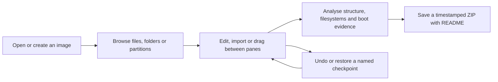
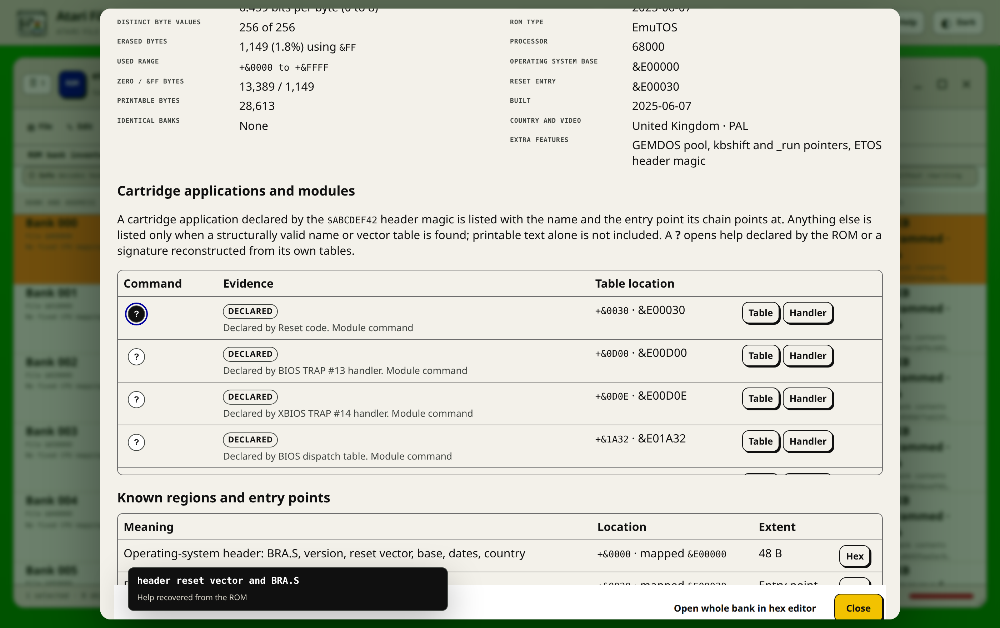

# Atari File Forge

Atari File Forge is a web and native Linux workshop for Atari ST floppy,
hard-disk, archive and ROM images. It covers the whole range: the 520ST and
1040ST, the Mega ST, the STE and Mega STE, the TT030 and the Falcon030. Both
editions use the same workbench, filesystem services and editors, so a format
fix or a feature is not maintained twice.

Open as many image panes as the browser and the computer can comfortably
handle, browse their real filing systems and drag files between them. You can
add, export, rename, move, delete, set attributes, defragment and validate
files without touching the original image on your computer. Partitioned hard
disks, private session recovery, undo points, health checks and format-aware
imports are part of the same workflow.


The light palette follows the GEM desktop of TOS 1.x and 2.06 on a colour
monitor: the medium-resolution green desktop, white windows with black window
furniture, the beige-grey ST chassis, TOS blue for primary actions and the warm
Atari Fuji orange for the selected row. Dark mode follows the ST low-resolution
screen, with its black desktop, white text and the same Fuji highlight.


Every screenshot in this handbook is a placeholder taken before the port. The
figures are kept so the captions have somewhere to point; each one is
recaptured from a running Atari build as its part of the interface lands. The
caption says what the Atari screen will show, not what the placeholder image
currently shows.

## Accessibility and themes

The frontend targets WCAG 2.2 AA in light and dark mode. It provides a skip
link, clear keyboard focus, labelled controls and image tables, focus-contained
dialogs, screen-reader status announcements, non-colour state cues and reduced
motion support. The layout remains usable with browser zoom and at narrow
viewport widths. Drag operations have keyboard alternatives: Cut, Copy and
Paste handle files and partitions, while Alt+Left and Alt+Right on a pane grip
reorders panes.

The operating-system colour preference is used on first visit. The Light / Dark
button in the header stores the chosen mode in the current host's private
state. Light mode is the GEM desktop as TOS drew it on a colour monitor: the
medium-resolution green desktop, white windows with black window furniture and
text, the beige-grey ST chassis for the chrome, TOS blue for primary actions
and title bars, and the warm end of the Atari Fuji rainbow for the selected
row. Dark mode is the ST low-resolution screen: a black desktop, white text,
the default sixteen-colour palette used sparingly for file-kind badges and
syntax colouring, and the same warm Fuji accent for selection and focus. Theme
colours live in `app/static/theme.css` as semantic custom properties. Layout,
typography and component geometry live separately in `app/static/styles.css`,
so another palette can be introduced without rewriting the interface. Any new
palette should keep normal text at 4.5:1 or better, large text and meaningful
graphics at 3:1 or better, and a clearly visible keyboard focus indicator.

## Quick start

The source lives at
[github.com/peteclarke-del/AtariFileForge](https://github.com/peteclarke-del/AtariFileForge).
Clone it over HTTPS and start the Docker service:

```bash
git clone https://github.com/peteclarke-del/AtariFileForge.git
cd AtariFileForge
docker compose up --build -d
```

SSH cloning also works when your GitHub public key is configured, but it is not
required to install or run the application.

Open <http://localhost:8684>.

Linux users can instead install the GTK 4 desktop host. GTK and Libadwaita
provide the window decorations, application menu, symbolic icons and local
file chooser, while the managed emulator uses a native window. The shared
workbench inherits the desktop font and colour preference. Large local images
use a filesystem clone or one sparse working copy rather than a browser upload:

```bash
tools/install-linux-desktop.sh
tools/atari-file-forge-desktop
```

Release builds also provide a native-architecture Debian package. Install it
on the Debian or Ubuntu release for which it was built:

```bash
sudo apt install ./atari-file-forge_0.4.0-1~deb13_amd64.deb
atari-file-forge
```

Stable releases provide Debian 13 and Ubuntu 24.04 packages for AMD64, ARM64
and ARMv7. Debian filenames contain `deb13`; Ubuntu filenames contain
`ubuntu24.04`. The package installs the application under
`/opt/atari-file-forge`, registers the launcher, icon, MIME types, AppStream
record and manual page, and vendors the pinned Python packages. The package
provides scalable and fixed-size icons and gives the GTK window the matching
desktop identity for reliable GNOME, Ubuntu Dock and X11 association. It does
not bundle Atari TOS or commercial media. The architecture-native HxC converter
and its private libraries are included so HFE and SCP workflows do not rely on
an untracked host tool. Build a package for the current machine with
`tools/build-linux-package.sh`; build the complete clean-tree release set with
`tools/build-release.sh`.

The native chooser accepts several images at once. Supported images can also
be dragged from the Linux file manager onto a pane. Both paths use the fast
private local-file adapter rather than uploading bytes through WebKit. A review
step applies the active hardware profile and distinguishes separate ROM images
from linear or byte-interleaved physical ROM sets. Native opens are serialised,
while a stable private owner and XDG-backed client state retain sessions,
workspace settings, profiles and the collection catalogue across random-port
desktop launches.

Read the [Linux desktop guide](docs/LINUX-DESKTOP.md) for prerequisite
packages, XDG storage, emulator paths and removal. The
[platform contract](docs/PLATFORM-CONTRACT.md) requires shared changes to be
implemented and tested for both web and desktop hosts. The
[Windows, macOS and RPM guide](docs/CROSS-PLATFORM.md) covers the shells that
build from this tree but are not yet part of the release matrix.

If your system still uses the standalone Compose command, replace
`docker compose` with `docker-compose` in the examples below.

The container listens on port `8666` for the application and `8668` for the
managed emulator display. Compose publishes those on `8684` and `8685`, so
they do not collide with the sibling File Forge applications, which use the
container defaults. Working images are stored in the `atari-file-forge-work`
Docker volume. Files selected in the browser are uploaded into private working
sessions; the application does not mount or alter the source directory on the
host.

To stop it:

```bash
docker compose down
```

To remove the saved working sessions as well:

```bash
docker compose down -v
```

Only use the second command when you really want to discard every working
copy.

The `samples/` directory is intentionally excluded from Git and from archives
made with `git archive`. Local test images can be large and may contain
software that is not ours to redistribute. Add your own fixtures there when
developing; they will not be committed or packaged.

## Current status

The current release is `0.4.0`. It provides the editing, drive preparation,
analysis and deployment workflows for the whole ST range, in the browser and in
the Linux desktop application. The [release notes](docs/releases/0.4.0.md)
describe what it does and what it does not yet do.

What this release does:

- The GEMDOS filing system, read and written: FAT12 floppies and FAT16
  partitions, 8.3 names, the attribute byte, FAT datestamps, defragmentation
  and a full structural validator.
- Every ST floppy geometry from 360 KiB to 1.44 MiB, and the MSA and DIM
  containers that wrap them.
- AHDI partition tables, their extended chains, the ICD twelve-entry table and
  PC master boot records, including byte-swapped images dumped through an IDE
  adapter, with the TOS release limits for each partition size reported rather
  than discovered.
- Pasti STX captures, read-only, with a per-track protection report.
- HFE and SCP flux containers through the bundled HxCFloppyEmulator converter,
  with the encode, decode and byte-for-byte compare policy that decides whether
  a container may be edited at all.
- Preservation captures, when the optional decoder library is installed.
- Preparing a drive: partitioning, formatting, the boot sector, a hard-disk
  driver from your own copy or driverless booting under EmuTOS, the driver's
  root-sector and boot-sector loaders copied from a drive it already prepared
  and kept in a boot loaders folder for every later drive,
  the folders a prepared drive expects, and the desktop configuration its TOS
  reads, `DESKTOP.INF` for TOS 1.x or `NEWDESK.INF` later. A replacement desktop
  can be installed at the same time, and NeoDesk and Geneva are set up the way
  Gribnif's own installers set them up, cookie jar and all.
- Staging a floppy onto a drive, installing a staged title into its own
  folder, and running a title's own installer under the emulator.
- TOS and cartridge ROM decoding: the header, both dates, the country and video
  standard, the trap entry points proven from their vector installs, the system
  fonts, and the cartridge application chain.
- Hatari for every machine in the range, over floppy, ACSI, SCSI, IDE and
  host-folder media, including a whole-drive hand-off that attaches a
  hard-disk image to the interface the profile declares, rather than
  extracting one volume out of it, and boots from it.
- Firmware selection: a real TOS ROM you supply is preferred, and the bundled
  EmuTOS 1.4 boots the machine when none is found, so the emulator always
  works.
- The hardware catalogue: six machines with their add-ons, requirements and
  conflicts, applied to the whole workspace and used by analysis, deployment
  and the emulator.
- Atari analysis: `AUTO` folder order, desktop configuration, program headers
  and their flags, bootable-disk evidence, name conflicts and TOS limits, in
  the health dashboard, the manifest and the generated README of every saved
  package.
- Deployment packages for a Gotek, an SD card, a CF card, a host folder and a
  real ACSI drive, each with its own verification steps.
- GFA BASIC, STOS BASIC and Atari ST BASIC in the editor, and 68000-family
  disassembly annotated with the TRAP calls, the TOS system variables and the
  ST hardware registers, with cheat-candidate analysis built on top of it.
  Proven machine-code changes are saved as exact-hash guarded patches.
- Undo and named checkpoints, owner-isolated recovery, background job tracking
  and a host-private collection catalogue.

The [product backlog](docs/BACKLOG.md) is the authority on what remains. The
next section repeats the parts of it that change what you can do with this
release.

### Known limits of this release

These are stated here rather than discovered later.

- **The Online Library.** Searching and downloading from the Atari collections,
  and identifying a title from the naming conventions the Atari archives use,
  are not finished. The sources are configured and described in the
  [collection guide](docs/COLLECTION-GUIDE.md), but the search and install
  workflow around them is incomplete.
- **Picture, music and resource formats.** The ST range's own image, sound and
  GEM resource formats are not previewed. They open in the hex editor.
- **Filenames drawn in the ST character set.** A name is decoded as Latin-1 so
  that writing it back produces the identical bytes. The ST font's glyphs below
  code 32, such as the musical notes some disks use in an extension, are not
  yet drawn.
- **The 1.44 MiB high-density geometry.** It is created, read and written as a
  sector image. The complete flux round trip for it has not been measured on
  hardware, so an HFE or SCP at that density is not yet claimed as verified end
  to end.
- **Container repacking.** When an MSA or DIM is updated in place, the writer
  chooses the shortest encoding rather than reproducing the exact packing the
  original tool chose. The result is a valid container with the same sectors,
  not a byte-identical rebuild of the source file.
- **Preservation captures.** Read when the SPS decoder library
  (`libcapsimage`) is installed, and refused with a plain explanation when it
  is not. That library is source-available under a non-commercial licence, so
  it is not bundled; [docs/IPF-GUIDE.md](docs/IPF-GUIDE.md) covers building it,
  where the workbench looks for it, and what a capture can and cannot become.
- **HFE and SCP creation.** Creating or converting a flux container needs the
  HxC converter, which the Docker image and the native packages build. A bare
  checkout reports it as unavailable rather than writing an unverified image.
- **Hard-disk driver loaders.** A driver whose distribution carries no
  root-sector loader, AHDI and ICD Pro among them, keeps that loader inside its
  own installer, which is Atari code this application does not run. Open a
  drive the driver has already prepared and Prepare copies both its loaders
  from there, keeping a copy in the boot loaders folder so later drives need
  no such drive open; otherwise run the driver's installer once, or boot the
  drive driverless under EmuTOS. The preparation says which applies.
- **Firmware.** No Atari TOS ROM is shipped or downloaded, and none can be:
  TOS is not free to redistribute. The bundled EmuTOS 1.4 boots every machine
  in the range, so the emulator works without one. Point a profile at a TOS ROM
  you own when you need the release the software was written against.
- **The shipped ROM identity catalogue lists EmuTOS only.** A ROM identity is
  keyed by the exact SHA-256 of an image, so an entry only means anything once
  someone has hashed a ROM they hold. Building a per-owner catalogue of real
  TOS ROMs is a backlog item.
- **Remote control of the emulator.** Hatari's control socket is supported by
  the command builder, but nothing in the application drives a running session
  through it yet. A managed run is watched, not driven.
- **Cheat verification.** Correlating a debugger watchpoint with a candidate
  automatically is the one remaining piece of the cheat workflow. Until it
  lands the tester records the observations and the interface labels them as
  tester supplied.
- **Archives.** ZIP and LZH archives are read in-tree and their members can be
  extracted into writable media. The LZH decoder covers `-lh0-`, `-lh4-`
  through `-lh7-` and directory entries, and names any other method rather than
  guessing at it. Editing a member in place, without extracting it first, is
  not yet supported.
- **Real hardware.** The Python, JavaScript and browser suites and the AMD64,
  ARM64 and ARMv7 image builds run on every commit, and the Debian and Ubuntu
  packages for all three architectures are built for every release. The
  real-hardware gate, with an edited disk on a real ST or STE and a prepared
  drive on a real hard-disk interface, has not been recorded for this release.

Atari media can contain unusual formats, copy protection and boot sectors that
are programs in their own right. Keep a known-good source image and test
important work before putting it onto real hardware. The application reports
uncertainty rather than claiming that an unproved conversion or launch path is
safe.

Bug reports and proposed improvements can be raised in the
[GitHub repository](https://github.com/peteclarke-del/AtariFileForge). Read the
[contribution guide](CONTRIBUTING.md) before submitting a change and report
suspected vulnerabilities through the private process in
[SECURITY.md](SECURITY.md), not a public issue.

## Documentation map

- The [documentation index](docs/README.md) is the quickest route to the right
  operational, media, editor, ROM, firmware or release reference.
- This README is the complete product, workflow and format guide.
- The [Atarinut GEMDOS engine notes](docs/ATARINUT-GEMDOS-SUPPORT.md) are the
  exact reference for boot sectors, FAT widths, partition tables, geometry and
  the TOS limits.
- The [ROM image handbook](docs/ROM-GUIDE.md) is the deeper technical reference
  for TOS and cartridge headers, decoded structures, ROM Workbench, patches and
  programmers.
- The [emulator guide](docs/EMULATOR-GUIDE.md) covers how Hatari is found, how
  firmware is chosen, and exactly what each machine is started with.
- The [HFE, SCP and export guide](docs/HFE-HXC-GUIDE.md) covers the flux
  containers, the bundled converter and the verified save.
- The [preservation capture guide](docs/IPF-GUIDE.md) covers the optional
  decoder library and what a capture can become.
- The [physical floppy guide](docs/PHYSICAL-FLOPPY-GUIDE.md) covers optional
  Greaseweazle setup, the floppy-controller adapter, supported images,
  verification and safe cancellation.
- The [hardware deployment guide](docs/HARDWARE-DEPLOYMENT-GUIDE.md) covers the
  Gotek, SD-card, CompactFlash, host-folder and ACSI targets.
- The [file catalogue metadata guide](docs/FILE-METADATA-GUIDE.md) covers the
  attribute byte, the datestamp, and what GEMDOS deliberately does not record.
- The [installation guide](docs/INSTALLATION.md) covers Docker, Debian
  packages, Raspberry Pi builds, updates, retained sessions and common
  failures.
- The [Linux desktop guide](docs/LINUX-DESKTOP.md) covers the GTK application,
  native file handling, XDG storage and emulator configuration.
- The [platform contract](docs/PLATFORM-CONTRACT.md) defines the mandatory
  parity boundary between browser and native hosts.
- The [private collection guide](docs/COLLECTION-GUIDE.md) covers web and Linux
  desktop indexing, stale revisions, reports, backups, privacy boundaries and
  the configured Online Library sources.
- The [cheat-candidate analysis guide](docs/CHEAT-ANALYSIS-GUIDE.md) covers
  BASIC and machine-code evidence, confidence, online references and safe
  emulator verification.
- The [release checklist](docs/RELEASE-CHECKLIST.md) defines the
  generated-media, fault-injection, benchmark, browser and real-hardware gates.
- The [product backlog](docs/BACKLOG.md) records what is finished and what is
  not, and is the authority whenever this handbook and the code disagree.
- [CONTRIBUTING.md](CONTRIBUTING.md), [SECURITY.md](SECURITY.md),
  [CODE_OF_CONDUCT.md](CODE_OF_CONDUCT.md) and [SUPPORT.md](SUPPORT.md) define
  how repository work and reports are handled.
- [GOVERNANCE.md](GOVERNANCE.md) defines maintainership, decision priorities,
  evidence requirements and release authority.
- [THIRD_PARTY_NOTICES.md](THIRD_PARTY_NOTICES.md) records the boundary between
  MIT-licensed project source, source-built tools, system packages, firmware
  and user media.
- [firmware/README.md](firmware/README.md) records the bundled EmuTOS images,
  their checksums and the rule that no Atari TOS ROM is ever committed.
- **Help** in the application contains illustrated, task-based instructions and
  stays with the running version of the frontend.

Three guides still describe the previous platform's media and are being
rewritten: the [file editor and code analysis
handbook](docs/FILE-EDITOR-GUIDE.md), the [headless CLI
guide](docs/CLI-GUIDE.md) and the [drive preparation and install
guide](docs/INSTALL-GUIDE.md). They are linked here for completeness. Do not
rely on them for Atari behaviour until the backlog row that covers them is
checked.

## The basic workflow

1. The app starts with one full-width work pane. Open or create an image there.
2. Select **Add Pane** in the header when you need a source, destination or
   scratch area. There is no fixed pane-count limit. The practical limit is
   the browser, memory and available workspace area.
3. Double-click folders or partitions to browse them. A volume pane opens at
   its root, shown as `\`. Use the `..` row to return to the parent, or select
   a breadcrumb to jump straight there.
4. Drag files, folders, disk images or ROM banks to their destination.
5. Use **Edit** to undo the latest operation or create a named checkpoint
   before a larger experiment.
6. Use **Tools → Check filesystem** after substantial edits.
7. Use **Save Image** in the pane heading to download the finished image.

Uploads are copied into an isolated workspace. Editing an image never writes
back to the original file selected in the browser.



### Panes and the workspace

Drag an empty part of a pane heading, or its numbered grip, to place that
window anywhere in the workspace. Windows can overlap and the one selected most
recently moves to the front. Drag against an edge for a half-workspace layout,
against a corner for a quarter-workspace layout, or against the top edge to
maximise. Drag any edge or corner to resize. Double-click the grip to maximise
or restore it. A snapped pane begins resizing from its visible rectangle, and
free panes scale proportionally when the browser workspace changes size. With
the grip focused, Alt+Left and Alt+Right snap to either side, Alt+Up maximises,
and Alt+Down minimises. Hold Shift with Alt and an arrow key to resize the
focused pane in 32-pixel steps.

There is no fixed pane-count limit. **Add Pane** creates another cascading
window whenever it is selected. Each open pane heading contains, in order, the
orange changed indicator and buttons for **New Blank Image**, **Load New
Image**, **Save Image**, **Export**, **Refresh View**, **Minimise**,
**Maximise/Restore** and **Close Pane**. A minimised pane is kept on the
workspace shelf and restores with one click. The × closes the whole pane, not
merely the image inside it. A changed image prompts for **Save and close**,
**Close without saving**, or **Cancel**. Closing never deletes its private
working copy: use **Recover previous session** in another pane to reopen it.
Empty panes also have a top-right ×. If every pane is closed, **Add Pane**
remains available in the header; a fresh browser workspace always begins with
one pane. Window positions, sizes, snap state, stack order and minimised state
are restored after a normal refresh and are included in project JSON exports.

After image validation, Save starts a native timestamped ZIP download and
opens a small confirmation dialog containing a direct **Download ZIP** link.
Once the download has been prepared, the orange changed indicator clears in
every pane showing that image. It returns after the next edit. If a browser
suppresses the automatic handoff after a long hard-disk validation, use that
link without returning to the work pane or risking the current session. Every
save uses the same foreground progress dialog. It covers validation, checksums,
the technical catalogue and construction of the complete ZIP. Small floppy
images move through those stages quickly; large hard-disk images show real
progress for as long as they need. The ready dialog appears only after the
timestamped ZIP is complete on disk. Starting the download then hands an
ordinary file with a known size to the browser immediately.

A hard-disk image usually contains large zero-filled free areas. Atari File
Forge stores those areas as sparse ranges in the private working copy and its
checkpoints, calculates checksums without physically rereading sparse holes,
and uses fast ZIP compression for sparse downloads. Extracting the ZIP still
produces the complete byte-for-byte image size the hardware requires.

Click the image filename in any pane heading to rename the working image.
Press Enter or click elsewhere to keep the new name, or press Escape to cancel.
The media extension is preserved automatically. This changes the container
filename used by recovery and download, not the volume label stored inside its
filing system.

Each pane has its own refresh button. Long operations display a progress
overlay with the current phase, item count, elapsed time, measured throughput
and estimated time remaining. Dialog action buttons disable after the first
valid click, which prevents accidental duplicate imports or copies. The
controls in a pane also disable as soon as a creative, destructive, validation
or maintenance action starts. Changes to one image are serialised so that two
writes cannot modify it at the same time.

The meter at the lower-right of every populated pane shows real filesystem
usage. It fills green, then orange at 70%, and red at 90%. Hover over it for
used, free, total and percentage figures in appropriate units. At a drive's
partition table it counts allocated and unallocated capacity; inside a
partition it reports that volume's own clusters. A read-only container with no
filesystem free space shows a neutral unavailable meter.

## Online Library


**Not yet in this build.** Searching the Atari collections, downloading from
them and identifying a title from the naming conventions those archives use are
unchecked backlog rows. The sources below are configured and verified against
the live sites, and the workflow described here is the one being built. Nothing
in this section should be relied on until the backlog row is checked.

Every writable media pane has a **Library** menu offering **Find software
online**. It searches enabled catalogues on the server so a browser does not
need to negotiate cross-site download rules.

The initial machine filter comes from the Workbench hardware profile applied
to that pane. For panes without an applied profile, the remembered active
Workbench profile is used as the workspace default. It is still only a starting
value: choose another machine in the Online Library whenever an individual
search needs a wider or different catalogue.

The shipped source set is five entries, each checked against the live site:

| Source | What it offers | Machines |
| --- | --- | --- |
| Internet Archive Atari ST games | `.st`, `.msa`, `.stx`, `.dim` and `.zip` downloads from the `softwarelibrary_atari_st_games` collection | the whole range |
| Demozoo | demoscene productions for platform 9 (ST and STE), 58 (TT030) and 17 (Falcon030), with their download links | the whole range |
| Pigwa Atari ST game packs | the game-pack folders on `ftp.pigwa.net`, one level deep | ST, Mega ST, STE, Mega STE |
| Atarimania | title, publisher, country and year; no downloads | all |
| Atari Legend | title and developer; no downloads | all |

Atarimania and Atari Legend are reference databases rather than archives. Their
results identify a release and link to its page; they cannot be installed, and
the Online Library says so rather than offering a download that would fail.
They contribute metadata and the duplicate check instead.

The TOSEC Atari ST collection is deliberately not shipped as a source. It is
published as one ZIP of about 15 GB with no per-title index, so there is no way
to search it or fetch one image out of it. Unpack it by hand and index the
extracted images through **Collection** like any other local material.

Only records with a confirmed public `.st`, `.msa`, `.stx`, `.dim`, `.hfe`,
`.scp` or `.zip` download appear. The app suppresses gallery pages,
documentation-only records and catalogue records whose item page does not
contain supported downloadable media.

Large provider indexes are checked in bounded pages. The initial result set
contains only entries whose detail page has already confirmed a supported
download. Choose **Find more downloadable results** to validate the next
provider page; repeat until the status says that all matching catalogue entries
have been checked. **Not already present** reports how many verified results
were hidden; choose **All results** when auditing catalogue coverage.

Choose **Sources…** in the Online Library to enable or disable a catalogue,
change its URL, or add another compatible provider. Configuration is stored in
the persistent work volume as `catalog-sources.json`. Each provider record
contains its loading and parsing settings, including query templates, crawl
paths, machine identifiers, cache durations and validation limits. Item and
download path rules are configurable too, so site-specific URLs and identifiers
live in source configuration rather than in application logic.

The bundled defaults live in `app/catalog_sources.json`. The catalogue engine
only understands reusable loading stages such as a single page, a directory
listing, a JSON API or a category crawl, reusable page layouts, and optional
link resolution. It does not branch on a catalogue name or identifier. The copy
in the work volume contains local changes made through **Sources…**.

### Install online software onto a drive or a floppy

**Not yet in this build**, for the reason given above.

1. Open the destination: a partition on a hard disk, or a floppy image.
2. Choose **Library → Find software online**, select a machine and search by
   title, publisher or keyword. A blank search browses the catalogue's current
   page.
3. Select the Title, Publisher, Year or Source heading to sort the results.
   The active heading shows ↑ for ascending or ↓ for descending order; select
   it again to reverse the order.
4. Choose **Not already present** to hide likely duplicates detected from
   volume labels, folder names and remembered online distribution names.
   Choose **All results** to include them.
5. If the status says more catalogue entries remain, choose **Find more
   downloadable results**. The next bounded group is checked and merged into
   the current sortable selection without claiming unchecked links as files.
6. Select several downloadable results. Each one's expanded size is measured
   against the destination's free clusters before anything is written, so a
   batch that will not fit is refused before its first write rather than part
   way through.
7. Review the title, publisher and proposed boot evidence for each installed
   item. Every proposal carries the evidence behind it, and an ambiguous one is
   marked rather than written silently.

Multi-item installs run one download at a time and show the current title.
**Abort operation** lets the active item reach a safe image boundary, then
prevents the next download from starting. Completed items remain installed and
undo checkpoints are retained.

If one download contains the same program in several media formats, the app
uses the best native disk format once. A plain `.st` is preferred over an
equivalent `.msa` or `.dim`, so an import does not write the sector image and
then complain about the container.

The catalogue title and publisher seed the review form, while the actual disk
is still inspected for its boot sector, its `AUTO` folder and its
`DESKTOP.INF`. An installed title therefore receives proper source metadata
without trusting a catalogue to describe the layout of the image.

### Add online software to a volume

**Not yet in this build**, for the reason given above.

For a blank image, the downloaded disk's catalogue and volume label are adopted
directly. For a volume that already holds files, or for an open partition,
files are copied into the current folder. The 8.3 name policy, free-space
checks and existing-file errors still apply.

Downloaded disk images extract into the current folder by default. Select
**Create a folder for each downloaded disk** when the software is
self-contained, or when several images would otherwise clash.

A floppy is not automatically a relocatable hard-disk application. Its loader
may name its files through the drive they arrived in, as `A:\GAME.PRG`, select
a drive explicitly, or read physical sectors through the BIOS. Explicit drive
changes and apparent direct sector access are reported as compatibility risks
rather than being guessed at. Such software should remain a mounted floppy
image unless a title-specific hard-disk installer is available.

### Audit software already installed on a hard drive

**Not yet in this build.** Reporting the Atari findings that this audit needs,
the `AUTO` folder order, the desktop configuration, program headers and their
flags, is an unchecked backlog row.

Choose **Tools → Check installed disk software** in a hard-disk partition to
inspect software which was previously extracted from floppy images. The command
is not shown for floppy images. It recursively finds installation roots from
the source-image history retained by Atari File Forge and from the conventional
Atari boot points: a program in the `AUTO` folder, which TOS runs before the
desktop appears, and a `DESKTOP.INF` or `NEWDESK.INF` that installs an
application.

The first pass is read-only and can be limited to the current folder or run
across the whole drive. Each detected installation reports its source image
when known, file count, exact deterministic repairs and unresolved warnings.
Safe repairs include drive-letter references such as `A:\GAME.PRG`, which are
correct on a floppy and wrong on a hard disk. Explicit drive assignments and
direct BIOS sector access are reported for review but are never rewritten by
guesswork.

A path is resolved before any warning or rewrite is offered. `DATA\LEVELS` is
preserved as the real path it is, rather than mistaken for a drive reference.

If repairs are available, select the folders to fix and choose **Repair
selected**. Choose **Cancel** to leave the image unchanged. The repair action
creates the normal automatic undo checkpoint and processes the selected batch
through one writable filesystem mount, which avoids repeatedly reopening a
large hard-disk image. Run the audit again after repair to confirm that only
intentional warnings remain.

Saved image notices retain actual compatibility changes, but do not retain old
point-in-time diagnoses forever. Opening an older working session consolidates
repeated notices and directs the user to the hard-disk audit for current
path-aware results. The pane reports the notice count and latest item instead
of placing the complete history in one oversized toast.

Small remote catalogue pages are cached for an hour and the larger directory
listings for a day, which can be changed in their provider settings. Selected
result tokens expire after an hour. Downloads have fixed size limits, ZIP
expansion is bounded, and path traversal members are ignored. One unavailable
source is reported under the remaining results rather than cancelling a
multi-source search. Availability in a catalogue does not change a program's
licence, so use the source page for permissions, payment and release notes.

## Undo and named checkpoints

Every request that can change an existing image begins by taking an automatic
checkpoint. If the request makes no change, that speculative checkpoint is
removed. If it succeeds, partially completes, or stops after some items in a
bulk operation, the previous state remains available through **Edit → Undo
last change**. Undo consumes the latest automatic point, so it can be repeated
to step backwards through the most recent operations. The newest 20 automatic
points are retained per working image.

Use **Edit → Checkpoints** to create a permanent named point before a large
import, compaction or folder reorganisation. The same dialog lists named
checkpoints and recent automatic points. Any listed point can be restored, and
named points can be deleted when no longer required. Restoring a checkpoint
first saves the state it is replacing as a fresh automatic undo point.

Checkpoints include the complete working image, its displayed filename, source
metadata, hardware target, warnings and dirty state. Partition and directory caches are rebuilt after a restore. Every
pane showing the restored image refreshes from the restored bytes.

On filesystems that support reflinks, snapshots use copy-on-write cloning. A
large hard-disk checkpoint is therefore normally quick and initially consumes
space only for clusters that later differ. When reflinks are unavailable, the
fallback copy preserves sparse zero ranges instead of writing hundreds of
megabytes of unused capacity. The logical checkpoint remains a complete
byte-for-byte image and restores normally.

Checkpoints live inside the private, owner-isolated working session. They
survive normal refreshes and container restarts with the Docker work volume,
but clearing that recovery session or removing the volume removes its
checkpoints too. They are not a replacement for downloading an important
finished image.

## Workbench and analysis tools

Every open pane has an **Analyse** menu. These tools are read-only unless a
repair or reviewed edit is explicitly selected, and normal automatic
checkpoints still protect every write.

The header **Search** command searches every distinct image currently open in
the workspace. One query covers filenames and bounded readable BASIC and text
content. A hard-disk search covers every partition; a floppy search traverses
the complete folder tree; a ROM search uses its decoded structures. Results
identify the pane, image, partition and path. Selecting a result restores a
minimised pane, brings it to the front, navigates to the containing partition
and folder, and opens the file in the appropriate editor. Raw ROM banks are
omitted because they are not a filing system and already have structure, string
and byte search in the ROM Workbench and the hex editor.


### Preflight and dry runs

Select files or folders and choose **Dry-run selected items**. The report shows
the proposed objects and detects target filename conversion, truncation to the
8.3 form, case-insensitive clashes, and operations that cannot proceed. The
bulk-import planner provides the deeper format-specific preflight for large
transfers, including free-cluster capacity, shortened-name collisions, existing
populated destinations, blank disks, and the exact destination folder for every
source.

### Unified image health


**Image health dashboard** brings the applicable checks together:

- filesystem structure and recursive catalogue access: both FATs agreeing, the
  media marker, chain consistency, cross-linked and lost clusters, directory
  loops, the `.` and `..` links, and each file's size against its chain;
- partition table state, partition bounds and overlaps, and the declared
  partition type against the volume actually written there;
- the boot sector: whether its 256 big-endian words sum to `0x1234`, which is
  what makes it executable, and whether its BIOS parameter block agrees with
  the image's real shape;
- the TOS release limits that apply to the partition sizes present;
- compatibility warnings and the applied hardware profile.

Before the scan begins, the app warns that a large drive may take several
minutes. The progress display names the current partition and folder, and
**Abort operation** stops at the next safe traversal boundary. Health checks do
not hash every file; full checksums remain available through manifests and the
duplicate finder, keeping routine structural checks substantially faster.

Repairs are offered only when the evidence is deterministic. The repair dialog
itemises what is eligible and creates an undo checkpoint before writing.
Ambiguous findings remain for review.

The Atari-specific findings, the `AUTO` folder order, the desktop
configuration, program header flags and name conflicts, are being added to this
dashboard as this is published, so a clean result in this build is not yet a
complete result.

### Cheat-candidate analysis

Open one tokenised BASIC or machine-code file and choose **Tools → Find cheat
candidates** in its editor. The read-only report correlates semantic BASIC
state, plausible initial values, updates and terminal paths. For machine code
it joins initialisation, access to the same storage, updates, forward terminal
branches and saved labels. Results are grouped by likely purpose and marked
Strong, Likely or Possible.

The BASIC pass reads the detokenised listing rather than one dialect's tokens,
so a GFA BASIC, STOS or ST BASIC program is analysed the same way. It knows
every spelling the ST dialects use for a direct memory write: `POKE`, `DPOKE`,
`LPOKE`, `DOKE`, `LOKE` and the GFA `BYTE{}`, `WORD{}` and `LONG{}` forms.

A write into the machine rather than into the game is named as such. The
analyser knows where the TOS system variables, the ST and STE hardware
registers, the SCC, the MFP, the keyboard and MIDI ACIAs, the TOS ROM and the
cartridge port live, and a candidate touching any of them says which one. A
countdown in an MFP timer or a sound-envelope register looks exactly like a
lives counter and is not one, so it is never offered as one.

The analyser suppresses unexplained memory writes, opaque BASIC countdowns,
backward decrement loops and likely copy, clear, scan or delay counters. It
retains reachable unlabelled state changes with a forward decision as Possible,
but excludes bytes reached only by speculative linear decoding. Loader commands
and packed or runtime-generated payloads are identified instead of being shown
as an unexplained zero-result scan. It explains the evidence and the risk, then
recommends an emulator watchpoint or control-flow check. Optional online title
identification and configured specialist searches can locate published
research, but never modify the image or claim that similarly named software has
identical bytes. See the
[cheat-candidate analysis guide](docs/CHEAT-ANALYSIS-GUIDE.md).

For a machine-code candidate with an exact file offset, select the result and
choose **Prepare guarded patch**. The patch builder requires the watched
address, two distinct emulator gameplay observations, an explanation and an
author. It records the complete source SHA-256, original and replacement bytes,
hardware profile and rollback instructions. Apply checks that exact hash and
the guarded bytes again, then uses the normal automatic image checkpoint. A
host-private library retains up to 500 of these small patch records and matches
by exact file content, never by a title or filename. The observations are
deliberately entered by the tester: automatic debugger-to-gameplay correlation
remains an open backlog row and the interface does not pretend otherwise.

### Opening and editing files

Double-click a file in any filesystem pane to open it. The same viewer is
available through **Analyse → Open selected file**. The app examines the
contents instead of trusting the filename:

- a tokenised BASIC program is recognised by content and opened as a listing;
- readable Atari-character-set files open in the text editor;
- a GEMDOS program, recognised by the `0x601A` word its header starts with and
  by section sizes that fit inside the file, opens in an annotated disassembly
  viewer;
- ZIP, LZH, TAR, TAR.GZ/TGZ, TAR.BZ2, TAR.XZ, standalone GZIP, BZIP2 and XZ
  files appear as archives and open as bounded folder hierarchies in the same
  pane. Double-clicking a member extracts it in memory and opens the
  appropriate BASIC, text, disassembly or hex viewer;
- an empty or otherwise undecodable file falls back to the hex editor.

The download arrow beside every filename exports the original file and its
GEMDOS metadata without opening it. This keeps opening, editing and downloading
as separate, predictable actions.

At a drive's partition table, every partition has the same download arrow. It
exports that partition as a standalone image named from its drive letter, so a
single volume can be handled without the whole drive.

Every row has a type icon: folders use folder icons, partitions use disks, ROM
banks use chips, containers use archive icons, and BASIC, text and program
files use distinct document icons. Names and extensions provide immediate safe
classifications. Unlabelled files up to 128 KiB are inspected through the
filesystem mount that is already open for the directory listing, so BASIC,
text, containers and programs normally have the right icon before they are
opened. Results are cached until the image changes. Larger unlabelled files
remain generic binary rows until opened, avoiding a costly scan of every file
in a large hard-disk image.

The compact source window uses familiar **File**, **Edit** and **Tools** menus.
File provides Save, Save As, browser-local text export, metadata download and
Close. Save As creates a sibling inside the image and retains the original
GEMDOS attributes and datestamp. Edit provides undo, redo, cut, copy, paste,
select all, find, and case-insensitive Find and Replace, with the usual
keyboard shortcuts. Replace Next works from the current selection and wraps
once; Replace All reports its exact replacement count. Unsaved text is never
discarded without a warning. Editors open centred at a useful desktop working
size and scale proportionally when the browser window is smaller. Drag the
title bar to move an editor, drag any edge or corner to resize it, or use the
title-bar square to maximise and restore it. Double-clicking the title bar
performs the same maximise or restore action. Movement and sizing remain
constrained to the visible browser window.

Saving from the text, BASIC or file-level hex editor checks the file digest
first. If another operation changed it while the editor was open, the save is
refused rather than overwriting newer work.


### Code-aware editing and help


The ST never had one BASIC, and the engine reads the three that matter. The
dialect is detected from the bytes, not from the filename, because a floppy may
not carry a useful extension.

| Dialect | Read | Write | Why |
| --- | --- | --- | --- |
| GFA BASIC 3 | Yes, from the saved binary or a `.LST` export | Yes | A listing encodes back to a `.GFA`; the tests prove both directions on a corpus. |
| GFA BASIC 2 | Listings only | No | GFA BASIC 2 saved a different binary layout that this engine does not decode. |
| STOS BASIC | Yes | No | The reader is faithful and tested, but the keyword table was derived from real programs rather than transcribed, and a saved file holds interpreter state the engine would have to write as zeros. A file a real STOS may refuse to load is worse than no file. |
| Atari ST BASIC | Yes | Yes | ST BASIC saves plain text, so the round trip is exact by construction. |

**Not yet in this build.** The engine reads and writes those dialects and is
covered by its own tests, but wiring it through the file editor is an unchecked
backlog row. A BASIC program in this build opens through ordinary content
detection rather than through a dialect-aware editor.

Source editors highlight keywords, strings, numbers, remarks, symbols and line
numbers using colours owned by the normal light and dark themes. The editable
textarea remains the real document, so browser undo, clipboard access, input
methods, selection and the existing checked save path continue to work
normally. The coloured layer never becomes the source of saved text.

Commands with built-in reference information have dotted hover targets. Hover
one to see its purpose, syntax, target requirements and a practical warning
where one matters. Hover help appears only after the pointer settles on a
command. Moving away, scrolling, clicking, pressing Escape, switching windows
or refreshing the code view dismisses it, and only one tooltip can exist at a
time. For keyboard use, place the caret in or after a command on the current
line and press **F1**. The editor's **Help** menu also provides an overview of
the detected language and the commands used in the file, a searchable command
reference, live problems that jump back to the relevant source position, and
document symbols.

The Edit menu can find every code reference to the symbol at the caret and can
rename that symbol as one undoable change. Strings and remarks are excluded, so
changing a variable or procedure name does not rewrite user-facing text.
Diagnostics report unused definitions, unmatched block boundaries and
conservatively identified unreachable lines.

Find and Replace is a persistent editor panel rather than a chain of browser
prompts. It supports case matching, whole identifiers, regular expressions, the
current selection, previous and next navigation, a replacement preview and one
undoable Replace All. **Edit → Search files in this image** searches names and
bounded readable content across the mounted filing system, including every
partition of a drive and every folder below the current one. Results report the
physical line and reopen the containing folder before opening the file.

Completion at the caret is available with Ctrl+Space. It combines language
commands, identifiers, document symbols and small templates. Text editors
provide duplicate, move, join and delete line operations. The conservative
formatter removes trailing whitespace and normalises proven line prefixes.

The File Properties dialog updates the attribute byte and the datestamp without
changing file content. GEMDOS records nothing else about a file, so nothing
else is offered: there is no comment field and no load address in a directory
entry, and the application does not invent one. Read the
[file catalogue metadata guide](docs/FILE-METADATA-GUIDE.md) for the exact
representation and a verification checklist.

**View → Show synchronized bytes** follows the source caret or selected
disassembly row and displays the corresponding saved bytes and printable text.
It is deliberately labelled as saved data when the source has unsaved edits.
The strip can open the same offset in the full hex editor.

The tab strip keeps several files from the same mounted image open in one
editor workspace. Draft source, selection and scroll position survive a tab
switch and browser refresh, dirty tabs carry a visible marker, and closing one
asks before discarding edits. **Open from image…** searches filenames and
bounded readable content, restores the result's partition and folder, and opens
it in a new tab. On a hard disk it searches every partition and identifies each
result by drive letter and volume label. Draft recovery is bounded and private
to the current browser tab.


The Project menu stores notes, bookmarks, symbols, offset-bound annotations and
code/data decisions with the recoverable working session and its checkpoints.
In disassembly, shift-click selects a range. It can be marked as code, text,
bytes, 16-bit words, an address table or bitmap data, then redisassembled using
that decision. Symbols can be renamed, imported from or exported to a simple
`address = label` text file, in decimal, `0x` or Motorola `$` notation. The
outline shows labelled regions and direct callers, while Find references jumps
to decoded users of the selected address. This metadata never changes the file
bytes.

Project metadata has a single management dialog for notes, symbols, bookmarks
and portable JSON. **Compare with saved file** presents current and saved
source side by side without touching the image. The selected-data inspector can
show text, hexadecimal bytes, big-endian and little-endian words, and a bounded
1-bit bitmap interpretation of a disassembly range. Every word and address
region defaults to big-endian, because that is how the 68000 reads it.

Managed emulator settings live in **Workbench → Hardware profiles → Emulator
and debugger integration**. Hatari is the one managed emulator, and the Docker
image installs Debian's package. It was chosen deliberately: one build covers
every machine from a 520ST to a Falcon030, floppy, ACSI, SCSI, IDE and
host-folder media alike, and it is driven entirely from the command line, which
keeps a test run repeatable and the capability checks honest rather than spread
across several tools with different gaps.

Selecting a machine chooses a sensible processor, memory size, monitor and
firmware. Apply the profile to the pane that should use it. Tests attach the
current bootable image, use bounded run times, and retain standard output,
standard error and return status in project history. Raw server command fields
and deployment command overrides are deliberately not exposed. The
[emulator guide](docs/EMULATOR-GUIDE.md) lists the exact options each machine
is started with.

Every machine needs a TOS. A real TOS ROM you supply is preferred, because it
is what the software was written against; the lookup reads
`ATARI_FILE_FORGE_TOS_DIR`, which defaults to `~/.config/atari-file-forge/tos`,
and then the repository's git-ignored `firmware/tos/`. When none is found the
bundled EmuTOS 1.4 boots the machine instead, in the size that fits it: 192 KiB
for the ST and Mega ST, 256 KiB for the STE and Mega STE, 512 KiB for the TT030
and Falcon030. EmuTOS is GPL and is committed to this repository on purpose, so
the emulator always works. The status reported to the interface names the ROM
chosen and the reason it was chosen.

Two further local-only integrations are optional. `ATARI_FILE_ASSEMBLER_COMMAND`
must contain `{source}` and `{output}` and may use `{origin}` and
`{architecture}`. **Edit and reassemble** starts from label-oriented assembly
source, warns that the complete binary will be replaced, invokes the configured
tool without a shell, checks the source file hash and writes the output through
an undo checkpoint. Debugger output and return status are retained in project
test history. The assembler remains an expert deployment integration; emulator
and debugger selection is managed by the workbench.

Hovering a 68000 mnemonic, an absolute address such as `$FF8240`, a `TRAP`
number, or an assembler directive including `DC.B`, `DC.W`, `DC.L`, `EVEN` and
`SECTION` shows contextual help. Ordinary BASIC variables are not mistaken for
mnemonics. Processor membership comes from one catalogue: the MC68000
instruction set, and the additions each of the 68010, 68020, 68030, 68040 and
68060 introduced, are kept distinct, so an instruction the target machine
cannot run is not offered as if it could.

The machine-code viewer uses the pane's hardware profile to choose the
processor, and falls back to the baseline 68000 when no profile is set. You can
override that with 68000, 68010, 68020, 68030, 68040 or 68060, change the load
origin and file offset, and request another block of bytes. The result is shown
as fixed-width source rather than a report table. Annotations follow values only
while they can be proved along the current code path.

The annotations are the Atari ones. A `TRAP` is named from the function word
pushed before it: `MOVE.W #$3D,-(SP) / TRAP #1` is reported as `GEMDOS Fopen`,
`TRAP #13` and `TRAP #14` are named from the BIOS and XBIOS tables, and
`TRAP #2` is reported as a VDI or AES call from the selector loaded into D0.
Absolute addresses are named from the ST memory map: the shifter, palette, MMU,
DMA and FDC, PSG, STE DMA sound, blitter, joypad, MFP 68901, ACIA and SCC
registers, the 68000 exception vectors including the TRAP and MFP vectors, and
the TOS system variables at `$380` to `$5FF`. A short absolute operand is
sign-extended the way the processor does it, so `$8240.W` is reported as the
palette at `$FF8240`.

Branches explain their condition, and local routines and destinations receive
stable semantic labels rather than anonymous names. File entry points use
`program_entry_`, while readable strings include a short, sanitised excerpt in
their label. Detected strings within the requested range are emitted directly
as `DC.B` data rows rather than left looking like accidental instructions. A
referenced address inside a string starts a separate labelled `DC.B` row so
jumps and cross-references remain exact. Every generated name retains its
hexadecimal address suffix so similar routines stay unambiguous. Select a
readable string to jump to its decoded line, disassembling that block first
when necessary. Double-click an instruction when you deliberately want the hex
editor at that exact file offset. The File menu exports the formatted
disassembly as text, exports the unchanged binary, or downloads the original
with its GEMDOS metadata. Binary data can resemble instructions, so the
raw-byte view remains the final authority.

The disassembly grid measures the widest byte sequence and instruction in each
result, adds a small monospace gutter, and moves Annotation left whenever the
decoded instructions are short. Sensible caps prevent a long data declaration
from consuming the editor; hover a shortened byte or instruction cell for its
full contents. A sticky heading keeps the columns identifiable while scrolling.


Archive browsing validates member paths, ignores non-regular objects and limits
archive, member and entry counts before expansion. Double-click an archive to
enter it, use its breadcrumbs or `..` to move around, then double-click a
member to inspect its extracted bytes in the normal content-aware viewer. LZH
is decoded in-tree rather than through an external decompressor, because a
package that is present in the container and absent from a native build is
exactly the kind of split that only shows up in the field. Use File or the row
download arrow to export any member.

The complete operational and technical reference will be in the
[file editor and code analysis handbook](docs/FILE-EDITOR-GUIDE.md), which is
still being rewritten for the Atari media.

### Raw image and file hex editor

Choose **Tools → Hex editor** to open a raw editor over the relevant pane. It
works in small ranged pages, so opening a large hard-disk image does not copy
the complete image into browser memory.

The same editor is available for an individual file from its BASIC, text or
disassembly view. File-level raw writes preserve filesystem metadata and create
an undo checkpoint, but can still damage tokenised source or executable code,
so they use the same explicit dangerous-change confirmation.


The editor provides:

- 16-byte rows with hexadecimal and text cells;
- first, previous, next and last-page navigation, plus direct offset entry;
- 128, 256, 512 and 1,024-byte page sizes;
- hexadecimal and text search, forward or backward, with optional wrapping;
- fixed-size hexadecimal or text replacement, with the matched byte range
  selected before it is staged. Search and replacement values must contain the
  same number of bytes because raw editing cannot resize an image;
- byte and range selection using click, Shift-click or Shift plus the arrow
  keys;
- hexadecimal or text typing modes;
- copy as hex or text, paste, fill, revert selection and revert all;
- editor-local undo and redo before anything reaches the image;
- structured decoding for the boot sector and its BIOS parameter block, a
  directory entry, an AHDI root sector and its partition entries, a TOS ROM
  header and a cartridge header, plus bounded custom JSON templates;
- unsigned 8, 16 and 32-bit value views in both byte orders, defaulting to the
  big-endian order the 68000 uses;
- a staged-change list with direct navigation to every changed offset.

Raw edits always overwrite existing bytes. The editor cannot insert, delete or
resize an image because changing container geometry that way would silently
invalidate the filing system. Before a write, the app displays **This is
dangerous. Are you sure?** and explains that raw edits bypass filesystem rules.
The backend checks that the image has not changed since the editor loaded it,
creates an automatic undo checkpoint, writes only the reviewed ranges, flushes
them to storage and invalidates cached catalogue and partition data. Closing
with staged changes offers Keep editing, Discard changes, or Review and write.

After a raw edit, refresh the pane and run **Analyse → Image health dashboard**.
The image remains marked as changed until its timestamped ZIP is saved. A flux
container whose advanced track data is protected can be inspected in the hex
editor, but its Write changes control remains disabled.

Useful shortcuts while the editor has focus are Ctrl/Cmd-S to review and write,
Ctrl/Cmd-Z and Ctrl/Cmd-Y for editor undo and redo, Ctrl/Cmd-F to search,
Ctrl/Cmd-H to move to replacement controls, Ctrl/Cmd-G to enter an offset,
Ctrl/Cmd-C and Ctrl/Cmd-V for byte selections, the arrow keys to move, Shift
plus the arrow keys to extend a selection, and Escape to close safely.

### Workspace search

The header **Search** command scans every distinct open filing system with one
query, including every partition of an open drive. It searches filenames,
attributes, datestamps, bounded BASIC and text, and useful printable strings
inside programs and raw ROM banks. Recognised volume labels are indexed too.
ROM Workbench identity, symbols, regions, notes and saved disassembly
annotations participate in the same search. Enter an 8 to 64 digit SHA-256
prefix to identify exact file content; the result shows the complete digest.
Each result identifies its pane, image, path, partition or ROM bank. Opening a
result restores and raises that pane, navigates to the containing location and
opens the file, ROM Workbench tab or saved address. Binary-string results go
directly to the matching disassembly or hex offset. File scanning and result
counts are bounded so an accidental broad query cannot consume unbounded
memory.

### Manifests, duplicates, and variants

**Export collection manifest** produces JSON or CSV. A hard disk's JSON
contains every partition, its drive letter and declared type, source names,
per-volume and per-file SHA-256 values, and the attribute byte and datestamp
GEMDOS records for each file. Floppy and ROM manifests recursively catalogue
their visible objects and metadata in the same shape.

**Compare with open image** builds the same complete logical manifest for two
open images and matches records by filesystem location, partition or ROM bank.
Added and removed objects are separated from changed content and metadata-only
changes. A file that has moved or been renamed is reported directly when its
content, size and filesystem context provide one unique match. Ambiguous
duplicates remain separate additions and removals rather than being guessed.
Full file and volume SHA-256 values distinguish a real payload change from
allocation or directory movement. Each report includes deterministic base and
candidate fingerprints and can be exported as JSON for review, automation or
later patch planning. Comparing different media families is allowed as an
inventory exercise, but the result is explicitly marked as unsuitable for a
directly applicable patch. The same report joins that logical evidence to
changed raw-byte ranges. Equal one-megabyte chunks are skipped as units,
avoiding per-byte range construction across large unchanged areas. The shared
raw-comparison safety limit covers the first 1 GiB of the common span and
explicitly marks larger comparisons as bounded.

When two images use the same filing system, a compatible partition layout and
the same ROM bank size, the comparison can also create an `.affpatch.zip`. Tick
logical changes to export only that reviewed subset, or leave every checkbox
clear to export the full comparison. Selective patches derive a new candidate
fingerprint and automatically close dependencies around new parent folders,
removed folder descendants and complete partitions. The archive contains a
readable patch plan plus only the added or changed payload bytes. Payloads are
checksummed and streamed straight into the ZIP, so a large batch does not
accumulate every changed file in application memory. Comparison, archive
creation and preflight verification report the current catalogue, checksum or
payload phase, together with byte or item counts, elapsed time, measured
throughput and estimated time remaining where meaningful. Abort stops these
read-only stages at the next stream or catalogue boundary without changing
either image.

Applying one through **Analyse → Apply guarded patch** first performs a
read-only preflight. The dialog checks the format, physical layout, exact base
fingerprint and SHA-256 of every embedded payload, then shows the source and
candidate names, change counts and an itemised operation preview. The Apply
button remains disabled until that inspection succeeds. Applying the verified
archive creates an automatic checkpoint, repeats the validation before the
first write, performs the operations and verifies the complete candidate
fingerprint. Abort during application restores that checkpoint, so a partial
patch is not kept. A stale, damaged or wrong-format patch is rejected. A failed
final verification reports the first mismatched logical object and the mutation
wrapper restores the checkpoint rather than leaving a half-applied image.

**Analyse → Dry-run selected items** produces the versioned Atari File Forge
compatibility-report document without writing to the image. It records the
source and target format, proposed target name, attribute byte and datestamp
for every selected item. Filename conversions, folder loss and unsupported
metadata are attached to the individual item that caused them. The reviewed
report can be downloaded as JSON for automation or Markdown for a package
record. Choose **Keep with saved image** after a report passes to retain it
with the working session. The next saved ZIP includes the accepted JSON and
Markdown below `Compatibility/`, and the generated README identifies the
accepted operation and review time.

The same report is mandatory before a cross-format batch started by pane drag
and drop, Cut/Copy/Paste, **File → Insert File** or folder import. It is built
before the first destination write. Blocking name clashes or folder losses stop
the operation, while reviewable conversions remain attached to the individual
item. When an import creates child folders, their final names are allocated
against the complete selected batch and the destination's existing entries
before review. Truncation collisions receive stable numeric suffixes inside the
eight characters rather than beyond them, and the server rechecks each name as
it writes. A genuinely blocking report offers **Change selection or import
options**; it never presents a disabled control labelled as though it could
resolve the problem itself.

**Find duplicates / variants** uses full SHA-256 hashes for byte-identical
content and a conservative normalised-title comparison for likely release or
side variants. It reports candidates rather than deleting anything.


The scan compares detected titles across differently named volumes and folders,
so the same game installed twice under two labels is reported. It also
fingerprints each volume's catalogued filenames, attributes, sizes and SHA-256
file hashes, which finds equivalent contents whose labels differ.
Byte-identical whole-volume matches are kept as a separate strongest signal.
Every duplicate row carries its own checkbox, all of them clear to start, and a
compilation lists the other titles it holds before you delete it. The complete
operation receives one automatic undo checkpoint.

### Hardware deployment packages

**Being finished as this is published.** The five targets and their
verification steps are an unchecked backlog row. The
[deployment guide](docs/HARDWARE-DEPLOYMENT-GUIDE.md) is accurate about what
each package holds and what installing it involves; the assistant that builds
them is not complete in this build.

Choose **Tools → Build hardware deployment** in any applicable pane to build a
checked directory tree for one of the five ways an Atari image reaches real
hardware:

| Target | Package folder | What it holds |
| --- | --- | --- |
| Gotek with FlashFloppy | `GOTEK-USB` | The floppy image plus an `FF.CFG` selecting the Shugart interface, the Atari host type and native or indexed navigation |
| SD card in an ACSI device | `SD-CARD` | The whole drive image as one raw `.img`, to be written to the card sector for sector |
| CompactFlash or IDE drive | `CF-CARD` | The same raw image, for an IDE adapter or the Falcon's internal interface |
| Host folder | `GEMDOS-DRIVE` | The mounted volume as a host directory tree, plus a `hatari.cfg` fragment, for Hatari's `--harddrive` |
| ACSI enclosure | `ACSI-DRIVE` | The raw image, its SHA-256 and the steps to get it onto a drive with no removable card |


The assistant works on an isolated sparse snapshot. Hardware finalisation,
hashing and package generation therefore do not alter the image still open in
the workspace, and opening the assistant does not clear the pane's changed
state.

The validation screen lists exact target paths, sizes, SHA-256 values,
hardware-profile warnings and the manual installation checks. Download remains
disabled when a finding is blocking. A changed source revision also invalidates
an approved plan before download. The ZIP contains the target media tree,
`README.md` with the numbered installation, verification and rollback steps,
`Deployment/manifest.json` and the Markdown compatibility report.

The profile checks are the ones that matter on real hardware:

- a target the machine has no interface for, such as an SD-card package for a
  profile with no ACSI device;
- a partition larger than the selected TOS release will mount;
- a byte-swapped image sent to an ACSI target, which reads the bytes as they
  stand and needs them un-swapped first;
- a plain image sent to an IDE target on a machine whose adapter wires the data
  bus swapped;
- a card image with no partition table, whose geometry the receiving driver has
  to be told.

Those last two are the two ways a correct image reads as noise on correct
hardware, which is why they are blocking findings rather than notes.

Nothing in the assistant writes to a device. It builds a reviewed tree and
hands it to you; a rollback is always a copy of your own backup rather than an
undo inside the application. Installing a hard-disk driver on the target drive
remains a manual step: no AHDI, HDDRIVER or ICD boot code is written into a
package.

### Hardware profiles and import recipes

The header **Workbench** includes reusable hardware profiles for the six
machines in the range:

| Machine | Base memory | Processor |
| --- | --- | --- |
| Atari 520ST / 1040ST | 512 KiB | 68000 at 8 MHz |
| Atari Mega ST 1 / 2 / 4 | 1 MiB | 68000 at 8 MHz |
| Atari 520STE / 1040STE | 1 MiB | 68000 at 8 MHz |
| Atari Mega STE | 1 MiB | 68000 at 16 MHz |
| Atari TT030 | 2 MiB | 68030 at 32 MHz |
| Atari Falcon030 | 4 MiB | 68030 at 16 MHz |

A profile starts with a base machine and adds only compatible additions: the
TOS release the machine shipped with or EmuTOS, memory, floppy drives, a Gotek,
a mass-storage interface, a hard-disk driver, an accelerator and its
coprocessor, a monitor, ports and the boot mechanisms the software uses.

Each addition declares which machines can take it, what it requires and what it
excludes, so the catalogue enforces the real constraints rather than offering
every box on every machine. A CompactFlash adapter requires an IDE interface. A
68030 accelerator in a 68000 socket is offered only for the ST-class machines,
and only TOS 2.06 and EmuTOS run on it. TT RAM is offered only on the two
68030 machines, because it needs 32-bit addressing. A single-sided internal
drive conflicts with a double-sided one and with the high-density drive. An
ACSI device is offered on every machine but the Falcon, which has none.

Additions are also marked by whether the emulator can reproduce them. Those
marked "Validation only" in the interface, such as the Gotek, the hard-disk
drivers, the ports and the boot mechanisms, inform compatibility checks and
change nothing on the emulator command line.

Custom profiles are stored in the current host's private state and the applied
profile is also persisted with the private image session. The health dashboard
highlights conflicts such as a partition larger than the selected TOS release
can mount. The active Workbench profile is remembered and supplies the
workspace default used by panes without their own profile.

Pane **Tools** menus and file editors use that same effective profile for every
emulator and debugger capability check. A floppy, a supported hard disk or a
host folder can be mounted and run directly from its pane. A floppy is copied
to temporary media before launch, so emulator writes cannot alter the working
image. The same commands remain available while browsing inside a partition.

Messages name the effective machine profile rather than reporting a capability
from a different one. Retained results show the firmware chosen and the reason,
the emulator, the machine, the launch mode and whether the bounded test window
completed normally. Interactive Run and Debug open the managed emulator in a
browser-embedded noVNC display on port `8668`. The viewer supports full-screen
display and an explicit Stop and close action. Only one managed interactive
emulator runs at a time. In the native Linux edition Hatari opens in an
ordinary window instead.

The Tools menu also shows a separate whole-drive target. Atari File Forge
copies the working hard-disk image to a private file, attaches that copy to the
interface the applied profile declares, and boots from it. The working image
itself is never given to the emulator, so Run and Debug cannot corrupt it. A
profile with no mass-storage interface says so plainly instead of attaching a
drive the machine could not have. The interface follows the profile: an ACSI
device becomes `--acsi 0=<image>`, an IDE adapter or CompactFlash card becomes
`--ide-master <image>`, an internal SCSI port becomes `--scsi 0=<image>`, and a
profile with no storage add-on falls back to the machine's own port, which is
ACSI on the ST family, SCSI on the TT030 and IDE on the Falcon.

Import recipes record the folder naming strategy, group prefix and online
metadata preference. They appear in the bulk import planner and can be adjusted
for exceptional disks without changing the saved recipe.

### Portable projects

Workbench can export an `.aff-project.json` description containing all open
pane positions, image names and private session references, the current
partition and path in each pane, hardware profiles and import recipes.
Importing it on the same retained installation restores that working context.
Theme remains a browser preference rather than part of the imported project.
The project is kept small by referring to private working sessions; image bytes
remain in the Docker volume and in the normal timestamped image ZIP backups.

The same **Portable project** screen can export a completed image as a
deterministic workflow bundle. It starts from the earliest retained pre-change
checkpoint, builds and proves a guarded `.affpatch.zip`, records the physical
and logical identity of the required base image, and calculates the exact
hashes produced by that deterministic replay. Hardware-profile choices and
accepted compatibility reports are retained as non-secret decisions. The
bundled README gives the complete replay command. Rebuild stops if the base
image, patch payload or final output differs from the recorded identity.
Original image bytes are not duplicated in the workflow ZIP.

This facility covers writable sector-image, hard-disk and ROM sessions. Flux
container export remains disabled because replay must preserve their track
timing and container details, not merely the decoded filing system.

### Persistent jobs

Long transfer records are written to `operations.json` in the work volume. The
header **Jobs** panel shows the phase, item count, completion state, time,
completed and skipped disks, and errors even after the foreground dialog
closes. A restart changes unfinished records to **interrupted** instead of
losing them. Resumable bulk jobs retain their safe request plan and omit
already completed or skipped sources when **Resume** is selected. Abort still
stops only at a safe filesystem boundary.

## Supported media

Every media family in this table is browseable through the normal pane
workflow. Support means that Atari File Forge opens the image, identifies the
filing system or media structure inside it, and presents its files, folders,
partitions, tracks, ROM banks or decoded structures as appropriate.
Recognition alone is not treated as format support: a container whose decoded
contents use an unrecognised filing system is rejected with that distinction
made clear.

| Media | Common names | What Atari File Forge can do |
|---|---|---|
| ST sector image | `.st`, and generically named or extensionless dumps | Browse, add, export, rename, move, delete, set attributes, defragment and validate every geometry from 360 KiB to 1.44 MiB |
| Magic Shadow Archiver container | `.msa` | Decode to sectors and browse; convert in either direction with the round trip proved byte for byte |
| FastCopy Pro container | `.dim` | Decode to sectors and browse; read the full form and the used-sectors form, and write the full form |
| Pasti capture | `.stx` | Read the sectors the controller could read, report every unreadable one, and produce a per-track protection report. Read-only |
| HxC floppy container | `.hfe`, revisions 1, 2 and 3 | Decode sectors for browsing and extraction; safely edit ordinary revision 1 disks and save them back against their original track layout |
| SuperCard Pro flux capture | `.scp` | Decode sectors for browsing and extraction; edit captures that re-encode byte for byte, otherwise browse and copy read-only |
| Preservation capture | `.ipf` | Decode the ordinary sectors into a working `.st` when the SPS decoder library is installed, reporting every sector the capture holds in a form a sector image cannot |
| Partitioned hard disk | `.img`, `.hd`, `.ahd`, `.acsi`, `.ide`, `.raw`, `.bin` | Read AHDI root sectors, XGM extended chains, ICD twelve-entry tables and PC master boot records; list every partition with its drive letter, type and size; open each one as an ordinary volume |
| Byte-swapped drive image | the same names | Detect the swap, present the volume un-swapped, and report the swap so a target is not fed the wrong byte order |
| Bare GEMDOS volume | the same names, plus extensionless dumps | Browse and edit a volume whose sector 0 is a BIOS parameter block rather than a partition table |
| TOS ROM | `.rom`, `.tos`, `.img`, `.bin` | Verify the header, the reset vector agreement, the build dates, the country and video standard; browse banks; prove the trap entry points; decode the system fonts |
| Cartridge ROM | the same names | Decode the `$ABCDEF42` magic and the application header chain; edit bytes; split and combine byte-wide chip sets for a programmer |
| CD image | `.iso`, `.cdr` | Browse and copy from an ISO 9660 disc, including the Joliet and Rock Ridge naming schemes. Read-only |
| ZIP and LZH archives | `.zip`, `.lzh`, `.lha`, and the TAR family | Browse as a hierarchy, inspect members and extract them into writable media |

The file extension is only a hint. Generic names such as `HARDDISK4`,
`drive.img` or `backup.bin` are inspected by content, so an ST floppy renamed
to `.bin` is still opened as an ST floppy. `.img` and `.bin` appear in both the
ROM and the hard-disk sets on purpose: a cartridge dump and an ACSI drive image
are both distributed under them, and only the bytes say which. Identification
order is the partition table, then GEMDOS, then a TOS ROM; a suffix only
reorders that cascade and never lets a driver claim bytes it cannot read.

### The filing system

An Atari floppy and an Atari hard-disk partition use the same filing system,
GEMDOS, which is why copying between them is an ordinary operation here rather
than a conversion. The ST stores files the way MS-DOS does: a boot sector with
a BIOS parameter block, one or two file allocation tables, a fixed root
directory and a data area of clusters.

| Decision | On a floppy | On a hard-disk partition |
| --- | --- | --- |
| FAT width | 12-bit below 4085 data clusters | 16-bit, because the driver's parameter block declares it so and TOS obeys |
| Logical sector | 512 bytes | the smallest power of two from 512 to 16384 that brings the cluster count to 32766 or fewer |
| Sectors per cluster | two | two |
| Root directory | 112 entries, or 224 on a high-density disk | fixed, sized by the driver |
| FAT copies | two, both written on every change and compared by validation | two, the same |

Growing the logical sector rather than the cluster is the Atari's own answer to
a 16-bit cluster number: TOS 1.x holds it in a signed word, so an 8 MiB
partition uses 512-byte sectors, a 32 MiB one 2048, a 255 MiB one 8192 and a
512 MiB one 16384.

What a directory entry records is short, and knowing what is absent matters as
much as knowing what is present:

| Value | Where it lives | Notes |
| --- | --- | --- |
| Name | The directory entry | Eight characters, optionally a full stop and three more, stored upper case and compared without case |
| Attribute byte | The directory entry | Six meaningful bits, printed `rhsvda`. A set bit means the flag is on, with no inversion anywhere |
| Datestamp | The directory entry | A FAT date and time word pair, from 1980 to 2107, with two-second resolution, so an odd second cannot be stored |
| Comment | Nowhere | GEMDOS has no comment field, so the application does not offer one |
| Load or execution address | Nowhere | A GEMDOS program is relocatable; its own header records the section sizes and a flags word, and the directory records none of it |
| Desktop icon | `DESKTOP.INF` | An ordinary text file on the volume, not a per-entry field |

The six attribute bits read left to right as read-only, hidden, system, volume,
directory and archive. A newly written file carries the archive bit alone and
prints `-----a`; marking it read-only gives `r----a`; a folder reads `----da`;
the volume label reads `---v--`. The directory and volume bits are structural
rather than editable, because changing one would not change a property of the
file, it would claim the entry is something it is not. Read-only, hidden,
system and archive are yours to set. TOS itself takes little notice of hidden
and system: the desktop honours them, most software does not, and a hidden file
is not protected in any sense. Use read-only when you mean to prevent a write.

Paths use a backslash between components and an optional drive letter, as in
`GAMES\STARBALL.PRG` or `C:\AUTO\FOLDR100.PRG`. A forward slash is accepted on
input and normalised. Partitions are numbered from zero and named `C:`, `D:`
and so on, which is how TOS assigns drive letters. These characters cannot
appear in a name, along with space and the control characters:

```text
\ / : * ? " < > | + , ; = [ ]
```

Which partition sizes a machine can mount is not a matter of taste. The limit
belongs to the TOS release, and the workbench reports it before you write an
image to real media:

| Limit | Releases |
| ---: | --- |
| 16 MiB | TOS 1.00 |
| 256 MiB | TOS 1.02, 1.04 and 1.62 |
| 512 MiB | TOS 2.06, 3.06 and 4.0x |

Nothing above 512 MiB mounts without a replacement DOS such as BigDOS or MiNT.
Creating an image larger than the limit is allowed; the notes are printed and
the image is still created, because the operator may be building for one of
those replacements.

A boot sector runs when its 256 big-endian words sum to `0x1234`. That is the
whole of what makes an ST disk bootable, and it is a separate question from
whether the disk holds a filing system. The workbench reads that word, reports
it, and can set it.

### Images you can create

Use **File → New → New Image (current format)** to start with the format that
matches the current pane. An unused pane is selected automatically, and a new
pane is added when every existing pane contains an image. It opens as another
cascading workspace window, without replacing or prompting to save an existing
image. The creation dialog then offers:

**Single-sided floppies**

| Format | Shape | Bytes |
| --- | --- | ---: |
| 360 KiB | 80 tracks x 1 side x 9 sectors | 368,640 |
| 400 KiB | 80 x 1 x 10 | 409,600 |
| 440 KiB | 80 x 1 x 11 | 450,560 |

**Double-sided floppies**

| Format | Shape | Bytes |
| --- | --- | ---: |
| 720 KiB | 80 tracks x 2 sides x 9 sectors | 737,280 |
| 800 KiB | 80 x 2 x 10 | 819,200 |
| 880 KiB | 80 x 2 x 11 | 901,120 |
| 1.44 MiB | 80 x 2 x 18, high density | 1,474,560 |

The extended track counts, 81, 82 and 83, are what a formatter such as FastCopy
squeezes onto a disk beyond the drive's nominal eighty. Every one of them is
recognised and opened, on one or two sides, at nine, ten or eleven sectors.
Creation offers them for the three double-sided shapes: `ds-720k-81` through
`ds-880k-83`. TOS allocates five FAT sectors on a
double-sided disk even though three would index the clusters; the engine does
the same, so an image it formats is byte-compatible with a disk formatted on
the machine.

A floppy image's shape comes from its BIOS parameter block, not from its size.
An 819,200-byte image is an 80 x 2 x 10 disk because the block says so, and
that is how it is told from a 720 KiB disk with the same boot code. A
368,640-byte file is either eighty single-sided tracks of nine sectors or forty
double-sided ones, and only the boot sector settles it.

**Containers**

- Any of the above, packed track by track as an MSA
- Any of the above, behind a FastCopy Pro DIM header
- Any of the above, wrapped as an HFE or SCP flux container

**Hard disks**

- A bare GEMDOS volume at any size FAT16 allows
- A partitioned disk with an AHDI root sector, an XGM chain for five partitions
  or more, an ICD twelve-entry table, or a PC master boot record for up to four
  primary partitions

Hard-disk capacity is entered as a size such as `4MB`, `20MB` or `512MB`. The
size field follows the selected format: fixed-size floppy and container choices
show their real capacity in a read-only field, while hard-disk choices keep it
editable and preserve the last typed capacity as you switch between formats.

Each partition of a new partitioned disk is formatted with the logical sector
size the cluster rule requires, and the TOS-limit notes for the requested size
are shown before the image is created.

**ROM**

- A blank ROM image with a configurable bank size, erased byte, family and
  linear, two-chip or four-chip byte layout
- An inert cartridge scaffold at 16 KiB, 32 KiB, 64 KiB or 128 KiB, with the
  `$ABCDEF42` magic and one application header per name you enter, each run
  routine a single `RTS` and no initialisation requested, so a scaffold fitted
  to a machine before its program is written does nothing

A TOS operating-system ROM is never built from a template. Open a real TOS or
the bundled EmuTOS instead.

When adding a recognised sector image, container or hard-disk image to an open
hard disk, Atari File Forge uploads it once and shows a bounded catalogue
preview before anything is written. Extraction defaults to the folder currently
shown in the pane. You can open the directory picker to choose a different
existing destination, and optionally create a named child folder inside it. The
original image can instead be kept as an ordinary file. Direct extraction never
overwrites an existing name, and it makes an efficient rollback copy of the
working image first, so a failed or aborted copy restores the destination
rather than leaving a partial import behind.

## Drag and drop

Drag and drop is format-aware. The application will only offer an operation
that makes sense for the target filing system.

The same format-aware transfer rules are available from a conventional pane
menu bar. **File** and **Edit** are always first, followed by **View**,
**Library**, **Analyse** and **Tools**. File contains image open and save plus
add and create actions. Edit contains clipboard commands, Undo and Checkpoints.
View contains refresh and the command that returns to a drive's partition
table. The pane-heading icons remain quick shortcuts.

Open **File** to insert a file or create a folder in the current volume. Open
**Edit** for **Cut**, **Copy** and **Paste**. The clipboard is intentionally
single-use: browsing and selecting a destination keeps it, while a successful
paste, cancelling paste, pressing Escape, or starting another image-changing
operation clears it. Use Ctrl/Cmd-X, Ctrl/Cmd-C and Ctrl/Cmd-V when a pane has
focus.

**File → Insert Folder & Contents** provides a batch host-folder import. Review
the preflight and choose either to recreate the selected folder tree beneath
the current folder or flatten every file into it. Names are checked against the
8.3 policy and the forbidden characters before anything is written. **Insert
folder of disk images** searches the complete selected tree for `.st`, `.msa`,
`.dim`, `.stx`, `.hfe`, `.scp` and `.zip` distributions, ignores unrelated
files, and imports the matches into the current folder, one per disk. The
folder picker selects one tree; drag several folders onto a pane when the
browser supports multi-folder drops. A single preflight lists the operation and
ignored files before the image changes, and a folder batch uses one filesystem
mount and one undo checkpoint rather than one request per file.

When several loose files or disk images are selected, the first review dialog
offers **Apply to all remaining**. That accepts each later item's own detected
defaults, legal filename and source metadata rather than stamping the first
file's values onto the complete batch. Image-to-image copies read the attribute
byte and the datestamp from the source directory entry. Loose host files do not
carry those values, so the import uses the reliable evidence it has, in order:

1. the source GEMDOS volume, when the file came from one;
2. the attribute byte a ZIP records for that member, where the archive was
   written on a machine that stored one;
3. neutral defaults: the archive bit alone, and the host file's own
   modification time clamped into the representable range.

A timestamp outside 1980 to 2107 cannot be represented, and the application
says so rather than storing a date that would read back as something else.
Seconds are rounded down to the nearest even second, which is the format's own
resolution and not a limitation of this application.

Double-clicking an ordinary file opens the appropriate BASIC, text, disassembly
or hex view. The download arrow beside the filename exports a small ZIP
containing the loose file and a sidecar recording the file's real path in the
volume, its attribute byte, datestamp and length, so moving the file through a
modern host filesystem does not discard its Atari identity. Complete image
saves do not receive a bogus image-level sidecar: those formats already carry
the metadata internally and their download ZIP includes the technical README
and catalogue instead.

### Files and folders

- Use **File → New → New file** in any writable folder. The filename is checked
  against the 8.3 policy, the initial file is zero bytes, and its attribute
  byte is the ordinary `-----a`. Existing files are never replaced.
- File-level panes have **Attributes** and **Date** columns, which are the two
  things GEMDOS actually records about a file besides its name and size.
  Attributes are shown in the fixed six-letter `rhsvda` form.
- Editing the attribute byte or the datestamp changes the directory entry in
  place and does not rewrite the file payload.
- Read the [file catalogue metadata guide](docs/FILE-METADATA-GUIDE.md) for the
  format-specific representation, sidecar syntax, metadata priority and a
  practical verification checklist.
- Choose **File → Insert Folder & Contents** or drop a host folder to import a
  complete batch. The hierarchy is preserved by default, and a flat import is
  also offered. Name shortening is shown in the preview. Existing ordinary
  files are replaced only when the explicit replacement option is selected.
- Select **File → New → New folder** in any writable volume to create a folder
  at the current location. The name is checked against the target format before
  the image is changed.
- Double-click `..` to move to the parent folder. Inside a partition, the
  root-level `..` row returns to **All partitions** with that partition still
  selected.
- Drag one or several files onto a folder row to move them. The same operation
  works between two panes showing the same volume or partition.
- Drag a file between any two writable filing systems.
- Drag a folder to another volume to copy its complete tree.
- Within one image, drag files or complete folders onto another folder to move
  them. Open the same image in multiple panes when it is useful to keep the
  source and destination visible at once.
- Select several rows before dragging to move the whole selection in one
  operation. A populated destination is never overwritten silently.
- If the destination cannot accept the source name, a dialog asks for a legal
  replacement.
- Attributes and datestamps are preserved where the destination format supports
  them.
- ROM banks can be dragged or copied between ROM panes. A drag within the same
  image is an atomic move, including overlapping ranges. Copy a bank onto a
  volume to write it out as an ordinary file.

### Complete images

- Drag an open sector image, container, flux capture, hard-disk partition or
  raw drive image onto another volume. Atari File Forge previews the source and
  defaults to copying into the current folder. A picker can select another
  existing folder, with an optional new child folder inside it.
- Drop a supported image file from the host onto an open volume. You can
  preview and extract its contents using the same destination controls, or
  store it as an ordinary file.
- ZIP distributions are accepted when opening an image and when extracting one
  into a volume. Opening or extracting a ZIP requires one supported image.
  Unrelated text and artwork files are ignored.
- Use **File → New → New Image** to run the normal creation workflow for a
  formatted floppy. New blank media is useful for save disks and user-writable
  data.
- Use **File → Insert folder of disk images** to scan a host folder
  recursively. Every supported disk image below it becomes its own folder, in
  discovery order, and unrelated files are reported as ignored before the
  import begins.
- Use the download arrow beside a partition to save that volume as a
  standalone image without opening it first.
- Several disks can be copied in one batch. Names are divided among editable
  parent groups only when the destination needs them. Interrupted batches
  remember completed disks while their dialog remains open, allowing **Copy**
  to continue with only the remaining ones.
- The bulk preflight is a wide, fixed-height planner. Naming strategy and
  editable parent groups remain visible beside a dense scrollable table of
  disk-to-folder mappings. On a normal desktop only the table scrolls, so the
  summary and Copy button stay visible.
- When a source disk turns out to be formatted but empty, the foreground dialog
  names it. Choose **Skip this disk and continue** or **Abort bulk copy**.
  Completed folders are retained, skipped disks are listed in the completion
  warning, and no empty folder is created.
- If a destination folder already exists during a resumed batch, choose to keep
  it and continue, replace and recopy it, or abort. An empty existing folder is
  reused automatically without prompting. Replacing a populated folder is
  always an explicit choice because it recursively removes the existing folder
  first.
- Before a bulk copy starts, all shortened folder names are checked together
  and case-insensitively. If shortening would create a collision, use the
  default generic `DISC0000`, `DISC0001` naming scheme or review the
  highlighted names manually. Parent group names are always editable.

### Bulk naming and recovery

The complete destination plan is checked before the first disk is copied. Names
are compared case-insensitively within the parent folder where they will be
created. This matters because eight characters is not much: two distinct volume
labels can become the same name once both are shortened to fit, and `GAME.PRG`
and `game.prg` are the same file to GEMDOS and cannot share a folder.

When that would happen, the dialog offers two choices:

1. **Use generic unique names**, which is selected by default and proposes
   `DISC0000`, `DISC0001`, and so on.
2. **Review shortened names**, which restores the proposed short names,
   highlights collisions, and requires every name to be legal and unique
   before copying can begin.

The generic leaf name affects only the destination folder. The source volume's
own label remains available to metadata detection. If grouping is required,
every suggested parent group name is editable before the operation starts.

A name that has to be shortened gains a numeric suffix inside the eight
characters rather than beyond them, because a ninth character is not a name
GEMDOS can store. The full stop is a separator here rather than an ordinary
character, which is the opposite of several other machines of the period, so a
name is split on its last dot into a stem and an extension rather than carried
across intact.


Destination checks are deliberately conservative:

- A folder that exists but contains no children is reused automatically.
- A populated folder pauses the batch and offers **Keep existing and
  continue**, **Replace and continue**, or **Abort bulk copy**.
- Keep leaves all existing content untouched and skips that source disk.
- Replace recursively removes the populated folder, recopies the current disk,
  and then continues.
- Abort keeps completed folders and starts no further disks.
- A same-named ordinary file is never considered an empty folder and is never
  overwritten silently.


When another pane has a floppy image or a partition open, use **File → Import
from open &lt;filename&gt;**. One command is shown for each other open image.
An image whose contents cannot be written to this destination remains visible
but disabled, with the reason shown beside it.

Use ◆ or ◇ in the Access column to mark one file, or every applicable item in a
multiple selection, read-only or read/write. That control sets the read-only
bit of the attribute byte. GEMDOS has no partition-level write-protect flag, so
a partition's access state is that of the volume mounted in it.

## Working with ST, MSA and DIM images

GEMDOS rules are enforced before a write is attempted:

- A name is at most eight characters, then optionally a full stop and at most
  three more. It is stored upper case and compared without case.
- The root directory of a floppy holds a fixed number of entries: 112 on a
  double-density disk, 224 on a high-density one. A subdirectory is a cluster
  chain and is limited only by free space.
- A file must fit in the volume's free clusters. Two sectors per cluster means
  a 512-byte file still occupies 1 KiB on a floppy, and rather more on a
  partition with a large logical sector.

An `.msa` is a whole floppy stored one track at a time behind a ten-byte
header, with a run-length pass over each track. Unpacking gives exactly the
`.st` the archiver was fed, which is why the conversion is proved byte for byte
in both directions rather than trusted. The packer follows the original tool's
rules: a run of four or more identical bytes becomes a run record, a literal
`0xE5` is always written as a run of one because it cannot appear bare, and a
track is stored packed only when the packed form is actually shorter.

A `.dim` is the raw sectors FastCopy Pro read, track by track and side by side,
behind a 32-byte header that records the shape. Unlike a plain `.st` the shape
is therefore never in doubt. The full form holds every sector. The
"used sectors" form was FastCopy's space saver: the sectors GEMDOS had not
allocated were left out. Reading it back means walking the FAT the image itself
carries, and that is done only when the packed length agrees exactly with what
the FAT predicts; otherwise the leading sectors are placed as far as they go
and the shortfall is reported, never silently zeroed. Only the full form is
ever written.

Both containers decode to sectors and are then browsed, edited and validated
exactly as a plain `.st` is. Convert between any of the three through
**File → Export as…**.

## Pasti STX captures

Pasti recorded what the WD1772 controller saw on a real disk, sector by sector:
the ID fields as written, the status the controller returned, where on the
track each sector sat, how long it took to read, and the bytes that changed
from one read to the next. That is what a copy-protected game needs and what a
plain sector image cannot hold.

An `.stx` is therefore opened for what can be read out of it and never as
something to write back. There is no STX writer and there will not be one: the
format is a record of a physical read, and the workbench has no physical read
to record. STX is not an export target either, for the same reason.

- A sector whose FDC status reports record-not-found or a CRC error is
  unreadable. Its place in the recovered sector image is left blank and the
  sector is reported.
- Everything else that distinguishes the capture from an ordinary disk, the
  fuzzy bits, the timing, the out-of-place sector identifiers, is collected
  into a per-track protection report so you can see what a sector image would
  lose.
- The recovered sectors can be copied into writable media, and exported as a
  plain `.st` for an emulator.

## HFE floppy images and HxCFE

HFE is a track and bit-cell container rather than a filing system. Atari File
Forge uses the official HxCFloppyEmulator command-line converter, `hxcfe`, to
expose the GEMDOS sectors inside an HFE, then presents them through the normal
file browser. Docker images and native Debian and Ubuntu packages include a
pinned, architecture-native HxCFE build and its supporting libraries. No
separate host HxC installation is needed.


- Ordinary HFE revision 1 images with clean sector data are editable. Saving
  encodes the changed sectors against the original HFE as a reference, decodes
  the new file again, and byte-compares every sector before offering the
  download. A byte mismatch blocks the download and leaves the original
  untouched.
- HFE revision 2 and 3 images, images with reported bad sectors, weak bits,
  variable timing, protection data, or other advanced track features open in a
  read-only safe view. Files may still be inspected, exported, or dragged to
  another image.
- An HFE can be extracted to a folder just like its underlying sector image.
- New HFE images can wrap any of the geometries above.
- Copying an advanced read-only HFE to a sector image intentionally carries
  only its readable sectors. A sector image has no place to store HFE timing,
  weak-bit or protection information, so the destination receives a visible
  warning.

The pane badge reads `HFE`, while navigation and file rules follow the decoded
GEMDOS filing system. A read-only HFE is labelled `Read-only safe view` and
does not offer editing or compaction controls.

The decoded sectors are kept as a `.st` whatever the side count or sector
count, and the shape is read from the BIOS parameter block with the file size
as the fallback. Because every sector image handed to HxCFE carries a valid
boot sector, no layout name is ever passed: a layout name would have to be kept
in step with the geometry table by hand, and one HxCFE does not know makes it
refuse the input outright. What the encode does insist on is that the sector
file is named `.st`, because HxCFE chooses its loader by suffix and a `.img`
would be read by the generic raw loader with PC assumptions.

The original HFE remains untouched in the session until a verified replacement
has been produced. This matters because an apparently normal catalogue can
coexist with non-sector protection data that a filesystem editor cannot
represent.

See the [HFE, SCP and export guide](docs/HFE-HXC-GUIDE.md) for the complete
opening, creation, guarded-save, package-layout and troubleshooting procedures.

## SCP flux captures and exporting to another format

An `.scp` file is a SuperCard Pro track and bit-cell capture. Opening one does
not require connected capture hardware: Atari File Forge handles an existing
SCP the same way it handles an HFE. HxCFE decodes it to a private working
sector image, the result is identified as a GEMDOS volume, and it is browsed
through the normal file list. The complete structural validator runs before the
pane is presented, so a plausible boot sector cannot hide a broken directory
tree. HxCFE then re-encodes the decoded sectors and decodes that result again;
a capture only remains editable if that round trip is byte-identical, otherwise
it opens in a read-only safe view.

A known HxCFE edge case can omit the blank final sector of an otherwise
complete decode. The app recognises only that exact one-sector-short form at
the end of a known geometry, restores the blank tail sector, then validates the
complete image. It never pads a missing sector in the middle of a track, and it
cannot mistake one geometry for another this way because no two shapes in the
table are a single sector apart.

The native Linux edition can separately send the original SCP to a connected
Greaseweazle drive. Flux-level writes cannot use the sector read-back verifier,
so they remain explicitly unverified and must be tested on target hardware.

**File → Export as…**, or the **Export** control in the pane header, converts
an open image's current decoded sectors into another compatible container
without touching the working image or the usual timestamped Save ZIP. The
header control is greyed out, with an explanatory tooltip, whenever the open
media has no compatible target:

- Every GEMDOS floppy can export its plain sector image as a `.st`, as an
  `.msa` packed track by track, or as a `.dim` with the FastCopy Pro header.
  This is useful when an image was opened from an HFE, SCP, Pasti or
  preservation container and a plain sector image is wanted for an emulator.
- Every shape in the ST family and the high-density disk can also export as an
  HFE or SCP, verified with the same encode-decode-compare check used for
  saving an edited container.

The 40-track PC geometries and hard-disk images only offer the native sector
export, because HxCFE has nothing to read the first back as, and a hard disk's
geometry is not something a flux container can represent. Pasti is never an
export target.

## Preservation captures

A preservation capture records what was physically on the disk: the bit cells,
their timing, and the deliberate irregularities that copy protection depends
on. That is why a protected ST disk survives as one and not as a plain `.st`,
and why the capture is worth keeping even after you have extracted the files
from it.

Decoding one needs the SPS decoder library, usually built as `libcapsimage`.
Its licence permits use and non-commercial redistribution but not sale or
inclusion in a commercial product, so it is not shipped. The workbench looks
for it when you open a capture and says plainly when it is not there; nothing
else in the application depends on it.

Opening one works as follows:

1. The library decodes the capture into each track's MFM bit cells.
2. Atari File Forge reads those cells the way the ST's WD1772 controller does:
   it finds the three `A1` sync bytes whose missing clock bit marks an address
   mark, reads the ID field naming the cylinder, head, sector and size, checks
   its CRC-16, then finds the data mark that follows and checks the CRC over
   the sector's bytes.
3. A sector that passes both checks is written into a working `.st`. One that
   fails is reported and its place left as zeroes. The layout is taken from the
   sectors themselves, so nine-, ten- and eleven-sector disks are handled
   without being told which.
4. The pane opens on the working image, and the original capture is left
   untouched beside it.

The pane's warnings say how many of the expected sectors were recovered. A
capture of an unprotected disk normally recovers all of them; a protected one
often does not, and the difference is the protection itself. Fuzzy bits, long
tracks, non-standard sector sizes and out-of-place sector identifiers survive
only in the capture and are reported rather than placed. If no standard sector
is recovered, the open is refused with the reason rather than handing you an
empty disk. See [docs/IPF-GUIDE.md](docs/IPF-GUIDE.md) for building the library
and where the workbench looks for it.

## Working with ROM images

A ROM pane treats the image as banks of bytes rather than pretending it has a
filing system. The default logical bank is 64 KiB, and the bank size must be at
least 256 bytes and aligned to 256 bytes. The bank view does not rewrite, pad
or reorder bytes merely because its layout settings change, and a partial final
bank is preserved without padding and reported by the health check.

The sizes recognised are:

| Size | Contents | Mapped at |
| --- | --- | --- |
| 192 KiB | TOS 1.00 to 1.04 | `$FC0000` |
| 256 KiB | TOS 1.06 to 2.06 | `$E00000` |
| 512 KiB | TOS 3.06 and 4.0x | `$E00000` |
| 128 KiB | Cartridge | `$FA0000` |
| any EmuTOS size | EmuTOS, including the 1 MiB build | as the header declares |

For a headerless custom ROM or a generically named dump, choose **Open image →
Raw format override → Atari ROM** so filesystem probing cannot misclassify it.
Choose **Tools → ROM layout** for other bank sizes, an `$FF` or `$00` erased
value, and TOS, cartridge or custom target notes.

A TOS ROM begins with a `BRA.S` to the reset code, and the reset vector at
`$04` must name the same byte. That agreement is what the decoder requires
before it calls an image a TOS ROM; a file that merely starts with `$60` is
reported as raw data. For a valid header the decoder reports the OS version
word, the operating-system base checked against the image size, the build date
as BCD and as a GEMDOS date word, the country and the video standard, and the
later pointers TOS 1.02 and above added. EmuTOS is recognised by its `ETOS`
magic or its boot text, and its own version string is reported in place of the
compatibility version word it writes into the header.

There is no editable title in a TOS header. Every string in the ROM is
addressed absolutely, so nothing can be renamed without moving code, and the
pane does not offer to.

A cartridge ROM begins with `$ABCDEF42` and a chain of application headers,
each holding a pointer to the next, an initialisation pointer with flags in its
top byte, a run pointer, a GEMDOS time and date, a size and an 8.3 name. The
decoder lists the chain and every in-ROM initialisation and run routine. The
cartridge application name is the one field the pane can rename, because it is
fixed at 14 bytes and nothing else moves.


The dedicated [ROM image handbook](docs/ROM-GUIDE.md) contains the complete
field reference, supported layouts, Workbench instructions, physical programmer
transform order, patch safeguards and troubleshooting guide.

## Working with a TOS ROM's decoded structures

TOS records no table of its components. The BIOS, XBIOS, GEMDOS, VDI, AES and
desktop are linked into one image and nothing marks where one ends and the next
begins. Presenting them as separate segments would be a guess, so the workbench
does not. What the ROM does prove are entry points, and every one listed is
backed by an instruction or a magic number:

- the reset code, from the header;
- the `TRAP #1` (GEMDOS), `TRAP #2` (AES and VDI), `TRAP #13` (BIOS) and
  `TRAP #14` (XBIOS) handlers, and the Line-A vector, from explicit
  `MOVE.L #handler,vector` instructions in the ROM;
- the BIOS and XBIOS dispatch tables, from the `LEA table(PC),A0` a TOS stub
  performs or the equivalent an EmuTOS stub performs;
- the VDI entry, from the comparison in the `TRAP #2` stub;
- the GEM memory usage parameter block and the AES initialisation routine it
  names.

A ROM that installs a vector through a table copy rather than an explicit move,
as TOS 4.0x does for GEMDOS, is reported as lacking that evidence rather than
given a guessed address. These entry points seed the Workbench disassembler's
reachability analysis.

The VDI's 6x6, 8x8 and 8x16 system fonts, and the 16x32 font of TOS 3.06, carry
88-byte headers naming the font, its point size, character range, offset table
and glyph data. The decoder validates each pointer against the ROM before
accepting a header, so the same words inside a message are not mistaken for a
font.

When the ROM is opened as a volume, its entry points are listed in the
validation report and the volume has three kinds of entry: `HEADER`, the proven
header range; `OS`, everything from the reset code to the end of the image,
marked as unsegmented; and `DATA`, the system-font block. The 1 MiB EmuTOS
build carries a second font set and reports it as `DATA2`.

### Pane and decoded bank information

- The main ROM inventory explains each bank before you open another tool. It
  shows the bank number, image offset, mapped window where applicable, decoded
  identity such as `TOS 1.04 UK` or `EmuTOS 1.4 US`, version and copyright,
  purpose, processor, entry vectors, programmed space, duplicate banks and a
  shortened SHA-256. The guidance strip links those facts to Info, Hex, ROM
  Workbench and layout.
- The processor follows the release rather than a header flag: 68000 for TOS
  1.x and 2.x, 68030 for TOS 3.06 and 4.0x.
- The ⓘ action opens a decoded-content view with the exact byte range, SHA-256
  and CRC-32 fingerprints, Shannon entropy, distinct byte count, erased, zero
  and `$FF` counts, the first and last non-erased offset, the printable-byte
  count and any byte-identical banks. Each location can be opened directly in
  the hex editor.
- Those values are diagnostics. High entropy can suggest compressed, encrypted
  or dense code, but it is not a copy-protection detector. Printable strings
  can suggest messages, resource text or build data, but string boundaries are
  not files.
- Double-click a bank to open the hex editor at its first byte. Erase fills a
  selected bank with the configured erased value while keeping the image size.
- **File → Insert ROM bank(s)** accepts several files. Exact multiples of the
  bank size are split in order; a file that would need silent truncation is
  refused.
- Select two or four equal-size ROM files together to concatenate them or
  interleave them as byte-wide chips. Every ST-family board is a 16-bit bus fed
  by pairs of byte-wide chips, so two lanes, even and odd, is the normal case;
  four lanes exist for boards that split each byte lane across two devices.
  Component order matters and must match the physical sockets. The save ZIP
  records that order and contains the reconstructed chip files.
- Cut, Copy, Paste and drag work across ROM images and the normal disk formats
  where the target can represent the bytes. ROM banks do not acquire fake
  directories, attribute bytes or filesystem compaction controls.
- Save produces the normal timestamped ZIP and technical README. The README
  records bank size, layout, erased value, target family, component order,
  header findings and the complete image SHA-256. It also contains
  `ROM-project.json`, which keeps hardware notes, symbols, annotations, regions
  and emulator test results separate from the ROM bytes.


The decoded dialog starts with focus on its heading, so opening it does not
highlight or expand the first entry. Use Tab to enter the table. Help appears
on hover or keyboard focus and can be pinned with a click.



### ROM Workbench

Choose **Tools → ROM Workbench** for the higher-level maintenance tools:

- **Overview** draws the logical bank map, file offsets, physical byte lanes,
  duplicate-bank relationships, fingerprints and structural audit. One narrowly
  defined repair is offered: rewriting the GEMDOS date word at `$1E` from the
  BCD build date at `$18`, and only when the two disagree and the ROM is TOS
  1.02 or later. TOS 1.00 has no date word. No guess-based repair is offered
  for a wrong operating-system base, a broken reset vector or ambiguous code,
  because those cannot be corrected in one field. The repair receives an
  automatic undo checkpoint.
- **Disassembly** decodes 68000, 68010, 68020, 68030, 68040 and 68060
  instructions from any bank and offset, always in the big-endian mode the
  hardware uses. Bytes that decode to no instruction remain `DC.B` data rather
  than being presented as invented code. Proven entry points and dispatch-table
  addresses seed reachable-code analysis, branch and call targets receive
  cross-references, and system calls are labelled from the function word pushed
  before the `TRAP`. Absolute addresses are named from the ST memory map and
  the TOS system variables. Symbols and address regions saved in the project
  metadata are applied to the listing. This is a bounded static analysis, not
  an emulator: indirect calls, generated code and vectors installed through
  table copies can remain unresolved.
- **Compare** compares this ROM with another ROM open in a workbench pane. It
  lists contiguous changed ranges and exports a patch recording the patch
  format, the complete source and target SHA-256 values, both sizes and the
  fixed byte ranges, so it is rejected if the source is the wrong version or
  the result is not exact. Tick individual ranges when only reviewed changes
  should be included. Patch creation has a 16 MiB safety limit. Comparing two
  country variants of the same TOS release, or a dump against the committed
  EmuTOS build, is the quickest way to see where a ROM has been altered.
- **Build** creates the inert cartridge scaffold described above. It can also
  package host files in the documented `AFFARCHIVE1` data layout inside a valid
  cartridge ROM. That archive needs a companion program written for that
  layout; TOS lists the cartridge but does not read the archive, and the
  application does not describe it as a native filing system. Both builders
  replace all working ROM bytes after a dangerous-operation confirmation and an
  automatic checkpoint.
- **Programmer** pads or mirrors the image to a power-of-two physical device,
  optionally swaps adjacent bytes or 16-bit words, applies explicit address-line
  swaps, and splits it into one, two or four byte lanes. The chip sets a real
  board takes are offered by size: six 32 KiB chips in three even and odd pairs
  for a 192 KiB ST or Mega ST ROM, two 128 KiB chips for a 256 KiB STE or Mega
  STE ROM, and two 256 KiB chips or four 128 KiB chips for a 512 KiB TT or
  Falcon ROM. The resulting ZIP includes the chip files and a checksum-bearing
  programming report.
- **Project** records hardware, socket, research and symbol information without
  modifying the image. **Emulator** reports the managed emulator selected by
  the hardware profile. Direct ROM attachment remains disabled unless the
  selected machine's exact ROM address mapping is known; this avoids silently
  replacing a machine's TOS or testing the wrong bank.


Workbench data falls into three safety classes:

| Class | Examples | Effect on working bytes |
| --- | --- | --- |
| Read-only analysis | Overview, audit, disassembly, compare, identity lookup | None |
| Project metadata | Exact-ROM identity, notes, symbols, regions, emulator results | Stored beside the image, not in ROM bytes |
| Reviewed write | Date-word repair, patch apply, Build | Automatic checkpoint, explicit confirmation and image revision change |

Programmer export is read-only with respect to the logical working ROM. Its
padding, mirroring, byte swapping, word swapping, address-line swapping and
lane splitting exist only in the downloaded programmer ZIP.

### Identification, saving and safety

Exact known-ROM identification reads `app/rom_catalogue.json`. Catalogue rows
use SHA-256 rather than titles or filenames, which makes the catalogue safe to
extend locally and prevents similar-looking versions from being confused. The
shipped catalogue covers the committed EmuTOS 1.4 images and nothing else,
because Atari's own TOS releases are not redistributed here and an entry only
means anything once someone has hashed a ROM they hold.

Building a per-owner catalogue of real TOS ROMs, with the same privacy rule the
ROM Workbench already applies, is an unchecked backlog row. Independently of
the catalogue, the identity report always states what the header declares:
release, version word, country, video standard, machine, build date and mapped
base. That names the release without proving the dump is unaltered.

Raw ROM edits can make hardware unbootable. Use a checkpoint, keep the original
dump and test a disposable programmed device or the emulator before replacing a
known-good ROM.

## Working with a partitioned hard drive

Sector 0 of an Atari hard disk is the AHDI root sector: the disk size at
`0x1C2`, four twelve-byte entries at `0x1C6` holding a flag byte, a
three-character identifier, and the start and size in 512-byte sectors, all
big-endian; the bad-sector list at `0x1F6`; and a checksum word at `0x1FE` that
makes the word sum `0x1234` when the root sector is meant to be executable.
Atari File Forge reads that description and shows the drive as a machine would
see it at boot.

Three extensions of that layout and one alternative are read and written:

| Scheme | What it is |
| --- | --- |
| `ahdi` | The plain four-entry root sector. |
| `xgm` | An entry with the identifier `XGM` points at a sector holding another table, chained onwards. Written for five partitions and above, leaving one sector free in front of every partition from the fourth. |
| `icd` | Eight extra entries at `0x156` ahead of the standard four, for twelve partitions in a flat table. |
| `mbr` | A PC master boot record with FAT partition types and extended chains, which TOS 4, HDDRIVER, MiNT and Hatari all accept. Written for up to four primary partitions. |

IDE and CompactFlash dumps often store every 16-bit word with its bytes
exchanged, which is what Hatari's `--ide-swap` reproduces. The root sector is
tried as it stands and then swapped. A swapped disk is marked as such, and
every read and write through it is swapped back, so the volume code never sees
the difference and the pane shows the drive the right way round. The swap is
reported, because a byte-swapped image written to an ACSI target, or a plain
image written to a swapped IDE adapter, is the way a correct image reads as
noise on correct hardware.

An image whose sector 0 is a BIOS parameter block describing the whole file is
a bare volume, not a partitioned disk, even if the bytes at `0x1C6` happen to
look like an entry.

A drive opens at its partition table, not inside the first partition.

- Every partition is listed with its drive letter, type, size and free space.
- Double-click a partition to browse the volume inside it. From that point
  everything behaves as it does on a floppy.
- Use **All partitions** to return to the table. The partition you came from
  stays selected.
- **Tools → Check filesystem** and **Compact filesystem** act on the open
  partition, not on the whole drive.
- The download arrow beside a partition exports that volume as a standalone
  image, named from its drive letter.

A partition reached through a table is FAT16 whatever its cluster count,
because the driver's parameter block flags it so and TOS obeys. A 4 MiB
partition has 4063 clusters, below the FAT12 threshold, and is still FAT16. A
partition dumped on its own loses that context; the engine then applies the
cluster-count rule, with one exception: a bare image with hard-disk logical
sectors, a FAT large enough for 16-bit entries and 16-bit media and end markers
at its head is opened as FAT16.

GEMDOS has no partition-level read-only flag. A partition's access state is
that of the volume mounted in it, and file-level protection is the read-only
bit of each entry's attribute byte.

### Creating a drive

Choose **File → New → New Image**, pick a partitioned disk, and enter a
capacity such as `20MB` or `512MB` and the number of partitions. The scheme
follows the count and your choice: four or fewer fit an AHDI root sector or a
PC master boot record, five or more need an XGM chain, and up to twelve fit an
ICD table. Each partition is formatted with the logical sector size the cluster
rule requires for its size, and the TOS-limit notes are shown before the image
is created.

**Not yet in this build.** Preparing that drive so a machine will boot from it,
writing the boot sector, installing an operator-supplied hard-disk driver into
the `AUTO` folder and the boot sector, and offering driverless booting under
the bundled EmuTOS, which reads ACSI, SCSI and IDE drives itself and needs no
third-party file, are all unchecked backlog rows. You get a correctly
partitioned, correctly formatted image; making it bootable is currently a
manual job on the machine or in the emulator.

### Bare GEMDOS volumes

A bare volume has no partition table at all: sector 0 is its BIOS parameter
block and the whole file is one filing system. Create one by choosing a bare
volume and a capacity. It is browsed and edited exactly as a partition is.

Both kinds are ordinarily distributed under names like `.img`, `.hd`, `.acsi`
or `.raw`, and which kind a given file is comes from its contents rather than
its name.

### Loader compatibility when software moves to a drive

**Not yet in this build.** Staging a floppy onto a drive, installing a staged
title into its own folder, running a title's own installer under the emulator
and merging `DESKTOP.INF` entries so an installed title appears on the desktop
are unchecked backlog rows.

The problem those rows address is real and worth stating. A floppy title
expects to be started from A:. On a hard disk that drive is empty or holds a
different disk, so a reference such as `A:\GAME.PRG` inside a script or a
desktop configuration is correct on the floppy and wrong the moment the
software sits on drive C:. Copying the files across gives you the files; it
does not give you something that runs.

When the audit lands, a reference will be rewritten only where exactly one file
in the volume carries that name, and the replacement will be padded to the same
length so no offset in the file moves. A replacement longer than what it
replaces is refused. Ambiguous references are left untouched and reported,
because a wrong repair is worse than none.

## CD images and archives

A good deal of ST and Falcon material was published on CD, so a disc is opened
and browsed like any other read-only container. Three naming schemes have to be
reconciled and real discs use all of them: the base upper-case 8.3 name with
its version suffix, which is what MetaDOS hands to a GEMDOS program, and the
proper names Joliet and Rock Ridge publish alongside it. Joliet is preferred,
then Rock Ridge, then the base tree. The reader works from the file rather than
into memory, because a CD image runs to hundreds of megabytes and a directory
listing should not cost half a gigabyte of resident memory. Everything on a
disc reads as read-only, with the date its directory record carries.

ZIP and LZH archives are intended to open as bounded folder hierarchies in the
same pane. The archive browser is one of the modules still being retargeted, so
whether an archive pane opens in this build depends on how far that work has
got; the LZH decoder itself is finished and tested. LZH
was the usual archive on the ST alongside ZIP, and it is decoded in-tree rather
than through an external decompressor: three header levels and the `-lh0-`
stored, `-lh4-` through `-lh7-` sliding-window and `-lhd-` directory methods
cover what the Atari world produced. Anything else is reported by name rather
than guessed at, because a wrong guess would write corrupt files into a disk
image and the corruption would not surface until the Atari tried to run them.

A ZIP written on a machine that stored the attribute byte supplies it to an
import; extract into writable media to change it.

Archive handling rejects parent traversal, non-regular objects, archives over
512 MiB, individual expanded members over 128 MiB and catalogues with 20,000 or
more entries. Content recognition while listing is capped at 16 MiB per archive
so a large collection cannot force an unbounded sequence of decompressions.

## The GEMDOS engine's own guarantees

The bundled Atarinut engine reads and writes FAT12 floppies and FAT16
partitions of any size the format allows. It preserves the attribute byte and
the datestamp across a copy, defragments in place while rewriting only files
whose clusters are not already contiguous, and runs a full structural
validator.

Write ordering is chosen so a failure part way through is recoverable. Data
clusters and both FATs are written before the directory entry, so an
interrupted write leaves at worst some allocated but unreferenced clusters,
never an entry pointing at data that was not written. Deletion marks the entry
first and frees the chain second, for the same reason.

TOS ignores the boot sector's jump instruction and its media byte, so the
engine cannot use them either. A volume is identified by whether its parameter
block is plausible and its FAT readable, and the confidence drops rather than
the identification failing outright when the evidence is partial: a sector
count that overruns the image, a FAT whose media and end markers are zero or
disagree, or a root directory that does not look like one. That last rule
matters for game disks. A copy-protected disk often carries a believable
parameter block in front of a root directory that is not one, and a disk with a
nonsense parameter block is not claimed at all. Both are reported honestly
rather than listed as garbage.

The engine is cross-checked against `dosfstools`: a `mkfs.fat -F 12 -s 2 -r 112`
volume opens with the free space `fsck.fat` reports, and a volume the engine
writes passes `fsck.fat -n`. Those tests skip when the tools are absent.

The engine ships in this repository as `atarinut/` and needs nothing beyond the
Python standard library. See the
[Atarinut GEMDOS engine notes](docs/ATARINUT-GEMDOS-SUPPORT.md).

## Saving and recovery

**Save Image** first validates and finalises the current working image, then
starts the download in an isolated browser target. A validation or network
error is reported inside Atari File Forge and cannot replace the application
with a raw JSON error page. A successful preparation clears the pane's orange
changed dot; a failed preparation leaves it in place so unsaved work cannot be
mistaken for a completed save.

- Every format is returned as a timestamped ZIP named
  `<image-name>-YYYYMMDD-HHMMSS.zip`, so repeated saves do not silently reuse
  an older filename.
- Every ZIP includes a detailed `README.md` with the format, target hardware,
  byte size, SHA-256 checksum, warnings, usage notes and a filesystem
  catalogue. A hard disk's report lists every partition with its drive letter,
  type, access state and the files inside each mounted volume. That generated
  README is being rewritten around the Atari facts, with attributes and
  datestamps in place of the previous platform's metadata fields, so treat its
  metadata columns in this build as provisional.
- Sparse hard-disk archives use fast compression. Free zero-filled capacity
  therefore does not need to cross the network verbatim; the extracted image
  still has its original logical size and exact SHA-256 checksum.
- ZIPs are built with bounded memory and real byte progress before the browser
  handoff. The completed archive is served as an ordinary file with a known
  length, so "ready" means no hidden checksum or ZIP-building work remains.
- Opening or creating media offers a target-hardware profile. Saving a volume
  also rebuilds its structures and writes both FAT copies, so a machine that
  already mounted it does not serve a stale cached view of the edited filing
  system.
- Saving a hard disk returns the complete image, every partition included.
- Saving an edited HFE or SCP first writes against the original track layout,
  then decodes and byte-compares the resulting sectors. A mismatch blocks the
  download. Read-only containers and damaged images download unchanged.

Session metadata is stored beside each working image. If the Gunicorn worker
restarts, the application can reopen a valid session from disk. On either empty
pane, choose **Recover previous session** to list retained working copies
newest first. Recovery preserves completed edits after a refresh, accidental
browser navigation, interrupted download, or container restart. Removing the
Docker volume removes those sessions.

Recovery is private to the owner that opened or created the image. In the web
edition the server issues a random, year-long `HttpOnly`, `SameSite=Strict`
ownership cookie and mirrors the same opaque ID in origin-scoped browser
storage. Either copy can restore the other after a browser update or container
restart. The desktop edition keeps a stable owner ID in
`$XDG_CONFIG_HOME/atari-file-forge/owner-id`, or the corresponding directory
under `~/.config`, with mode `0600`. Recovery listings, direct image API access
and deletion always enforce that owner match. There is no shared global session
browser. Clearing both site cookies and site storage breaks web recovery;
deleting the desktop owner ID breaks desktop recovery. Download important work
before clearing either identity.

Closing a work pane detaches the image without deleting its server-side working
copy. Reopen it through **Recover previous session**. Permanent removal is
deliberately confined to the recovery dialog's confirmed **Clear** actions.

The browser remembers every currently displayed work pane, its position, size,
stacking state and order. A normal refresh reopens each image and returns to
the same partition and folder. Closing a pane removes it from automatic
reopening while keeping its recovery copy.

Use **Recover previous session** to remove individual retained sessions or
clear the previous sessions shown there. Images currently open in any pane are
omitted from those clearing controls. Clearing removes only server-side working
copies, never the source files selected from the host.

Each recovered session includes its named checkpoints and automatic undo
history. Recovery ownership therefore protects both the active working image
and every snapshot beneath it.

## Built-in help

Use **Help → Handbook** in the top-right corner for the illustrated guide. It
covers the expandable pane workspace, window snapping, undo and named
checkpoints, the supported formats, hard-disk partitions, drag and drop,
directory traversal, container conversion, flux safety, long-operation
recovery, keyboard selection, saving and safety. The guide works in light or
dark mode.

The in-application handbook is being rewritten alongside the frontend port, and
its screenshots are being recaptured from a running Atari build. Where it and
this README disagree in this build, the [backlog](docs/BACKLOG.md) settles it.

Use **Help → About Atari File Forge** to confirm the version actually served by
the running process, distinguish the web and Linux desktop editions, identify
the filing-system engine, and open the source, release and third-party notice
pages. The version comes from the same `VERSION` file used by packages and
release tags.

Browser state is not a substitute for saving. Download important work before
upgrading the container, deleting its volume, or cleaning Docker storage.

## Limits and practical considerations

- The default upload limit is 8 GiB. Set `ATARI_MAX_UPLOAD_GIB` in
  `docker-compose.yml` to change it.
- A working image needs roughly its own size again in the work volume.
  Extraction and conversion may need additional temporary space. A flux session
  retains the original container, the decoded sectors and a verified encoded
  copy while saving.
- Large hard-disk uploads and recursive copies can take time. Keep the page
  open while the progress overlay is visible.
- A failed long operation replaces the progress view with a foreground error
  screen. It shows the completed count and last reported path. **Back / retry**
  returns to the original operation and completed items are skipped.
- Read-only requests retry brief connection failures automatically.
- Bulk extraction mounts the destination once for a complete batch.
- Complete directory extraction uses one recursive engine invocation, rather
  than starting a process for every top-level object.
- Local source-image opens use clone or kernel-copy paths where available;
  storage speed remains the dominant cost.
- Individual files use disk-backed responses. Complete image ZIPs are built
  with bounded memory while the foreground progress bar tracks checksum and
  archive bytes. Only then is the known-length archive handed to the browser.
- Open working images use a trusted, direct memory-mapped mount after the
  upload has been identified. Changing directory therefore reads only the
  requested catalogue and returns its free-space figure in the same request. It
  does not copy or re-identify a complete hard-disk file on every click.
- Transfers into a volume keep one destination mount open for the complete
  batch. Files and metadata are applied before that mount is released instead
  of reopening a large hard-disk image for every file or phase.
- Mutations to the same image are locked and run in sequence.
- The engine subprocess timeout is 240 seconds. Gunicorn allows requests for
  up to 300 seconds.
- Atari filenames are matched case-insensitively. The application stores the
  upper-case spelling GEMDOS uses.
- One canonical filename policy is used by browser uploads, native path opens,
  clipboard operations, drag and drop and dry-runs: eight characters, an
  optional full stop and three more, upper case, with the forbidden characters
  and space rejected.
- Leading or trailing whitespace, control characters, path syntax and names
  that cannot be represented in the Atari character set are rejected at the API
  boundary. The compatibility review can propose normalised replacements,
  underscores and safe truncation before the first write. Collision checks are
  case-insensitive and scoped to the destination parent, so identical leaf
  names in different folders do not conflict. Two partitions may hold volumes
  with the same label, because a partition is identified by its drive letter
  and its place in the partition table rather than by the label of the volume
  in it.
- A volume label is at most eleven characters and lives in an attribute-`0x08`
  root entry, which is a different thing from a filename and is not subject to
  the 8.3 split.
- Defragmenting matters most on a volume that has been written to many times. A
  freshly created volume does not need the same maintenance.

## Configuration

A minimal Compose service that publishes the container's own ports unchanged
looks like this:

```yaml
services:
  atari-file-forge:
    image: atari-file-forge:latest
    container_name: atari-file-forge
    ports:
      - "8666:8666"
      - "8668:8668"
    environment:
      ATARI_FILE_FORGE_WORK_DIR: /app/work
      ATARI_MAX_UPLOAD_GIB: "8"
    volumes:
      - atari-file-forge-work:/app/work
    restart: unless-stopped
volumes:
  atari-file-forge-work:
    name: atari-file-forge-work
networks:
  default:
    name: atari-file-forge-network
```

The `docker-compose.yml` in the repository is that service with the host side
of both mappings moved. The container still listens on `8666` for the
application and `8668` for the emulator display; Compose publishes them on
`8684` and `8685`, because the sibling File Forge applications already use the
container defaults and are all meant to run side by side. Override the host
ports with `ATARI_FILE_FORGE_PORT` and `ATARI_FILE_FORGE_VNC_PORT`.

`ATARI_FILE_FORGE_WORK_DIR` selects the private server-side working directory.
The Compose service, image, container, volume and network all use explicit
Atari File Forge names, so they remain consistent regardless of the checkout
directory name.

Four further variables point the application at local builds:

| Variable | Default | Purpose |
| --- | --- | --- |
| `ATARI_HATARI_ROOT` | `/usr/bin` | Directory searched for the Hatari executable, before the packaged names on `PATH`. |
| `ATARI_HATARI_EXECUTABLE` | unset | An exact executable that wins outright. |
| `ATARI_FILE_FORGE_TOS_DIR` | `~/.config/atari-file-forge/tos` | Where your own TOS ROMs are looked for first. |
| `ATARI_FILE_FORGE_CAPSIMAGE` | unset | An exact SPS decoder library to use instead of searching. |

## Architecture

```text
Browser
  dynamic panes, dialogs, HTML drag and drop
                    |
                    | JSON and multipart HTTP
                    v
Flask API
  images | files | hex editor | ROM tools | catalogue | analysis | jobs
                    |
                    v
Disk service
  session copies | locking | partition tables | container decode | flux safety
             |                              |
             v                              v
   Atarinut engine                     HxCFE converter
  GEMDOS | AHDI | TOS ROM            HFE and SCP tracks
```

The application runs one Gunicorn worker with eight threads. A single worker
keeps the in-memory session cache coherent, while per-image locks allow safe
parallel reads and prevent overlapping writes to the same image.

### The Atarinut engine

`atarinut/` is the GEMDOS filing-system engine, and it ships in this repository
rather than as an external dependency. It has no dependencies of its own beyond
the standard library.

- `atarinut/filesystem/blocks.py` owns the boot sector and its BIOS parameter
  block, the `0x1234` checksum, the directory entry layout and the name policy.
- `atarinut/filesystem/gemdos.py` implements FAT12 and FAT16 in one class,
  because the two differ in the width of a FAT entry rather than in the
  filing system built on it. It owns cluster allocation, directories,
  validation, defragmentation and the TOS-limit notes.
- `atarinut/filesystem/ahdi.py` reads and writes the AHDI root sector, XGM
  chains, ICD tables and PC master boot records, detects byte-swapped images
  and hands back a reader that swaps transparently.
- `atarinut/filesystem/__init__.py` is the registry: filesystem creation,
  readers, identification and the mount protocols the application uses.
- `atarinut/tosrom/tosrom.py` decodes a TOS ROM: its header, its reset vector
  agreement, its dates, its country and video standard, its trap entry points
  and its system fonts, and the cartridge magic and application chain.
- `atarinut/file/` owns the attribute byte, the datestamp and content
  classification.
- `atarinut/basic/` reads GFA BASIC 3 and 2 listings, STOS BASIC and Atari ST
  BASIC, detects the dialect from the bytes, and writes back the two that
  round-trip exactly.
- `atarinut/disc/cli.py` and `atarinut/disc/mount.py` own the command line and
  the compound `image.st:PATH` syntax the workbench borrows through one adapter
  module.

Run the engine directly when you want to check something without the web
application:

```bash
python -m atarinut identify --as json disk.st
python -m atarinut partitions --as json drive.img
python -m atarinut ls --partition 0 drive.img
python -m atarinut tree game.st
python -m atarinut validate drive.img
python -m atarinut tosrom tos104uk.img
```

### Backend responsibilities

Backend routes are split by responsibility:

- `app/wsgi.py` is the Gunicorn composition root. It creates the production
  service without making route modules depend on process startup.
- `app/server.py` holds `create_app`, the one application factory both hosts
  use.
- `app/routes/images.py` handles opening, creating, saving, conversion and
  defragmentation.
- `app/routes/files.py` handles tree browsing, file operations, extraction and
  cross-image transfers.
- `app/routes/catalog.py` handles Online Library search, source settings and
  installation.
- `app/routes/tools.py` handles health checks, manifests, duplicate analysis,
  file inspection, editor projects, disassembly, emulator hand-off and
  dependency reports.
- `app/routes/effects.py` lets each image-changing route declare its own undo
  checkpoint reason and target, so a new write route cannot depend on a
  separate endpoint-name table staying in sync.
- `app/atari_paths.py` is the one place inner paths are built and taken apart.
  GEMDOS separates path components with a backslash and names a drive with a
  letter and a colon.
- `app/filename_policy.py` is the canonical name policy: the 8.3 split, the
  upper-case storage, the forbidden characters and the numeric suffix that
  resolves a truncation collision inside the eight characters.
- `app/floppy_geometry.py` is the one table of floppy shapes. The flux policy,
  the floppy-controller adapter and the container decoders all read from it
  rather than keeping their own copy, and every caller that has the first
  sector prefers the BIOS parameter block over the file size.
- `app/formats.py` declares which extensions hint at which probe. Extensions
  are a hint, never a decision.
- `app/msa.py`, `app/dim.py` and `app/stx.py` decode the three ST container
  formats, and write the two that can be written.
- `app/flux_containers.py` owns the shared HFE and SCP policy: decode, identify
  the volume, prove the sectors re-encode and decode back byte for byte before
  permitting an edit, and prove it again before handing out a saved image.
  Expressing it once means a container cannot quietly miss a fix made for its
  sibling.
- `app/hfe.py` validates HFE headers and classifies HFE revisions safely.
- `app/ipf.py` loads the SPS decoder library when it is installed and turns the
  MFM bit cells it returns into GEMDOS sectors.
- `app/iso9660.py` and `app/iso_disk_service.py` read a CD image and present it
  as an ordinary read-only pane.
- `app/lha.py` decodes LZH archives in-tree.
- `app/image_session.py` defines the shared session model and ownership context
  used by the disk, checkpoint, operation and download services.
- `app/session_state.py` owns durable session metadata and warning compaction.
- `app/disk_service.py` coordinates image operations and calls the engine.
- `app/session_disk_service.py` owns private session persistence, ownership,
  recovery, checkpoints and summaries.
- `app/filesystem_disk_service.py` owns trusted GEMDOS mounts.
- `app/disk_identity.py` works out a disk's title and boot evidence from the
  disk itself, carrying the evidence for each conclusion so an ambiguous one
  can be marked rather than guessed.
- `app/volume_copy.py` is the one implementation of reading a volume and
  copying its contents into another one.
- `app/progress.py` declares the progress callback every long-running service
  operation accepts, and the do-nothing default.
- `app/disk_tools.py` owns engine and HxCFE process execution, timeout
  handling, JSON decoding and user-facing error cleanup.
- `app/rom.py` decodes TOS headers, entry points, system fonts and cartridge
  chains.
- `app/rom_workbench.py` owns 68000-family disassembly, guarded patches,
  builds, programmer transforms and ROM project metadata. TRAP calls, system
  variables and hardware registers are named.
- `app/rom_components.py` validates physical ROM component ordering and
  interleaving.
- `app/rom_disk_service.py` owns raw ROM bank inspection, layout, movement,
  replacement, physical-component export and persistent ROM projects.
- `app/emulator_config.py` builds the Hatari command line for the applied
  profile, chooses the firmware and explains the choice.
- `app/hardware_profiles.py` is the machine and add-on catalogue with its
  requires and conflicts.
- `app/deployment_service.py` builds the five hardware deployment packages from
  an isolated snapshot.
- `app/analysis_service.py` builds health, manifest, duplicate, inspection and
  preflight reports.
- `app/image_diff.py` assigns filesystem-aware manifest identities, produces
  deterministic logical fingerprints and classifies cross-image changes.
- `app/workflow_recipe.py` proves completed workflows by replaying a guarded
  patch from the earliest retained base and comparing byte-exact outputs.
- `app/content_kind.py` owns bounded content classification.
- `app/file_editor.py` owns editable-file inspection, checked source writes,
  byte ranges and annotated disassembly.
- `app/cheat_analysis.py` and `app/cheat_patches.py` own the candidate report
  and the exact-hash guarded patch record.
- `app/checksum.py` provides the shared byte-payload and sparse-aware image
  checksum implementations.
- `app/platform_contract.py` declares the host-exclusive endpoints and
  capabilities, and the route-map test fails when an undeclared endpoint
  appears on only one host.

Several modules in `app/` still carry the previous platform's names and are
being replaced as the disk service is finished. They are not part of the Atari
surface described here.

### Frontend responsibilities

Frontend format declarations live in `app/static/formats.js` and backend
extension declarations in `app/formats.py`, so accepted names live in one place
on each side of the API.

`app/static/atari-metadata.js` owns the attribute vocabulary the whole
interface shares: the `rhsvda` letters, which bits are structural rather than
editable, and the formatting used wherever attributes are displayed or edited.
`app/static/core.js` contains shared request and formatting primitives,
`workspace.js` owns pane state and selection paths, `pane-window-manager.js`
owns window placement, snapping and the shelf, `file-visuals.js` classifies
entries for consistent icons, and `import-planning.js` owns target naming and
host metadata. `pane-view.js` owns format, breadcrumb and capacity
presentation, `transfer-planning.js` owns folder-transfer allocation, and
`safety-dialogs.js` owns destructive-change confirmation.
`editor-workspace.js` owns bounded editor-tab persistence,
`workspace-persistence.js` owns open-pane recovery, and `operation-ui.js` owns
guarded actions and persistent job progress. `help.js` owns the in-app
handbook, `about.js` the runtime About panel, `hex-editor.js` raw fixed-range
editing, `code-editor.js` language intelligence, `basic-language.js` the BASIC
catalogues, `assembly-language.js` the 68000-family instruction catalogue,
`atari-call-catalogue.js` the system-call catalogue,
`collection-catalogue.js` the private collection, and `app.js` coordinates
panes and workflows. The content classifier remains a backend authority, so a
filename or browser hint cannot bypass filesystem-aware validation.

The palette lives entirely in `app/static/theme.css`. Its light and dark
sections define semantic tokens for surfaces, text, state, media icons,
dialogs, progress and the hex editor. `app/static/styles.css` consumes those
tokens and contains no palette-specific colour literals, which keeps visual
redesigns small and contrast review repeatable.

Porting this frontend to the Atari media, machines and columns is an unchecked
backlog row, so parts of the running interface still use the previous
platform's vocabulary.

## Development checks

Local development media belongs in `samples/`, which is ignored by Git, source
archives and the Docker build context. Tests that need optional real-world
fixtures should skip cleanly when those files are not present. Generated test
images belong in `output/`, which is also excluded.

Run the Python regression tests:

```bash
python3 -m unittest discover -s tests -v
```

Check Python and JavaScript syntax:

```bash
python3 -m py_compile app/*.py app/routes/*.py atarinut/*.py
node --check app/static/formats.js
node --check app/static/core.js
node --check app/static/app.js
```

Run the standalone editor language-engine regressions:

```bash
node tests/run_js_tests.js
```

Run the browser regressions against a service on port 8666, which is where the
CI container publishes it. Set `ATARI_FILE_FORGE_URL` for any other address,
including the Compose default of 8684:

```bash
npm install
npx playwright install chromium
npm run test:browser
```

Check the running service:

```bash
curl http://localhost:8684/api/health
```

A healthy response looks like:

```json
{"engine":"atarinut","status":"ok","version":"0.4.0"}
```

The [release checklist](docs/RELEASE-CHECKLIST.md) defines the full gate. Its
automated rows are evidenced by the CI and release workflow runs on the tagged
commit. Its real-hardware rows have not been recorded for this release.

## Main dependencies

Atari File Forge source is licensed under the [MIT License](LICENSE). Runtime
components and user media retain separate terms. Review
[THIRD_PARTY_NOTICES.md](THIRD_PARTY_NOTICES.md) before redistributing a source
archive, container image or native package.

- Python 3.14 in the container, or a compatible Python 3 release for the native
  application
- Flask 3.1
- Gunicorn 26
- Capstone 5.0, for 68000-family disassembly
- The bundled Atarinut engine, which needs nothing beyond the standard library
- HxC Floppy Emulator command-line engine, compiled from one pinned upstream
  revision for both Docker and native release packages
- Hatari, for the emulator hand-off
- EmuTOS 1.4, committed under `firmware/emutos/` and shipped with every build
- Docker or Docker Compose

**No Atari TOS ROM is shipped, and none is downloaded during a build.** TOS
remains the copyright of Atari's successors. Nothing in the build fetches one,
none is in the repository, and `firmware/tos/` is ignored by Git so a ROM you
keep there cannot reach the public repository through a stray `git add`. The
emulator hand-off reads ROMs you supply from the directory named by
`ATARI_FILE_FORGE_TOS_DIR`, and reports plainly when it cannot find one. The
bundled EmuTOS is GPL and is committed on purpose, so a machine always boots.
See [firmware/README.md](firmware/README.md).

The Dockerfile is multi-architecture. It builds on `amd64`, `arm64` and 32-bit
Raspberry Pi Linux without assuming that PyPI provides a binary package for the
host. Capstone is compiled into a staged Python installation when the
architecture has no published package. Copying that verified installation,
rather than a locally architecture-tagged wheel, avoids a second compatibility
decision after the native build has already succeeded. The compiler, `make` and
development headers are not copied into the final application image.

The first Docker build compiles HxCFE, and may also compile Capstone on 32-bit
Raspberry Pi systems, so it takes longer than an application-only build. Docker
caches those builder layers, so later source and documentation rebuilds are
much quicker.
