# Atari File Forge

> **Status: 0.0.0 development baseline.** This repository is being retargeted
> at the Atari ST range. The Atari filesystem engine, floppy and hard-disk
> formats, TOS ROM tools, Hatari integration and handbook are being rewritten
> in stages, so the documentation below describes the intended workflows and
> is not yet accurate for this build. Do not rely on it before 0.1.0.

Atari File Forge is a web and native Linux workshop for Atari floppy, hard-drive,
archive and ROM images. It covers the whole range, from a Kickstart 1.3 A500 to
an AGA A4000 running TOS 3.x. Both editions use the same workbench,
filesystem services and editors, so a format fix or feature is not maintained
twice.

Open as many image panes as the browser and computer can comfortably handle,
browse their real filing systems and drag files between them. You can add,
export, rename, move, delete, protect, defragment and validate files without
touching the original image on your computer. Partitioned hard drives, private
session recovery, undo points, health checks and format-aware imports are part
of the same workflow.

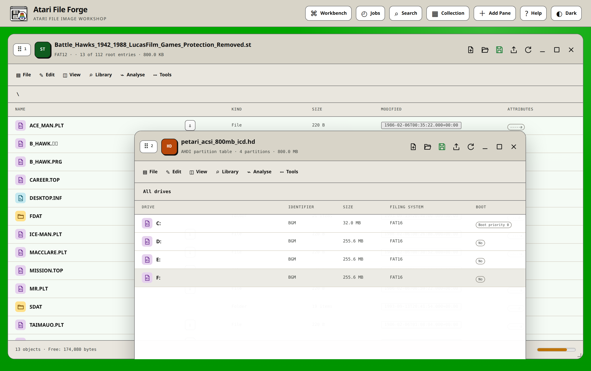

The light palette follows the GEM desktop of TOS 1.x and 2.06 on a colour
monitor: the medium-resolution green desktop, white windows with black window
furniture, the beige-grey ST chassis, TOS blue for primary actions and the warm
Atari Fuji orange for the selected row. Dark mode follows the ST low-resolution
screen, with its black desktop, white text and the same Fuji highlight.

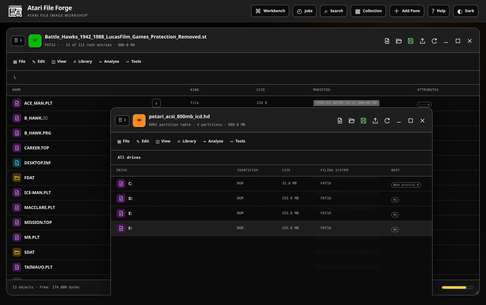

## Accessibility and themes

The frontend targets WCAG 2.2 AA in light and dark mode. It provides a skip
link, clear keyboard focus, labelled controls and image tables, focus-contained
dialogs, screen-reader status announcements, non-colour state cues and reduced
motion support. The layout remains usable with browser zoom and at narrow
viewport widths. Drag operations have keyboard alternatives: Cut, Copy and
Paste handle files and partitions, while Alt+Left and Alt+Right on a pane grip
reorders panes.

The operating-system colour preference is used on first visit. The Light / Dark
button in the header stores the chosen mode in the current host's private
state. Light mode is the GEM desktop as TOS drew it on a colour monitor: the
medium-resolution green desktop, white windows with black window furniture and
text, the beige-grey ST chassis for the chrome, TOS blue for primary actions
and title bars, and the warm end of the Atari Fuji rainbow for the selected
row. Dark mode is the ST low-resolution screen: a black desktop, white text,
the default sixteen-colour palette used sparingly for file-kind badges and
syntax colouring, and the same warm Fuji accent for selection and focus. Theme
colours live in `app/static/theme.css` as semantic custom properties. Layout,
typography and component geometry live separately in `app/static/styles.css`,
so another palette can be introduced without rewriting the interface. Any new
palette should keep normal text at 4.5:1 or better, large text and meaningful
graphics at 3:1 or better, and a clearly visible keyboard focus indicator.

## Quick start

The source lives at
[github.com/peteclarke-del/AtariFileForge](https://github.com/peteclarke-del/AtariFileForge).
Clone it over HTTPS and start the Docker service:

```bash
git clone https://github.com/peteclarke-del/AtariFileForge.git
cd AtariFileForge
docker compose up --build -d
```

SSH cloning also works when your GitHub public key is configured, but it is not
required to install or run the application.

Open <http://localhost:8684>.

Linux users can instead install the GTK 4 desktop host. GTK and Libadwaita
provide the window decorations, application menu, symbolic icons and local
file chooser, while managed emulators use native windows. The shared workbench
inherits the desktop font and colour preference. Large local images use a
filesystem clone or one sparse working copy rather than a browser upload:

```bash
tools/install-linux-desktop.sh
tools/atari-file-forge-desktop
```

Release builds also provide a native-architecture Debian package. Install it
on the Debian or Ubuntu release for which it was built:

```bash
sudo apt install ./atari-file-forge_0.0.0-1~deb13_amd64.deb
atari-file-forge
```

Stable releases provide Debian 13 and Ubuntu 24.04 packages for AMD64, ARM64
and ARMv7. Debian filenames contain `deb13`; Ubuntu filenames contain
`ubuntu24.04`. The package installs the application under
`/opt/atari-file-forge`, registers the launcher, icon, MIME types, AppStream
record and manual page, and vendors the pinned Python packages. The package
provides scalable and fixed-size icons and gives the GTK window the matching
desktop identity for reliable GNOME, Ubuntu Dock and X11 association. It does not
bundle Atari firmware or commercial media. The architecture-native HxC
converter and its private libraries are included so HFE workflows do not rely
on an untracked host tool. Build a package for the current machine with
`tools/build-linux-package.sh`; build the complete clean-tree release set with
`tools/build-release.sh`.

The native chooser accepts several images at once. Supported images can also
be dragged from the Linux file manager onto a pane. Matching HDA and GEO files
are paired before opening, and both paths use the fast private local-file
adapter rather than uploading bytes through WebKit. A review step applies the
active hardware profile, permits an explicit FFS target and distinguishes
separate ROM images from linear or byte-interleaved physical ROM sets. Native
opens are serialised, while a stable private owner and XDG-backed client state
retain sessions, workspace settings, profiles and the collection catalogue
across random-port desktop launches.

Read the [Linux desktop guide](docs/LINUX-DESKTOP.md) for prerequisite packages,
XDG storage, emulator paths and removal. The
[platform contract](docs/PLATFORM-CONTRACT.md) requires shared changes to be
implemented and tested for both web and desktop hosts.

If your system still uses the standalone Compose command, replace
`docker compose` with `docker-compose` in the examples below.

The container listens on port `8666` and Compose publishes it on `8684`, so
it does not collide with anything already using the default. Its working
images are stored in the
`atari-file-forge-work` Docker volume. Files selected in the browser are uploaded into
private working sessions; the application does not mount or alter the source
directory on the host.

To stop it:

```bash
docker compose down
```

To remove the saved working sessions as well:

```bash
docker compose down -v
```

Only use the second command when you really want to discard every working
copy.

The `samples/` directory is intentionally excluded from Git and from archives
made with `git archive`. Local test images can be large and may contain software
that is not ours to redistribute. Add your own fixtures there when developing;
they will not be committed or packaged.

## Current status

The current release is `0.0.0`. It provides the editing and transfer workflows
described in this guide, including movable, resizable and stackable panes, undo
and named checkpoints, owner-isolated recovery, background job tracking,
Rigid Disk Block partition maintenance, HFE handling, an Online Library
and machine-aware compatibility checks. A host-private collection catalogue
retains owned-image manifests, hashes, titles, publishers, machines and physical
locations, then reports duplicates, variants and missing wanted titles even when
those images are closed. The web edition uses origin-scoped IndexedDB; the Linux
desktop edition stores the same bounded state atomically in its private XDG
configuration directory.

Raw and banked ROM analysis, resident-module browsing, content-aware file
editors, archive browsing, guarded ST BASIC transformations and annotated
68000-family disassembly are included. The disassembler names library vector
calls through A6, identifies custom-chip registers and exception vectors, and
tracks which library base a routine has open. Cheat analysis combines static
evidence with tester-supplied emulator observations; proven changes can be
packaged as exact-hash guarded patches. A managed FS-UAE session supports every
medium the emulator can mount, including a whole-drive hand-off that attaches an
`.hdf` as a hard drive rather than extracting a volume from it. FS-UAE is the
one bundled emulator, chosen because it covers the whole Atari range in a single
portable build. Proven cheat findings are packaged as exact-hash guarded
patches.

A drive can be prepared with TOS from your own Workbench floppies: point at
the folder holding them and the disks are recognised by the volume name inside
each image rather than by its file name, matched to one release, and copied into
the layout the TOS install script produces. No TOS is shipped or
downloaded.

A floppy can then be installed onto that drive rather than only copied there, by
staging a multi-disc set into one tree, by installing WHDLoad, or by booting the
drive under emulation with the disc in `DF0:` so the title's own installer can
be run. Staged discs are written into a drawer on the target image rather than
into a directory on the computer running the workbench, so the install can be
finished inside the emulator or on the real machine, with the discs already
there. LHA archives are read in-tree, without an external decompressor.
[docs/INSTALL-GUIDE.md](docs/INSTALL-GUIDE.md) covers every method and is
explicit about which parts cannot be automated.

### Known limits of this build

These are stated here rather than discovered later:

- **DiskMasher writing.** A DMS track can be replaced only at its exact
  length, and only when it is stored uncompressed; same-length member edits are
  the only edit an archive's own size fields can survive. Reading is complete:
  `NOCOMP`, `SIMPLE`, `QUICK`, `MEDIUM`, `DEEP`, `HEAVY1` and `HEAVY2` are all
  decoded in-tree, along with the run-length pass every mode may apply, and the
  decoders are pinned byte-for-byte to the public-domain xDMS 1.3 reference.
- **Long-filename and third-party filing systems.** `DOS\6`, `DOS\7`, `PFS\3`,
  `SFS\0` and `SFS\2` are identified and reported, but opened read-only.
- **TOS disks.** No Workbench, Extras, Fonts or Locale disk is shipped or
  downloaded, and none can be: TOS is not free to redistribute. Installing
  Workbench needs the disk images of the release you own.
- **WHDLoad slaves.** WHDLoad itself is installed for you from its author's
  site. The per-title slave is not, and cannot be: `whdload.de` refuses its
  game index to anything that is not a browser session, and Aminet carries no
  slaves. Supply one yourself, bare or still inside its archive; an install
  without one is reported as incomplete rather than presented as finished.
- **IPF images.** Read when the SPS decoder library (`libcapsimage`) is
  installed, and refused with a plain explanation when it is not. That library
  is source-available under a non-commercial licence, so it is not bundled;
  [docs/IPF-GUIDE.md](docs/IPF-GUIDE.md) covers building it, where the
  workbench looks for it, and what an IPF can and cannot become.
- **Firmware.** No Kickstart ROM is shipped or downloaded. The emulator
  hand-off needs one you supply.
- **Online Library sources.** Every source has been run against the live site.
  Aminet, OS4Depot and itch.io search and download; an Aminet and an OS4Depot
  archive were both fetched whole and checked for a valid LHA header. Lemon
  Atari searches and is parsed correctly, but it is a reference database of
  titles, publishers and years with no downloadable media, so it contributes
  metadata and the duplicate check rather than installable results.

  Two are disabled because they cannot be reached, not because their parsers
  are wrong. Hall of Light now sits behind an Anubis proof-of-work bot check
  that answers an ordinary HTTP client with a challenge page. whdload.de
  returns 403 for `/games/` to every client tried, browser user agents
  included, while the rest of that site answers normally. Every Game Going
  ships disabled because its Atari machine identifiers have to be read from
  the site before a search can be sent to the right catalogue.

  A source that returns nothing is worth checking in **Library → Sources**
  before assuming it is broken: an archive can change its search form, and
  the shipped options describe the form as it was.
- **HFE creation.** Creating or converting an HFE needs the HxC converter,
  which the Docker image builds. A bare checkout reports it as unavailable
  rather than writing an unverified image.
- **The shipped ROM identity catalogue is empty.** A ROM identity is keyed by
  the exact SHA-256 of an image, so an entry only means anything once someone
  has hashed a ROM they hold. Add your own in **ROM Workbench → Identity**.

Atari media can contain unusual loaders, copy protection and filing-system
variants. Keep a known-good source image and test important downloads before
putting them onto real hardware. The application reports uncertainty rather than
claiming that an unproved conversion or launch path is safe.

Bug reports and proposed improvements can be raised in the
[GitHub repository](https://github.com/peteclarke-del/AtariFileForge). Read the
[contribution guide](CONTRIBUTING.md) before submitting a change and report
suspected vulnerabilities through the private process in
[SECURITY.md](SECURITY.md), not a public issue.
The [product backlog](docs/BACKLOG.md) records the agreed larger improvements,
splits completed foundations from unfinished work and keeps them separate from
the reusable release checklist.

## Documentation map

- The [documentation index](docs/README.md) is the quickest route to the right
  operational, media, editor, ROM, firmware or release reference.
- This README is the complete product, workflow and format guide.
- The [ROM image handbook](docs/ROM-GUIDE.md) is the deeper technical reference
  for bank layouts, decoded structures, ROM Workbench, patches and programmers.
- The [file editor and code analysis handbook](docs/FILE-EDITOR-GUIDE.md) covers
  content detection, BASIC and script editing, source transformations,
  disassembly projects, archives, synchronized bytes and emulator hand-off.
- The [installation guide](docs/INSTALLATION.md) covers Docker, Debian packages,
  Raspberry Pi builds, updates, retained sessions and common failures.
- The [Linux desktop guide](docs/LINUX-DESKTOP.md) covers the GTK application,
  native file handling, XDG storage and emulator configuration.
- The [physical floppy guide](docs/PHYSICAL-FLOPPY-GUIDE.md) covers optional
  Greaseweazle setup, supported images, verification and safe cancellation.
- The [platform contract](docs/PLATFORM-CONTRACT.md) defines the mandatory
  parity boundary between browser and native hosts.
- The [headless CLI guide](docs/CLI-GUIDE.md) covers automation, stable JSON results, dry-runs and deterministic recipes.
- The [private collection guide](docs/COLLECTION-GUIDE.md) covers web and Linux
  desktop indexing, stale revisions, reports, backups and privacy boundaries.
- The [cheat-candidate analysis guide](docs/CHEAT-ANALYSIS-GUIDE.md) covers BASIC and machine-code evidence, confidence, online references and safe emulator verification.
- The [release checklist](docs/RELEASE-CHECKLIST.md) defines the generated-media, fault-injection, benchmark, browser and real-hardware gates.
- [CONTRIBUTING.md](CONTRIBUTING.md), [SECURITY.md](SECURITY.md),
  [CODE_OF_CONDUCT.md](CODE_OF_CONDUCT.md) and [SUPPORT.md](SUPPORT.md) define
  how repository work and reports are handled.
- [GOVERNANCE.md](GOVERNANCE.md) defines maintainership, decision priorities,
  evidence requirements and release authority.
- [THIRD_PARTY_NOTICES.md](THIRD_PARTY_NOTICES.md) records the boundary between
  MIT-licensed project source, source-built tools, system packages, firmware
  and user media.
- **Help** in the application contains illustrated, task-based instructions and
  stays with the running version of the frontend.
- Every saved image ZIP contains its own generated `README.md` describing that
  exact image, target profile, checksums, catalogue, warnings and recovery
  notes. ROM archives also contain `ROM-project.json`.

Documentation screenshots are taken from the current Docker build. Screens
that contain media use real test images and decoded data rather than mockups.
Empty-state and configuration screens are captured from a clean isolated
workspace so they do not expose retained sessions or personal media.

## The basic workflow

1. The app starts with one full-width work pane. Open or create an image there.
2. Select **Add Pane** in the header when you need a source, destination or
   scratch area. There is no fixed pane-count limit. The practical limit is
   the browser, memory and available workspace area.
3. Double-click drawers or partitions to browse them. A volume pane opens at
   its root, shown as `:`. Use the `..` row to return to the parent, or select
   a breadcrumb to jump straight there.
4. Drag files, directories, disk images or ROM banks to their destination.
5. Use **Edit** to undo the latest operation or create a named checkpoint
   before a larger experiment.
6. Use **Tools → Check filesystem** after substantial edits.
7. Use **Save Image** in the pane heading to download the finished image.

Uploads are copied into an isolated workspace. Editing an image never writes
back to the original file selected in the browser.

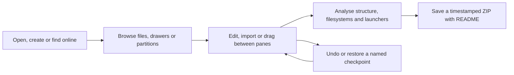

## Online Library

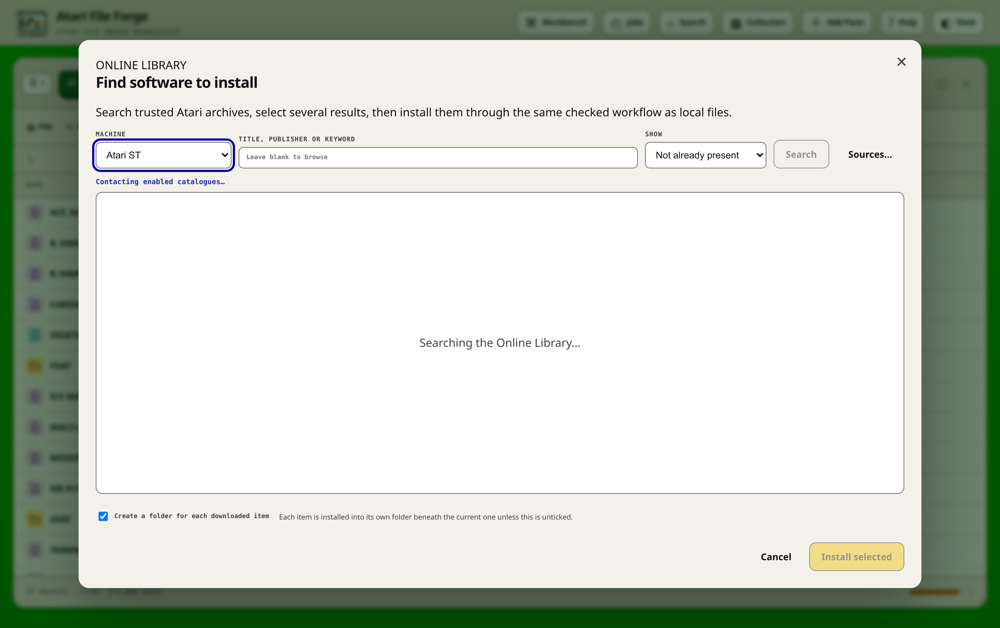

Every writable media pane has a **Library** menu offering **Find software
online**. It searches enabled catalogues on the server so a browser does not
need to negotiate cross-site download rules.

The initial machine filter comes from the Workbench hardware profile applied
to that pane. For panes without an applied profile, the remembered active
Workbench profile is used as the workspace default. A fresh browser starts with
an Atari 500. It is still only a starting value: choose another machine in
the Online Library whenever an individual search needs a wider or different
catalogue.

The built-in catalogue set is:

- Aminet, the Atari's own software archive, for LHA and DMS releases;
- the WHDLoad installer index for hard-drive-installable games;
- Hall of Light for title, publisher and year, which is the reference record
  of what was released for the machine;
- Lemon Atari for release details and cover material;
- Every Game Going, shipped disabled until its Atari machine identifiers are
  confirmed;
- itch.io homebrew searches restricted to Atari uploads;
- OS4Depot for TOS 4 packages;
- the Aminet development tree, shipped disabled because it is a source archive
  rather than a software catalogue.

Only records with a confirmed public DMS, ADF, ADZ, ADF, HFE, ZIP or TOS
package download appear. The app suppresses gallery pages, documentation-only
records and catalogue records whose item page
does not contain supported downloadable media. itch.io results are checked at
their project page and shown only when a supported Atari disk or DMS upload is
actually present. Its short-lived downprotection value is generated only when you
install the item.

Large provider indexes are checked in bounded pages. This matters for Every
Game Going, whose Atari 600 index contains several thousand release and media
records. The initial result set contains only entries whose detail page has
already confirmed a supported download. Choose **Find more downloadable
results** to validate the next provider page; repeat until the status says that
all matching catalogue entries have been checked. Shared `Atari/Atari 600`
releases are classified for both machine families and are included by an
Atari 600 search. **Not already present** reports how many verified results were
hidden; choose **All results** when auditing catalogue coverage.

Choose **Sources…** in the Online Library to enable or disable a catalogue,
change its URL, or add another compatible provider. Configuration is stored in
the persistent work volume as `catalog-sources.json`. Each provider record
contains its loading and parsing settings, including query templates, Atari 600
category roots, crawl paths, machine IDs, cache durations and validation
limits. Item and download path rules are configurable too.
Site-specific URLs and IDs therefore live in source configuration rather than
application logic.

The bundled defaults live in `app/catalog_sources.json`. The catalogue engine
only understands reusable loading stages such as a single page, category crawl
or machine index, reusable page layouts, embedded media query parameters, and
optional link or upload-button resolution. Machine-specific itch.io search
phrases also live in the source record.
It does not branch on a catalogue name or identifier. The copy in the work
volume contains local changes made through **Sources…**.

### Install online software into a drive or a floppy

1. Open the destination: a partition on a hard drive, or a floppy image.
2. Choose **Library → Find software online**, select a machine and search by
   title, publisher or keyword. A blank search browses the catalogue's current
   page.
3. Select the Title, Publisher, Year or Source heading to sort the results.
   The active heading shows ↑ for ascending or ↓ for descending order; select
   it again to reverse the order.
4. Choose **Not already present** to hide likely duplicates detected from
   volume and drawer titles and from remembered online distribution names.
   Punctuation and the publisher suffix saved during installation do not
   prevent a match. Choose **All results** to include them.
5. If the status says more catalogue entries remain, choose **Find more
   downloadable results**. The next bounded group is checked and merged into
   the current sortable selection without claiming unchecked links as files.
6. Select several downloadable results. Each one's expanded size is measured
   against the destination's free blocks before anything is written, so a batch
   that will not fit is refused before its first write rather than part way
   through.
7. Review the title, publisher, launcher, action and stack proposed for each
   installed item. Every proposal carries the evidence behind it, and an
   ambiguous one is marked rather than written silently.

Dragging or importing an ADF that is already open in another pane carries its
visible volume title into the destination drawer, shortened only to the
30-character GEMDOS name limit.

Multi-item installs run one download at a time and show the current title.
**Abort operation** lets the active item reach a safe image boundary, then
prevents the next download from starting. Completed items remain installed and
undo checkpoints are retained.

If one download contains the same program in several media formats, the app
uses the best native disk format once. For example, an ADF is preferred over a
duplicate DMS archive, so an import does not write the ADF and then complain
about the DMS. Installing into a blank ADF adopts the source catalogue and
disk title, padding shortened ADF distributions to the target's normal size.

The catalogue title and publisher seed the review form, while the actual disk
is still inspected for `DiskMenu`, `Startup-Sequence`, `Loader`, action and
stack size. An installed title therefore receives proper source metadata
without trusting a catalogue to describe the executable layout of the image.

### Add online software to a volume

For a blank ADF, the downloaded disk's catalogue and volume name are adopted
directly. For a volume that already holds files, or for an open partition,
files are copied into the current drawer. The 30-character name limit, free-space
checks and existing-file errors still apply.

Downloaded disk images extract into the current drawer by default. Select
**Create a drawer for each downloaded disk** when the software is
self-contained, or when several images would otherwise clash. The loader
compatibility checks described above apply to these imports too.

A floppy is not automatically a relocatable hard-drive application. Its loader
may name its files through the drive they arrived in, as `DF0:Game`, select a
drive explicitly, or read physical sectors. Hard-drive extraction follows the
reachable loader graph, including launch filenames stored in BASIC `DATA`, and
rewrites a proven `DF0:` to `DF3:` reference as a path relative to the script's
own drawer. The replacement is padded with spaces to the exact length it
replaced, so no offset in the file moves. Explicit filing-system or drive
changes and apparent direct sector I/O are reported as compatibility risks
rather than being guessed at. Such software should remain as a mounted floppy
image unless a title-specific hard-drive installer is available.

### Audit software already installed on a hard drive

Choose **Tools → Check installed disk software** in a hard-drive partition to
inspect software which was previously extracted from floppy images. The command
is not shown for floppy images. It recursively finds installation roots from the
source-image history retained by Atari File Forge and from conventional launch
files such as `Startup-Sequence`, `DiskMenu`, `Menu`, `Loader` and `Start`.

The first pass is read-only and can be limited to the current directory or run
across the whole HDD. Each detected installation reports its source image when
known, file count, exact deterministic repairs and unresolved warnings. Safe
repairs include floppy-device references such as `DF0:Game`, which are correct
in a drive and wrong on a hard drive, and volume-rooted paths that must become
relative once the software sits in a drawer. Explicit device assignments and
direct trackdisk access are reported for review but are never rewritten by
guesswork.

A path is resolved before any warning or rewrite is offered. `Data/Levels` is
preserved as the real path it is, rather than mistaken for a device reference.
The check applies to readable GEMDOS scripts and to ST BASIC programs.

ST BASIC launchers are rewritten line by line, and every changed line
receives a rebuilt length byte. The audit also detects the malformed line
lengths left by older rewrites and offers to repair them before analysing the
rest of the loader.

If repairs are available, select the directories to fix and choose **Repair
selected**. Choose **Cancel** to leave the image unchanged. The repair action
creates the normal automatic undo checkpoint and processes the selected batch
through one writable filesystem mount, which avoids repeatedly reopening a
large Hardfile HDA image. Run the audit again after repair to confirm that only
intentional warnings remain.

Saved image notices retain actual compatibility changes, but do not retain old
point-in-time loader diagnoses forever. Opening an older working session
consolidates repeated drawer and accelerator notices, and directs the user to
the hard-drive audit for current path-aware loader results. The pane reports the notice
count and latest item instead of placing the complete history in one oversized
toast. Retained byte-level repair history remains available in the generated README.

TOS packages install only into FFS or TOS images. The installer keeps
the application drawer structure and the protection bits an Atari-made archive
records, while omitting the package manager's own control drawer. An older
filing system can still reject a long name, which is a filesystem restriction
rather than a download failure.

Small remote catalogue pages are cached for 15 minutes. The larger Atari 600
World and Every Game Going indexes default to 24 hours, which can be changed in
their provider settings. Selected result tokens expire after an hour. Downloads
have fixed size limits, ZIP expansion is bounded, and path traversal members
are ignored. One unavailable source is reported under the remaining results
rather than cancelling a multi-source search. Availability in a catalogue does
not change a program's licence, so use the source page for permissions, payment
and release notes.

Drag an empty part of a pane heading, or its numbered grip, to place that window
anywhere in the workspace. Windows can overlap and the one selected most
recently moves to the front. Drag against an edge for a half-workspace layout,
against a corner for a quarter-workspace layout, or against the top edge to
maximise. Drag any edge or corner to resize. Double-click the grip to maximise
or restore it. A snapped pane begins resizing from its visible rectangle, and
free panes scale proportionally when the browser workspace changes size. With
the grip focused, Alt+Left and Alt+Right snap to either
side, Alt+Up maximises, and Alt+Down minimises.
Hold Shift with Alt and an arrow key to resize the focused pane in 32-pixel
steps.

There is no fixed pane-count limit. **Add Pane** creates another cascading
window whenever it is selected. Each open pane heading contains, in order, the
orange changed indicator and buttons for **New Blank Image**, **Load New
Image**, **Save Image**, **Refresh View**, **Minimise**, **Maximise/Restore** and
**Close Pane**. A minimised pane is kept on the workspace shelf and restores
with one click. Save is no longer duplicated in the file toolbar. The × closes
the whole pane, not merely the image inside it. A changed image prompts for
**Save and close**, **Close without saving**, or **Cancel**. Closing never
deletes its private working copy: use **Recover previous session** in another
pane to reopen it.
Empty panes also have a top-right ×. If every pane is closed, **Add Pane**
remains available in the header; a fresh browser workspace always begins with
one pane. Window positions, sizes, snap state, stack order and minimised state
are restored after a normal refresh and are included in project JSON exports.

After image validation, Save starts a native timestamped ZIP download and
opens a small confirmation dialog containing a direct **Download ZIP** link.
Once the download has been prepared, the orange changed indicator clears in
every pane showing that image. It returns after the next edit.
If a browser suppresses the automatic handoff after a long HDA/GEO validation,
use that link without returning to the work pane or risking the current session.
Every save uses the same foreground progress dialog. It covers validation,
checksums, the technical catalogue and construction of the complete ZIP. Small
floppy images move through those stages quickly; large HDA, HDF, RAW and HDF
images show real progress for as long as they need. The ready dialog appears
only after the timestamped ZIP is complete on disk. Starting the download then
hands an ordinary file with a known size to the browser immediately.
Hardfile HDA files usually contain large zero-filled free areas. Atari File
Forge stores those areas as sparse ranges in the private working copy and its
checkpoints, calculates checksums without physically rereading sparse holes,
and uses fast ZIP compression for sparse HDA downloads. Extracting the ZIP
still produces the complete byte-for-byte HDA size required by the hardware.

Click the image filename in any pane heading to rename the working image.
Press Enter or click elsewhere to keep the new name, or press Escape to cancel.
The media extension is preserved automatically, and a Hardfile HDA rename also
renames its matching GEO in the downloaded ZIP. This changes the container
filename used by recovery and download, not the volume title stored inside its
filesystem.

Each pane has its own refresh button. Long operations display a progress
overlay with the current phase, item count, elapsed time, measured throughput and estimated time remaining. Dialog action buttons disable
after the first valid click, which prevents accidental duplicate imports or
copies. The controls in a pane also disable as soon as a creative,
destructive, validation, or maintenance action starts. Changes to one image
are serialized so that two writes cannot modify it at the same time.

The meter at the lower-right of every populated pane shows real filesystem
usage. It fills green, then orange at 70%, and red at 90%. Hover over it for
used, free, total, and percentage figures in appropriate units. At a drive's
partition table it counts allocated and unallocated capacity; inside a
partition it reports that volume's own blocks. A DMS archive shows a neutral
unavailable meter, because an archive has no fixed filesystem free space.

## Undo and named checkpoints

Every request that can change an existing image begins by taking an automatic
checkpoint. If the request makes no change, that speculative checkpoint is
removed. If it succeeds, partially completes, or stops after some items in a
bulk operation, the previous state remains available through **Edit → Undo
last change**. Undo consumes the latest automatic point, so it can be repeated
to step backwards through the most recent operations. The newest 20 automatic
points are retained per working image.

Use **Edit → Checkpoints** to create a permanent named point before a large
import, compaction, or directory reorganisation. The same dialog
lists named checkpoints and recent automatic points. Any listed point can be
restored, and named points can be deleted when no longer required. Restoring a
checkpoint first saves the state it is replacing as a fresh automatic undo
point.

Checkpoints include the complete working image, its matching descriptor when
present, its displayed filename, source metadata, hardware target, warnings,
and dirty state. Partition and directory caches are rebuilt after a restore. Every pane showing the restored image refreshes from the restored
bytes.

On filesystems that support reflinks, snapshots use copy-on-write cloning. A
large HDD checkpoint is therefore normally quick and initially consumes space
only for blocks that later differ. When reflinks are unavailable, the fallback
copy preserves sparse zero ranges instead of writing hundreds of megabytes of
unused HDA capacity. The logical checkpoint remains a complete byte-for-byte
image and restores normally.

Checkpoints live inside the private, owner-isolated working session. They
survive normal refreshes and container restarts with the Docker work volume,
but clearing that recovery session or removing the volume removes its
checkpoints too. They are not a replacement for downloading an important
finished image.

## Workbench and analysis tools

Every open pane has an **Analyse** menu. These tools are read-only unless a
repair or reviewed edit is explicitly selected, and normal automatic
checkpoints still protect every write.

The header **Search** command searches every distinct image currently open in
the workspace. One query covers filenames and bounded readable BASIC, command
script and text content. A hard-drive search covers every partition; a volume
search traverses the complete drawer tree; Kickstart ROM and DMS searches use
their visible filing-system catalogues. Results identify the pane, image,
partition and path. Selecting a result restores a minimised pane, brings it to
the front, navigates to the containing partition and drawer, and opens the file
in the appropriate editor. Raw ROM banks are omitted because they are not a
filing system and already have structure, string and byte search in the ROM
Workbench and Hex editor.

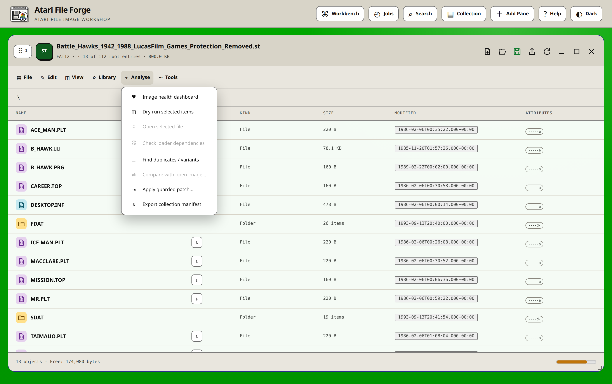

### Preflight and dry runs

Select files or directories and choose **Dry-run selected items**. The report
shows the proposed objects and detects target filename conversion, truncation,
case-insensitive clashes, and operations that cannot proceed. The bulk-import
planner provides the deeper format-specific preflight for large transfers,
including free-block capacity, group holders, shortened-name collisions,
existing populated destinations, blank disks, and the exact destination drawer
for every source.

### Unified image health

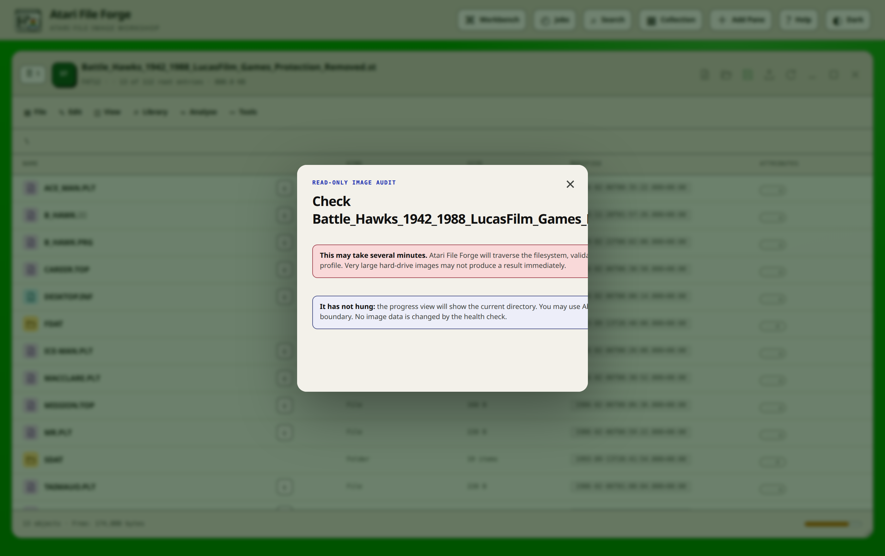

**Image health dashboard** brings the applicable checks together:

- filesystem structure and recursive catalogue access;
- Rigid Disk Block state, partition bounds and overlaps, and each partition's
  declared DOS type against the volume actually written there;
- launch-file existence, volume-title mapping, action and STACK evidence;
- Hardfile HDA/GEO geometry where present;
- compatibility warnings and the applied hardware profile.

Before the scan begins, the app warns that a large drive may take several
minutes. The progress display names the current partition and drawer, and
**Abort operation** stops at the next safe traversal boundary. Health checks do
not hash every file; full checksums remain available through manifests and the
duplicate finder, keeping routine structural checks substantially faster.

Repairs are offered only when the evidence is deterministic. For example, a
recorded stack size can be replaced when the selected tokenised BASIC launcher
proves a different one. Missing launchers and ambiguous dependencies remain
for review. The repair dialog itemises what is eligible and creates an undo
checkpoint before writing.

### Cheat-candidate analysis

Open one tokenised ST BASIC or machine-code file and choose **Tools → Find
cheat candidates** in its editor. The read-only report correlates semantic
BASIC state, plausible initial values, updates and terminal paths. For machine
code it joins initialisation, access to the same storage, updates, forward
terminal branches and saved labels.
Results are grouped by likely purpose and marked Strong, Likely or Possible.

The analyser suppresses unexplained memory writes, opaque BASIC countdowns,
backward decrement loops and likely copy, clear, scan or delay counters. It
retains reachable unlabelled state changes with a forward decision as Possible,
but excludes bytes reached only by speculative linear decoding. Loader commands
and packed or runtime-generated payloads are identified instead of being shown
as an unexplained zero-result scan. It explains the evidence and the risk, then
recommends an emulator watchpoint or control-flow check. Optional online title identification and configured
specialist searches can locate published research, but never modify the image
or claim that similarly named software has identical bytes. See the
[cheat-candidate analysis guide](docs/CHEAT-ANALYSIS-GUIDE.md).

For a machine-code candidate with an exact file offset, select the result and
choose **Prepare guarded patch**. The patch builder requires the watched
address, two distinct emulator gameplay observations, an explanation and an
author. It records the complete source SHA-256, original and replacement bytes,
hardware profile and rollback instructions. Apply checks that exact hash and
the guarded bytes again, then uses the normal automatic image checkpoint. A
host-private library retains up to 500 of these small patch records and
matches by exact file content, never by a title or filename. The observations
are deliberately entered by the tester: automatic debugger-to-gameplay
correlation remains an open proof gate and the UI does not pretend otherwise.

### Opening and editing files

Double-click a file in any filesystem pane to open it. The same viewer is
available through **Analyse → Open selected file**. The app examines the
contents instead of trusting the filename:

- a saved ST BASIC program opens as an editable, numbered source listing;
- `Startup-Sequence` and other recognised GEMDOS scripts open as editable,
  unnumbered scripts;
- readable Latin-1 files open in the text editor;
- binary files open in an annotated disassembly viewer;
- DMS archives, including gzip-compressed or extensionless DMS files, list
  every track with its compression mode and both CRCs. An uncompressed track
  allows a same-length edit after a structural preservation review;
- ZIP, TAR, TAR.GZ/TGZ, TAR.BZ2, TAR.XZ, standalone GZIP, BZIP2 and XZ files
  appear as archives and open as bounded folder hierarchies in the same pane.
  Double-clicking a member extracts it in memory and opens the appropriate
  BASIC, command-script, text, disassembly or hex viewer. Supported readable
  members can be edited and written back through a verified container rebuild;
- an empty or otherwise undecodable file falls back to the hex editor.

The download arrow beside every filename exports the original file and its
Atari metadata without opening it. This keeps opening, editing and downloading
as separate, predictable actions.

At a drive's partition table, every partition has the same download arrow. It
exports that partition as a standalone image named from its device name, so a
single volume can be handled without the whole drive.

Every row has a type icon: drawers use folder icons, partitions use disks, ROM banks use chips, containers use archive icons,
and BASIC, command-script, text and binary files use distinct document icons.
Names and TOS filetypes provide immediate safe classifications. Unlabelled
files up to 128 KiB are inspected through the filesystem mount that is already
open for the directory listing, so BASIC, command scripts, text, containers and
binary files normally have the right icon before they are opened. Results are
cached until the image changes. Larger unlabelled files remain generic binary
rows until opened, avoiding a costly scan of every file in a large HDA image.

The compact source window uses familiar **File**, **Edit** and **Tools** menus.
File provides Save, Save As, browser-local text export, metadata download and
Close. Save As creates a sibling inside the image and retains the original
Atari metadata and access state. Edit provides undo, redo, cut, copy, paste,
select all, find, and case-insensitive Find and Replace, with the usual keyboard
shortcuts. Replace Next works from the current selection and wraps once;
Replace All reports its exact replacement count. Unsaved text is never
discarded without a warning. Editors open centred at a useful desktop working
size and scale proportionally when the browser window is smaller. Drag the
title bar to move an editor, drag any edge or corner to resize it, or use the
title-bar square to maximise and
restore it. Double-clicking the title bar performs the same maximise or restore
action. Movement and sizing remain constrained to the visible browser window.


Command files remain unnumbered and retain their execution order. The editor
shown here was opened directly from the current Docker build, not recreated as
host text.

### Code-aware editing and help


Source editors highlight ST BASIC keywords, command-script operations,
strings, numbers, comments, symbols and line numbers using colours owned by the
normal light and dark themes. The editable textarea remains the real document,
so browser undo, clipboard access, input methods, selection and the existing
checked save path continue to work normally. The coloured layer never becomes
the source of saved text.

Commands with built-in reference information have dotted hover targets. Hover
one to see its purpose, syntax, target requirements and a practical warning
where one matters. Hover help appears only after the pointer settles on a
command. Moving away, scrolling, clicking, pressing Escape, switching windows
or refreshing the code view dismisses it, and only one tooltip can exist at a
time. For keyboard use, place the caret in or after a command on
the current line and press **F1**. The editor's **Help** menu also provides:

- an overview of the detected language and the commands used in the file;
- a searchable command reference;
- live problems that jump back to the relevant source position;
- document symbols for BASIC line numbers, subprograms, functions and important
  script targets.

An GEMDOS script and an ST BASIC program are told apart by vocabulary,
because GEMDOS names its commands without any sigil. `LOAD "Program"` in a
BASIC line is ST BASIC LOAD, while `Execute Loader` in a script is the
GEMDOS command. RUN and other overlapping names are resolved the same way. A
keyword glued to a name, such as `printer` or `total`, stays a variable,
because that is exactly what the interpreter's own tokeniser does with it. One
canonical language catalogue covers the ST BASIC 1.0 token table plus the
statements ST BASIC 1.2 added, and the selected dialect supplies availability
diagnostics.

Help also interprets useful constant operands in context. `POKEW &HDFF180,0`
names `COLOR00` and says the write goes straight to the hardware rather than to
program memory; an odd address given to a word or long write is reported,
because a 68000 cannot make that access. `SCREEN` explains what a chosen depth
costs in Chip RAM and warns when a mode interlaces. `LIBRARY` names the `.bmap`
file the call needs. `SOUND`, `WAVE`, `SAY` and `PALETTE` decode every argument
they can prove.

In assembly source, a `JSR` through a negative offset from A6 is named as the
library function it calls, using the immediate loads earlier on the same line
for its parameters. `MOVEA.L $4,A6` is recognised as reading ExecBase, and an
absolute operand naming a custom-chip or CIA register is labelled. Every result
is compared with the hardware profile applied to the pane: an AGA-only
operation viewed in an Atari 500 profile still explains the operation, and then
states that it is outside the configured target and may fail. Dynamic
expressions remain explicitly unknown rather than guessed.

The Edit menu can find every code reference to the symbol at the caret and can
rename that symbol as one undoable change. Strings and comments are excluded,
so changing a variable, subprogram or function name does not rewrite
user-facing text. The BASIC program outline groups subprograms and functions
with their call sites. Diagnostics also report unused definitions, mismatched
`SUB` and `END SUB` counts, and conservatively identified unreachable lines.

Find and Replace is a persistent editor panel rather than a chain of browser
prompts. It supports case matching, whole identifiers, regular expressions,
the current selection, previous/next navigation, a replacement preview and one
undoable Replace All. **Edit → Search files in this image** searches names and
bounded readable content across the mounted filesystem, including every
partition of a drive and every drawer below the current one. Results report the physical line and reopen the containing
directory before opening the file. **Tools → Analyse file dependencies** indexes
the whole image and distinguishes exact, unique-leaf, ambiguous, missing and
root-relative launcher references.

Completion at the caret is available with Ctrl+Space. It combines language
commands, identifiers, document symbols and small templates. Text and script
editors provide duplicate, move, join and delete line operations; BASIC keeps
the operations that cannot preserve line-number semantics disabled. The
conservative formatter removes trailing whitespace and normalises proven line
prefixes. BASIC formatting is offered only after a successful token round trip.
The File Properties dialog updates the protection bits, the file comment, the
Workbench icon type and the writable state without changing file content.

Refactor and Condense use a two-column review with the original source beside
the proposal. Changed rows are marked, and ST BASIC proposals are tokenised,
detokenised and tokenised again before they can be accepted. The review reports
the exact tokenised byte size and line count. **Tools → Verify BASIC round
trip** performs the same check without proposing a transformation. A retained
editor history lists accepted transformations and symbol changes made in the
current window.

**View → Show synchronized bytes** follows the source caret or selected
disassembly row and displays the corresponding saved bytes and printable text.
It is deliberately labelled as saved data when the source has unsaved edits.
The strip can open the same offset in the full Hex editor.

The tab strip keeps several files from the same mounted image open in one
editor workspace. Draft source, selection and scroll position survive a tab
switch and browser refresh, dirty tabs carry a visible marker, and closing one asks before
discarding edits. **Open from image…** searches filenames and bounded readable
content, restores the result's partition and drawer, and opens it in a new tab.
On a hard drive it searches every partition and identifies each result by
device name and volume title. Draft recovery is bounded and private to the
current browser tab.


The Project menu stores notes, bookmarks, symbols, offset-bound comments and
code/data decisions with
the recoverable working session and its checkpoints. In disassembly, shift-click
selects a range. It can be marked as code, text, bytes, 16-bit words, an address
table or bitmap data, then redisassembled using that decision. Symbols can be
renamed, imported from or exported to a simple `&address = label` text file.
The outline shows labelled regions and direct callers, while Find references
jumps to decoded users of the selected address. This metadata never changes the
file bytes.

Project metadata has a single management dialog for notes, symbols, bookmarks
and portable JSON. **Compare with saved file** presents current and saved source
side by side without touching the image. The selected-data inspector can show
ASCII, hexadecimal bytes, little-endian and big-endian words, and a bounded
1-bit bitmap interpretation of a disassembly range.

Managed emulator settings live in **Workbench → Hardware profiles → Emulator
and debugger integration**. FS-UAE is the one managed emulator, and the Docker
image builds a reviewed revision of it with deterministic key injection. It was
chosen deliberately: one portable build covers every machine from an A500 to an
A4000 and CD32, floppy and hard-drive attachment alike, which keeps testing and
debugging fast and keeps the capability checks honest rather than spread across
three tools with different gaps.

Selecting a machine chooses a sensible processor, controller, RAM size and
startup action. Apply the profile to the pane that should use it. Tests attach
the current bootable image, use bounded run times, and retain stdout, stderr and
return status in project history. Raw server command fields and deployment
command overrides are deliberately not exposed.

No Kickstart ROM is shipped or downloaded. Point the profile at one you own;
until you do, Run and Debug report the missing firmware rather than failing at
launch.

Two further local-only integrations are optional. `ATARI_FILE_ASSEMBLER_COMMAND`
must contain `{source}` and `{output}` and may use `{origin}` and
`{architecture}`. **Edit and reassemble** starts from label-oriented assembly
source, warns that the complete binary will be replaced, invokes the configured
tool without a shell, checks the source file hash and writes the output through
an undo checkpoint. Debugger output and return status are retained in project
test history. The assembler remains an expert deployment integration; emulator
and debugger selection is managed by the workbench.

Hovering a 68000 mnemonic, a library vector symbol such as `_LVOOpenLibrary`,
an absolute address such as `$DFF180`, or an assembler directive including
`DC.B`, `DC.W`, `DC.L`, `EVEN` and `SECTION` shows contextual help. Ordinary
BASIC variables are not mistaken for mnemonics. Processor membership comes from
one catalogue: the MC68000 instruction set, and the additions each of the
68010, 68020, 68030, 68040 and 68060 introduced, are kept distinct, so an
instruction the target machine cannot run is not offered as if it could.

The initial ST BASIC checks find missing, duplicate and out-of-order line
numbers, unresolved direct `GOTO`, `GOSUB` and `RESTORE` destinations, a `CALL`
with no matching `SUB`, a `SUB` with no `END SUB`, and unclosed strings. Script
checks flag unclosed strings and floppy-device references that will not resolve
once the software is on a hard drive. These are editing diagnostics, not a
substitute for running the software on its target machine.

The **Edit** menu can jump to a physical source line or an ST BASIC line number.
For BASIC, **Toggle comment** adds or removes `REM` across the selected lines. **Tools →
Normalise recognised commands** applies the convention for the detected
language without changing strings, comments or ordinary identifiers.
ST BASIC normalises its keywords to uppercase and GEMDOS scripts to the
mixed case the commands are named in. Existing whole-program renumbering remains available separately
because it also updates encoded BASIC line references.

ST BASIC subprograms, `FOR` and `WHILE` loops and structured `IF` and
`SELECT CASE` blocks have a small minus control in the left gutter. Select it to fold
the block and use the resulting plus control to restore it. The single
state-aware **View** command reads **Collapse all blocks** while everything is
expanded and **Expand all blocks** whenever blocks are collapsed. The original textarea and saved program are never
rewritten to produce the outline. Double-click a visible outline line to expand
everything and place the caret on that line before editing. Files open with all
blocks expanded.

**View → Structure guidance** draws live 2, 4, or 8-character guide steps beside
the editable BASIC source and highlights the innermost procedure, function,
loop or structured conditional containing the caret. This is deliberately a
display option. It does not insert indentation, replace the textarea, set the
dirty state or alter tokenised bytes. The guidance updates as the caret and
source move, so normal browser editing, selection and undo remain available.
Subprograms and multi-line functions are treated consistently: code after
`SUB name` or a multi-line `DEF FNname` receives another guide level until
`END SUB` or the function's leading `=` return. The scanner recognises closers
later on a physical line, including `NEXT:END SUB` and `CALL name:END SUB`. A
one-line `DEF FNname(...)=expression` does not open a block. Folding uses this same structure scan, so its controls match the visual
indentation.

**Tools → Refactor selection or program** uses the physical selection when one
exists, including a single selected line, or the complete BASIC program
otherwise. This is the single command for both untangling and wider cleanup. It normalises proven command
tokens, expands every statement boundary it can prove safe, renumbers the program from
10 in steps of 10, and updates direct line destinations, including every target
in an `ON … GOTO` or `ON … GOSUB` list. Refactor first opens a
non-destructive proposal in the code view. No line is changed or renumbered
until ✓ is selected and the confirmation is accepted; × discards the proposal
without touching the document or undo history. It deliberately does not rename
variables, alter strings, invent procedures or rewrite dynamic line expressions.
Those changes could alter ST BASIC's semantics, memory use or computed control
flow. An accepted rewrite is one undoable editor operation and retains the
logical cursor position and viewport. Visual indentation remains view-only.
Nested `IF … ELSE IF … ELSE` chains are expanded into explicit guarded branches
whose generated targets are resolved during the proposal. A compact `ON ERROR`
handler is expanded safely using an explicit `ON ERROR GOTO` target followed by
a normal-flow jump over the extracted handler. Its former colon-separated
actions can therefore occupy separate numbered lines without running when the
handler is installed.
Every other proven statement separator is expanded, including chains on a
`SUB` or `END SUB` line and statements inside each branch of an inline `IF`. A
line whose entire body is `:` is preserved exactly because ST BASIC requires
an executable no-op rather than an empty numbered source line. Compact command
spellings such as `PRINT"x"` and `CHAINf$` are recognised as statements rather
than being mistaken for computed line destinations. ST BASIC's
omitted-`THEN` assignment shorthand is also recognised when both
branches assign the same unambiguous variable, for example
`IF condition path$="one" ELSE path$="two"`. Cases whose statement boundary
cannot be proved remain unchanged for manual review.

Structure guidance classifies lines created by Refactor immediately using the
same block scanner as folding. A classic `IF condition THEN line` does not open
a multi-line block, so later physical lines reached by branching or fall-through
are not shown inside it. Presentation remains view-only and no tabs or spaces
are written into the tokenised program.

**Tools → Condense selection or program** performs the inverse operation. It
packs adjacent statements onto the fewest safe physical lines with `:`, while
preserving the first surviving line number and every explicit destination. The
actual ST BASIC tokeniser measures each proposed line, so tokenised keyword
savings are used without exceeding the 251-byte line limit. A target line always
starts a new packed line. Packing also stops after an inline `IF`, `ON ERROR`, `REM` or unconditional
transfer, and at structured branch boundaries. Programs that use computed line destinations or use `ERL` in
calculations or control flow are left unchanged because removing a physical
line number could alter their behaviour. Merely printing `ERL` in an error
handler is safe and does not block the transformation. Empty, untargeted
numbered lines inside the chosen range are removed.
Like Refactor, Condense first shows an original/proposed comparison with Accept
and Cancel controls, commits as
one undoable edit, and preserves the logical selection and viewport.

The parser recognises ST BASIC's block forms, including omitted `THEN`,
nested `ELSEIF`, subprograms, loops and `SELECT CASE`. Transformations are only
enabled for dialects the installed tokeniser can write back without changing
their byte format. An ST BASIC 1.2 program remains an annotated, read-only
listing at present; the app will not silently rewrite it as ST BASIC 1.0.

Every emitted disassembly row has contextual hover help across 68000, 68010,
68020, 68030, 68040 and 68060 output. This includes processor instructions,
condition and size variants, decoder-specific mnemonics, and data
pseudo-operations such as `DC.B`, `DC.W` and `DC.L`. The tooltip combines the
operation family, the exact decoded operand and addressing form, encoded bytes,
cross-references and the analyser's row comment. A library vector retains its
specific register conventions. An unfamiliar decoder mnemonic receives a
processor-specific fallback instead of losing its tooltip. The Help menu lists
the operations actually present alongside the instruction and library
reference. Disassembly help remains advisory because data bytes can decode as
plausible instructions.
Labelled disassembly regions have the same left-gutter controls and one
state-aware **View** command. Folding only hides rendered rows, so double-clicking any visible
instruction still opens its bytes at the matching Hex offset.


The complete operational and technical reference is in the
[file editor and code analysis handbook](docs/FILE-EDITOR-GUIDE.md).

The BASIC editor accepts complete numbered lines, so you can insert a line by
typing its number or remove it by deleting the line. Every displayed line has
a space after its line number. **Tools → Renumber BASIC** retokenises the
current listing and updates encoded targets used by statements such as `GOTO`,
`GOSUB` and `RESTORE`; numbers inside strings are left alone. Pasting offers a
choice between validating and normalising numbered ST BASIC source or
inserting the clipboard exactly as plain text. The complete listing must still
be valid BASIC when it is saved. Existing protection bits, comment and
datestamp are retained, and every save creates an automatic undo checkpoint. An
ST BASIC 1.0 program with a recognised trailing binary payload is editable:
Save replaces only the tokenised prefix and appends the original payload byte
for byte. ST BASIC 1.2 remains read-only because rewriting its extended token
stream as ST BASIC 1.0 would be unsafe.

The script editor is intended for files such as `Startup-Sequence`, `Loader`
and `Start`, and other content that is recognisably made from GEMDOS or BASIC
commands. It does not add line numbers. Lines are read in order by `Execute` or
the boot process, so they can be inserted, removed or rearranged directly. Detection checks both
content and conventional names, while a tokenised `Startup-Sequence` still opens in the
numbered BASIC editor.

The machine-code viewer uses the pane's hardware profile to choose the
processor, and falls back to the baseline 68000 when no profile is set. You can
override that with 68000, 68010, 68020, 68030, 68040 or 68060, change the load
origin and file offset, and request another block of bytes. The result is shown
as fixed-width source rather than a report table. Annotations follow values
only while they can be proved along the current code path. Immediate register
values are shown, a `JSR` through the base in A6 is named as the library
function it calls, and the registers that call takes are decoded from the
immediate loads that precede it. Branches explain their condition, and local
routines and destinations receive
stable semantic labels rather than anonymous `sub_` and `loc_` names. Proven
behaviour produces names such as `write_text_8120`, `open_close_file_834A`,
`loop_8057` and `equal_80C2`. File entry points use `program_entry_`, while
readable strings include a short, sanitised excerpt in their label. Detected
strings within the requested range are emitted directly as `DC.B` data rows
rather than left looking like accidental instructions. A referenced address
inside a string starts a separate labelled `DC.B` row so jumps and
cross-references remain exact; adjacent non-text bytes remain visible as
`DC.B`. Every
generated name retains its hexadecimal address suffix so similar routines stay
unambiguous. Hardware accesses identify the relevant Atari I/O region, execution
addresses are marked, and a `TRAP` is named with the exception vector it
raises. Known library calls and cross-references appear as semicolon comments
on the instruction they describe. The string list excludes incidental punctuation and
number runs that merely happen to be printable. Select a readable string to
jump to its decoded line, disassembling that block first when necessary.
Double-click an instruction when you deliberately want Hex at that exact file
offset. The File menu exports
the formatted disassembly as text, exports the unchanged binary, or downloads
the original with Atari metadata. Binary data can resemble instructions, so
the raw-byte view remains the final authority.

The disassembly grid measures the widest byte sequence and instruction in each
result, adds a small monospace gutter, and moves Annotation left whenever the
decoded instructions are short. Sensible caps prevent a long data declaration
from consuming the editor; hover a shortened byte or instruction cell for its
full contents. A sticky heading keeps the columns identifiable while scrolling.

Archive browsing validates member paths, ignores non-regular TAR objects and
limits archive, member and entry counts before expansion. Double-click an
archive to enter it, use its breadcrumbs or `..` to move around, then
double-click a member to inspect its extracted bytes in the normal
content-aware viewer. BASIC, command scripts and text are decoded as source;
machine code is disassembled; uncertain data opens in Hex. Readable members in
ZIP, TAR, compressed TAR, GZIP, BZIP2 and XZ containers can be edited. Save
rebuilds the complete container, checks both member and parent SHA-256 values,
then replaces the outer file through the normal image transaction and undo
checkpoint. A complete, unambiguous DMS member can also be edited when its
encoded length does not change. Before Save, the DMS-project review lists
every physical chunk, its type, length and checksum, and highlights the exact
standard-data chunks that will change. The rebuild preserves chunk order,
baud-rate changes, carrier tones, gaps, security cycles and unknown chunks byte
for byte. Incomplete, overlapping, cycle-level or length-changing edits remain
read-only. Use File or the row download arrow to export any unchanged member.

DMS detection examines the content rather than requiring a filename suffix.
This means a file such as `Games/Thrust` opens as a DMS container even though
its name has no `.dms`. Both raw and gzip-compressed DMS streams are
recognised. Each track becomes a row; a track that could not be unpacked stays
visible and is marked incomplete rather than discarded. Converting the archive
writes every track back at the cylinder it came from, so the result is the disk
the archive was made from.

Saving from the text, BASIC or file-level hex editor checks the file digest
first. If another operation changed it while the editor was open, the save is
refused rather than overwriting newer work.

**Check loader dependencies** resolves conventional targets beside the
launcher and reports missing or root-relative paths. Complete disk extraction
already copies every catalogue file, so local companion programs travel with
the launcher. The report explains when installing below FFS root is unsafe or
needs the existing guarded root-reference rewrite.

### Raw image and file hex editor

Choose **Tools → Hex editor** to open a raw editor over the relevant pane. It
works in small ranged pages, so opening a large HDF or Hardfile HDA does not
copy the complete image into browser memory. A paired Hardfile GEO can be
selected from the Component list when its geometry needs inspection.

The same editor is available for an individual file from its BASIC, text or
disassembly view. File-level raw writes preserve filesystem metadata and create
an undo checkpoint, but can still damage tokenised source or executable code,
so they use the same explicit dangerous-change confirmation.

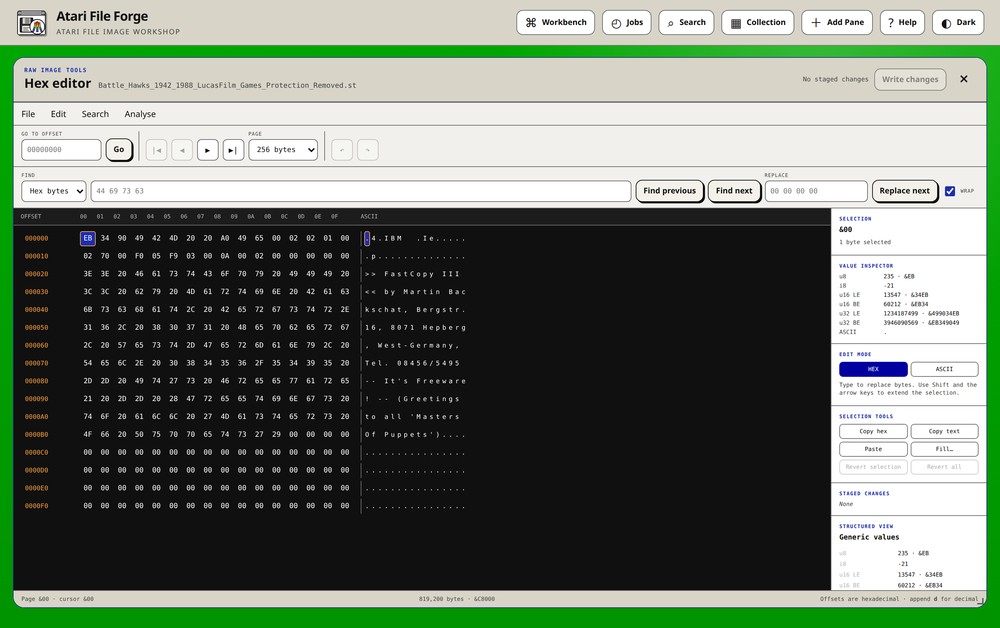

The editor provides:

- 16-byte rows with hexadecimal and ASCII cells;
- first, previous, next and last-page navigation, plus direct offset entry;
- 128, 256, 512 and 1,024-byte page sizes;
- hexadecimal and Latin-1 text search, forward or backward, with optional
  wrapping;
- fixed-size hexadecimal or Latin-1 replacement, with the matched byte range
  selected before it is staged. Search and replacement values must contain the
  same number of bytes because raw editing cannot resize an image;
- byte and range selection using click, Shift-click or Shift plus the arrow
  keys;
- hexadecimal or ASCII typing modes;
- copy as hex or text, paste, fill, revert selection and revert all;
- editor-local undo and redo before anything reaches the image;
- structured decoding for ROM, Kickstart ROM, TOS module, OFS, FFS, the
  Rigid Disk Block, Hardfile GEO and DMS data, plus bounded custom JSON
  templates;
- unsigned 8, 16 and 32-bit value views in little and big-endian order;
- a staged-change list with direct navigation to every changed offset.

Raw edits always overwrite existing bytes. The editor cannot insert, delete or
resize an image because changing container geometry that way would silently
invalidate most Atari filesystems. Before a write, the app displays **This is
dangerous. Are you sure?** and explains that raw edits bypass filesystem rules.
The backend checks that the image has not changed since the editor loaded it,
creates an automatic undo checkpoint, writes only the reviewed ranges, flushes
them to storage and invalidates cached catalogue and partition data. Closing with
staged changes offers Keep editing, Discard changes, or Review and write.

After a raw edit, refresh the pane and run **Analyse → Image health dashboard**.
The image remains marked as changed until its timestamped ZIP is saved. An HFE
whose advanced track data is protected can be inspected in the hex editor, but
its Write changes control remains disabled.

Useful shortcuts while the editor has focus are Ctrl/Cmd-S to review and write,
Ctrl/Cmd-Z and Ctrl/Cmd-Y for editor undo and redo, Ctrl/Cmd-F to search,
Ctrl/Cmd-H to move to replacement controls,
Ctrl/Cmd-G to enter an offset, Ctrl/Cmd-C and Ctrl/Cmd-V for byte selections,
the arrow keys to move, Shift plus the arrow keys to extend a selection, and
Escape to close safely.

### Workspace search

The header **Search** command scans every distinct open filesystem with one
query, including every partition of an open drive. It searches filenames,
protection bits, comments, datestamps, bounded BASIC and script text,
and useful printable strings inside binary files and raw ROM banks. Recognised
volume titles, publishers, launch actions and STACK values are indexed too. ROM Workbench identity, symbols, regions, notes and
saved disassembly comments participate in the same search. Enter an 8 to 64
digit SHA-256 prefix to identify exact file content; the result shows the
complete digest. Each result identifies its pane, image, path, partition or
ROM bank. Opening a result restores and raises that pane, navigates to
the containing location and opens the file, ROM Workbench tab or saved address.
Binary-string results go directly to the matching disassembly or Hex offset.
File scanning and result counts are bounded so an accidental broad query
cannot consume unbounded memory.

### Manifests, duplicates, and variants

**Export collection manifest** produces JSON or CSV. A hard drive's JSON
contains every partition, its declared DOS type and device name, access state,
source names, per-volume and per-file SHA-256 values, and the protection bits,
comment and datestamp GEMDOS records for each file. Floppy, DMS and ROM
manifests recursively catalogue their visible objects and metadata in the same
shape.

**Compare with open image** builds the same complete logical manifest for two
open images and matches records by filesystem location, partition or
ROM bank. Added and removed objects are separated from changed content and
metadata-only changes. A file that has moved or been renamed is reported
directly when its content, size and filesystem context provide one unique
match. Ambiguous duplicates remain separate additions and removals rather than
being guessed. Full file and volume SHA-256 values distinguish a real payload
change from allocation or directory movement. Each report includes
deterministic base and candidate fingerprints and can be exported as JSON for
review, automation or later patch planning. Comparing different filesystem
families is allowed as an inventory exercise, but the result is explicitly
marked as unsuitable for a directly applicable patch. The same report joins
that logical evidence to changed raw-byte ranges for the primary image and,
where present, its companion descriptor. Equal one-megabyte chunks are skipped
as units, avoiding per-byte range construction across large unchanged HDD
areas. The shared raw-comparison safety limit covers the first 1 GiB of the
common span and explicitly marks larger comparisons as bounded.

When two images use the same filesystem family, compatible partition layout and
ROM bank size, the comparison can also create an `.affpatch.zip`. Tick logical
changes to export only that reviewed subset, or leave every checkbox clear to
export the full comparison. Selective patches derive a new candidate
fingerprint and automatically close dependencies around new parent drawers,
removed drawer descendants and complete partitions. The archive contains a
readable patch plan plus only the added or changed payload bytes. Payloads are
checksummed and streamed straight into the ZIP, so a large GEMDOS batch does
not accumulate every changed file in application memory. Comparison, archive
creation and preflight verification report the current catalogue, checksum or
payload phase, together with byte or item counts, elapsed time, measured
throughput and ETA where meaningful. Abort stops these read-only stages at the
next stream or catalogue boundary without changing either image. Applying it
through **Analyse → Apply guarded patch** first performs a read-only preflight.
The dialog checks the format, physical layout, exact base fingerprint and
SHA-256 of every embedded payload, then shows the source and candidate names,
change counts and an itemised operation preview. The Apply button remains
disabled until that inspection succeeds. Applying the verified archive creates
an automatic checkpoint, repeats the validation before the first write,
performs the operations and verifies the complete candidate fingerprint. Abort
during application restores that checkpoint, so a partial patch is not kept. A
stale, damaged or wrong-format patch is rejected. A failed final verification
reports the first mismatched logical object and the mutation wrapper restores
the checkpoint rather than leaving a half-applied image.

**Analyse → Dry-run selected items** produces the versioned Atari File Forge
compatibility-report document without writing to the image. It records the
source and target format, proposed target name, protection bits, comment and
datestamp for every selected item. Filename conversions,
directory loss and unsupported metadata are attached to the
individual item that caused them. The reviewed report can be downloaded as
JSON for automation or Markdown for a package record. Choose **Keep with saved
image** after a report passes to retain it with the working session. The next
saved ZIP includes the accepted JSON and Markdown below `Compatibility/`, and
the generated README identifies the accepted operation and review time.

The same report is now mandatory before a cross-format batch started by pane
drag and drop, Cut/Copy/Paste, **File → Insert File**, folder import or Online
Library. It is built before the first destination write. Blocking name clashes
or directory losses stop the operation, while reviewable conversions remain
attached to the individual item. Online Library displays the report inside its
existing results dialog and requires a second Install action after review.
When an import creates child drawers, their final names are allocated against
the complete selected batch and the destination's existing entries before
review. Truncation collisions receive stable numeric
suffixes, and the server rechecks each name as it writes. A genuinely blocking
report offers **Change selection or import options**; it never presents a
disabled control labelled as though it could resolve the problem itself.

### Hardware deployment packages

Choose **Tools → Build hardware deployment** in any applicable pane to build a
checked directory tree for Gotek/FlashFloppy, a whole-drive `.hdf`, Hardfile,
PiStorm or an TOS host. The assistant works on an isolated sparse snapshot. Hardware
finalisation, hashing and package generation therefore do not advance the disc
ID or otherwise alter the image still open in the workspace.

The validation screen lists exact target paths, sizes, SHA-256 values,
hardware-profile warnings and the manual installation checks. Download remains
disabled when a finding is blocking. A changed source revision also invalidates
an approved plan before download. The ZIP contains the target media tree,
`README.md`, `Deployment/manifest.json` and the Markdown compatibility report.
Gotek packages support native filenames and indexed `DSKA0000` navigation;
a whole-drive package uses a root `ATARI.HDF`; Hardfile uses the matched
`Hardfile0/scsi0.hda` and `scsi0.geo` layout; PiStorm produces a merge tree that
does not replace firmware or configuration; TOS packages retain controller
attachment as an explicit manual step. The complete procedure and limits are
in the [hardware deployment guide](docs/HARDWARE-DEPLOYMENT-GUIDE.md).

**Find duplicates / variants** uses full SHA-256 hashes for byte-identical
content and a conservative normalised-title comparison for likely release or
side variants. It reports candidates rather than deleting anything.

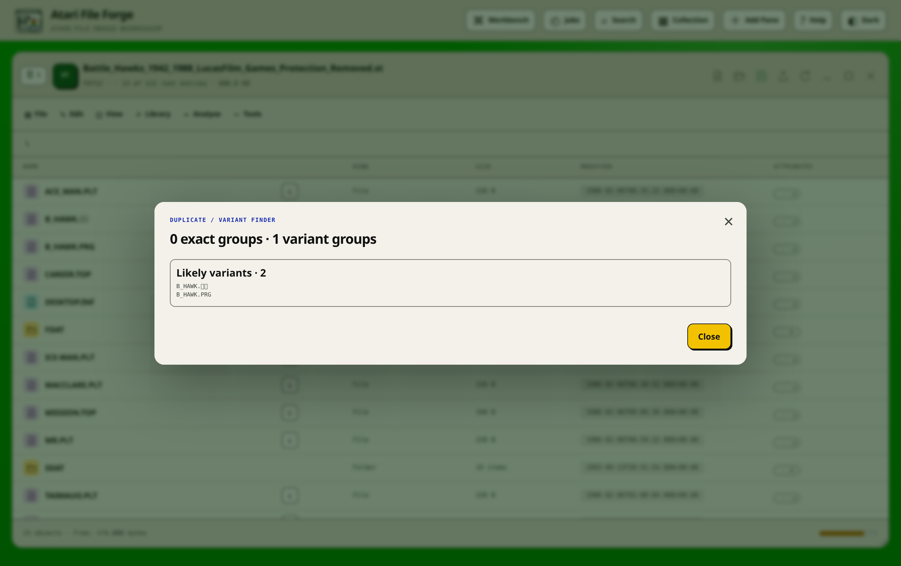

The scan compares detected titles across differently named volumes and drawers,
so the same game installed twice under two labels is reported. It also
fingerprints each volume's catalogued filenames, protection bits, comments,
sizes and SHA-256 file hashes, which finds equivalent contents whose titles
differ. Byte-identical whole-volume matches are kept as a separate strongest
signal. Every duplicate row carries its own checkbox, all of them clear to
start, and a compilation lists the other titles it holds before you delete it.
The complete operation receives one automatic undo checkpoint.

The image health dashboard itemises every failed record. Each finding shows its
title, volume, path, launcher and action, STACK, exact problem, and the
evidence found in the loader, which makes a failed audit useful without running
a second report.

Online Library's **Not already present** view compares results with volume and
drawer titles and with remembered online distribution names. Punctuation and
the publisher suffix saved during an online import do not stop an installed
title from being recognised.

### Hardware profiles and import recipes

The header **Workbench** includes reusable hardware profiles for stock Atari
500, 500+, 600, 1200, 2000, 3000, 4000 and CD32 systems, together with common
OFS, FFS and hardfile configurations. A profile starts with a base machine and
adds only compatible Kickstart revisions, disk interfaces, memory, mass storage,
CPU accelerators and Zorro expansion cards. A PiStorm replaces the processor,
so it cannot be combined with another accelerator, and the two boards are not
interchangeable: the original sits in a socketed 68000, which is why it is
offered for the A500, A500+, A600 and A2000, while the PiStorm32 fits the
A1200's CPU slot and is offered there alone. Mutually exclusive choices
use dropdowns, while genuinely cumulative hardware uses bounded checkboxes.
Required carrier or bus expansions are selected automatically, and removing a
dependency also removes any combination that can no longer exist.

A profile also records the Online Library filter, filing system, FastFileSystem ROM build,
expected stack size, FFS validation target, and managed emulator, debugger, RAM and
startup choices. Custom profiles are stored in the current host's private state and the applied
profile is also persisted with the private image session. The health dashboard
highlights conflicts such as running OCS or ECS software on a profile that
fits a CPU accelerator and its Fast RAM. The active Workbench profile is remembered and supplies the workspace
default used by **Library → Find software online** on panes without their own
profile. Selecting,
saving, or applying a different profile changes that default.

Pane **Tools** menus and file editors use that same effective profile for every
emulator and debugger capability check. An OFS or FFS floppy, a supported hard
drive or a DMS archive can be mounted and run directly from its pane. A floppy
is copied to temporary media before launch, so emulator writes cannot alter the
working image. The same commands remain available while browsing inside a
partition.

Opening a BASIC program offers three explicit launch paths:
tokenise and inject the current editor buffer into a temporary bootable floppy,
mount and boot the complete parent image, or mount the parent without autoboot.
The isolated test includes unsaved editor text but no companion files. Parent
mounting retains dependencies and is offered only when the emulator supports
that container. Messages name the effective machine profile rather than
reporting a capability from a different one.
Expected ALSA and virtual-X shutdown chatter is suppressed. Retained results
still show meaningful Kickstart and accelerator setup notices, the emulator, machine, launch
mode and whether the bounded test window completed normally.
Interactive Run and Debug open the managed emulator in a browser-embedded noVNC
display on port 8668. The viewer supports full-screen display and an explicit
Stop and close action. Only one managed interactive emulator runs at a time.

The Tools menu also shows a separate whole-drive target. Atari File Forge
copies the working `.hdf` to a private file, attaches that copy to the FS-UAE
hard-drive controller the applied profile declares, and boots from it. The
working image itself is never given to the emulator, so Run and Debug cannot
corrupt it. A profile with no mass-storage interface says so plainly instead of
attaching a drive the machine could not have.

Online Library search results carry short-lived server-side download tokens.
They are retained for one hour in the private application work area, so a safe
container restart does not invalidate a search dialog that is already open.

Import recipes record the drawer naming strategy, group prefix, online
metadata preference and guarded compatibility rewrites. They appear in the bulk
import planner and can be adjusted for exceptional disks without changing the
saved recipe.

### Portable projects

Workbench can export an `.aff-project.json` description containing all open
pane positions, image names and private session references, the current
partition and path in each pane, hardware profiles, and import recipes. Importing it on the
same retained installation restores that working context. Theme remains a
browser preference rather than part of the imported project. The project is
kept small by referring to private working sessions; image bytes remain in the
Docker volume and in the normal timestamped image ZIP backups.

The same **Portable project** screen can export a completed image as a
deterministic workflow bundle. It starts from the earliest retained pre-change
checkpoint, builds and proves a guarded `.affpatch.zip`, records the physical
and logical identity of the required base image and GEO companion, and
calculates the exact hashes produced by that deterministic replay.
Hardware-profile choices and accepted
compatibility reports are retained as non-secret decisions. The bundled
README gives the complete `recipe-run` command. Rebuild stops if the base,
descriptor, patch payload or final output differs from the recorded identity.
Original image bytes are not duplicated in the workflow ZIP.

This facility covers writable OFS, FFS, hard-drive, ROM and Kickstart ROM
sessions. DMS and
HFE workflow export remains disabled because replay must preserve their dms
timing or track-container details, not merely the decoded filesystem.

### Persistent jobs

Long transfer records are written to `operations.json` in the work volume.
The header **Jobs** panel shows the phase, item count, completion state, time,
completed and skipped disks, and errors even after the foreground dialog
closes. A restart changes unfinished records to **interrupted** instead of
losing them. Resumable bulk jobs retain their safe request plan and omit
already completed or skipped sources when **Resume** is selected. Abort
still stops only at a safe filesystem boundary.

## Supported media

Every media family in this table is browseable through the normal pane
workflow. Support means that Atari File Forge opens the image, identifies the
filing system or media structure inside it, and presents its files, drawers,
partitions, tracks, ROM banks or resident modules as appropriate. Recognition alone
is not treated as format support: a container whose decoded contents use an
unrecognised filing system is rejected with that distinction made clear.

| Media | Common names | What Atari File Forge can do |
|---|---|---|
| GEMDOS floppy | ADF | Browse, add, export, rename, move, delete, protect, comment, defragment and validate every DOS type from `DOS\0` to `DOS\5` |
| Partitioned hard drive | HDF, HDZ, RDSK | Read the Rigid Disk Block, list every partition with its device name, DOS type, boot flag and priority, and open each one as an ordinary volume |
| RDB-less hardfile | HDA with a GEO sidecar | Browse and edit a bare volume whose geometry comes from its sidecar, and keep the two in step on save |
| Raw drive dump | IMG, RAW, BIN, extensionless images | Identify the filing system from its contents, then open it as OFS, FFS or a partitioned drive |
| DiskMasher archive | DMS | List every track with its compression mode and both CRCs, decode every compression mode DiskMasher defines, and rebuild the disk as an ADF |
| HxC floppy container | HFE v1, v2 and v3 | Decode OFS or FFS sectors for browsing and extraction; safely edit ordinary HFE v1 disks and save them back with their original track layout |
| SuperCard Pro flux capture | SCP | Decode OFS or FFS sectors for browsing and extraction; edit captures that HxCFE can re-encode byte-for-byte, otherwise browse and copy read-only |
| SPS preservation capture | IPF | Decode the ordinary GEMDOS sectors into a working ADF when the SPS decoder library is installed, reporting every sector the capture holds in a form an ADF cannot |
| Kickstart and expansion ROM | ROM, KICK, A500, A600, A1200, A3000, A4000, CD32 | Verify the size header, declared size and reset checksum; browse banks; edit bytes; split and combine byte-wide chip sets for an EPROM programmer |
| ROM resident modules | any ROM with `$4AFC` tags | Browse every resident module as a read-only filing system, with its name, version, priority, node type and identification string; export any module's bytes |

The file extension is only a hint. Generic names such as `HardDisk4`,
`drive.img` or `backup.bin` are inspected by content, so an FFS floppy renamed
to `.bin` is still opened as an FFS floppy. An `.adf` says nothing about which
filing system formatted it; only its boot block knows, and that is read at open
time.

### The filing systems

An Atari floppy and an Atari hard-drive partition use the same filing system,
which is why copying between them is an ordinary operation here rather than a
conversion. The variants differ in only three decisions, and the workbench
reports all three for every mounted volume:

| DOS type | Name | Data blocks | Name hashing | Directories |
|---|---|---|---|---|
| `DOS\0` | OFS | 24-byte header per block | ASCII | hash table |
| `DOS\1` | FFS | whole 512-byte blocks | ASCII | hash table |
| `DOS\2` | OFS International | 24-byte header per block | Latin-1 folding | hash table |
| `DOS\3` | FFS International | whole 512-byte blocks | Latin-1 folding | hash table |
| `DOS\4` | OFS Directory Cache | 24-byte header per block | Latin-1 folding | hash table plus cache |
| `DOS\5` | FFS Directory Cache | whole 512-byte blocks | Latin-1 folding | hash table plus cache |

`DOS\6` and `DOS\7` (long filenames), `PFS\3` and the `SFS` types are
recognised and reported, but this build opens them read-only rather than
writing structures it cannot verify.

Which of these a machine can mount is not a matter of taste. A Kickstart 1.3
machine has no FastFileSystem in ROM, so an FFS volume will not mount at all
until `L:FastFileSystem` and a Mountlist entry are present. Choosing a target
machine in the pane makes Atari File Forge check that for you and say so before
you write the image to real media.

### Images you can create

Use **File → New → New Image (current format)** to start with the format that
matches the current pane. An unused pane is selected automatically, and a new
pane is added when every existing pane contains an image. It opens as another
cascading workspace window, without replacing or prompting to save an existing
image. The creation dialog then offers:

**DS/DD floppies, 880 KiB**

- OFS ADF, `DOS\0`, for a Kickstart 1.x machine
- OFS International ADF, `DOS\2`
- OFS Directory Cache ADF, `DOS\4`
- FFS ADF, `DOS\1`
- FFS International ADF, `DOS\3`, the usual choice for Kickstart 3.x
- FFS Directory Cache ADF, `DOS\5`

**High-density floppies, 1760 KiB**

- OFS International, FFS International and FFS Directory Cache. Only the
  high-density drives of the A3000 and A4000 read these; the rest of the range
  is DS/DD only.

**Gotek and HxC**

- Any of the above, wrapped as an HFE track image

**Hard drives**

- A UAE hardfile as a matched HDA and GEO sidecar pair
- A partitioned drive as an HDF with a Rigid Disk Block
- A raw physical-drive image

Either kind of hard drive converts to the other through **File → Export as…**.
Adding a Rigid Disk Block copies the volume across unchanged and reserves one
cylinder in front of it for the partition table, so the drive then declares its
own geometry. Removing one exports the open partition as a bare `.hdf` with a
`.geo` sidecar carrying the geometry that the partition table used to hold; the
two files are only usable together. The working image is untouched either way.

**ROM**

- A blank ROM image from 256 bytes to 64 MiB, with a configurable bank size,
  erased byte, family and linear, two-chip or four-chip byte layout
- An expansion ROM built around one valid resident tag, at 256 KiB, 512 KiB or
  1 MiB: size header, reset vector, module name, identification string,
  declared size and a correct reset checksum

Hard-drive capacity is entered as a size such as `4MB`, `20MB` or `512MB`. The
size field follows the selected format: fixed-size floppy and HFE choices show
their real capacity in a read-only field, while hardfile, HDF and RAW choices
keep it editable and preserve the last typed capacity as you switch between
formats.

A new partitioned drive is created with a Rigid Disk Block and one FFS
International partition, which is what an Atari expects to find. The title you
enter is written both to that volume's root block and to the partition's RDB
device name, so the drive mounts correctly on real hardware and in an
emulator.

A newly created hardfile stays linked to its GEO sidecar while it is edited and
downloads as a ZIP containing both. The sidecar's surfaces, sectors and
cylinders are chosen so that they multiply back to exactly the file's size,
because an emulator that finds a mismatch refuses the hardfile rather than
guessing.

When adding a recognised ADF, HFE, HDF or DMS image to an open hard drive,
Atari File Forge uploads it once and shows a bounded catalogue preview before
anything is written. Extraction defaults to the drawer currently shown in the
pane. You can open the directory picker to choose a different existing
destination, and optionally create a named child drawer inside it. The original
image can instead be kept as an ordinary file. Direct extraction never
overwrites an existing name, and it makes an efficient rollback copy of the
working image first, so a failed or aborted copy restores the destination
rather than leaving a partial import behind.

## Drag and drop

Drag and drop is format-aware. The application will only offer an operation
that makes sense for the target filing system.

The same format-aware transfer rules are available from a conventional pane
menu bar. **File** and **Edit** are always first, followed by **View**,
**Library**, **Analyse**, and **Tools**. File contains image open/save plus
add/create actions. Edit contains clipboard commands, Undo and Checkpoints.
View contains refresh and the command that returns to a drive's partition
table. The pane-heading icons remain quick shortcuts.

Open **File** to insert a file or create the directory/catalogue object supported
by the current filesystem. Open **Edit** for **Cut**, **Copy** and **Paste**.
The clipboard is intentionally single-use: browsing and selecting a destination
keeps it, while a successful paste, cancelling paste, pressing Escape, or
starting another image-changing operation clears it. Use Ctrl/Cmd-X,
Ctrl/Cmd-C and Ctrl/Cmd-V when a pane has focus.

**File → Insert Folder & Contents** provides a batch host-folder import. Review
the preflight and choose either to recreate the selected folder tree beneath the
current drawer or flatten every file into it. Names are checked against the
30-character GEMDOS limit and the three reserved characters before anything is
written. **Insert folder of disk images** searches the complete selected tree
for ADF, ADZ, HFE, DMS and ZIP distributions, ignores unrelated files, and
imports the matches into the current drawer, one per disk. The folder picker
selects one tree; drag several folders onto a pane when the browser supports
multi-folder drops. A single preflight lists the operation and ignored files
before the image changes, and FFS/OFS folder batches use one filesystem mount
and one undo checkpoint rather than one request per file.

When several loose files or disk images are selected, the first review dialog
offers **Apply to all remaining**. That accepts each later item's own detected
defaults, legal filename and source metadata rather than stamping the first
file's load or file comment onto the complete batch. The same shortcut is
available for repeated metadata reviews. Image-to-image copies read the
protection bits, comment and datestamp from the source catalogue. Loose host
files do not carry those values, so Atari File Forge also recognises companion
`.inf` sidecars written by Atari tools. It uses neutral metadata only when no
reliable source exists.

Double-clicking an ordinary file opens the appropriate BASIC, text,
disassembly or hex view. The download arrow beside the filename exports a small
ZIP containing the loose file and its matching `.inf` sidecar. The sidecar
records the file's real path in the volume, plus its protection bits, comment,
datestamp and length, so moving the file through a modern host filesystem does not discard its
Atari identity. Complete ADF, ADZ, FFS, HFE and HDF image saves do not receive
a bogus image-level `.inf`: those formats already carry the metadata internally
and their download ZIP includes the technical README and catalogue instead.
HDA saves continue to include the required matching GEO geometry file.

### Files and directories

- Use **File → New → New file** in any writable drawer. The filename is
  checked against the 30-character GEMDOS limit, the initial file is zero
  bytes, and its protection is the ordinary `----rwed`. Existing files are
  never replaced.
- File-level panes have **Protection**, **Comment** and **Date** columns, which
  are the three things GEMDOS actually records about a file. Protection is
  shown the way `List` shows it, as the eight `hsparwed` letters.
- The four low bits are stored inverted: a set bit denies the operation, so an
  ordinary readable, writable, executable, deletable file stores `0x00` and
  displays `----rwed`, while a locked one stores `0x05` and displays
  `----r-e-`. Editing works in the letters, not the raw value, because the
  inversion is the commonest source of mistakes when reading Atari metadata by
  hand.
- Editing protection, the comment or the datestamp changes the file header in
  place and does not rewrite the file payload.
- Read the [file metadata guide](docs/FILE-METADATA-GUIDE.md) for the
  format-specific representation, `.inf` syntax, metadata priority and a
  practical verification checklist.

- Choose **File → Insert Folder & Contents** or drop a host folder to import a
  complete batch. The hierarchy is preserved by default, and a flat import is
  also offered. Name shortening is shown in the preview. Existing ordinary
  files are replaced only when the explicit replacement option is selected.
- Select **File → New → New drawer** in any writable volume to create a drawer
  at the current location. The name is checked against the target format before
  the image is changed.
- Double-click `..` to move to the parent drawer. Inside a partition, the
  root-level `..` row returns to **All partitions** with that partition still
  selected.
- Drag one or several files onto a drawer row to move them. The same operation
  works between two panes showing the same volume or partition.
- Drag a file between any two writable filesystems.
- Drag a drawer to another volume to copy its complete tree.
- Within one image, drag files or complete drawers onto another drawer to move
  them. Open the same image in multiple panes when it is useful to keep the
  source and destination visible at once.
- Select several rows before dragging to move the whole selection in one
  operation. A populated destination is never overwritten silently.
- Drag a DMS file onto a volume to copy the reconstructed disk's contents.
- If the destination cannot accept the source name, a dialog asks for a legal
  replacement.
- Protection bits, file comments and datestamps are preserved where the
  destination format supports them.
- ROM banks can be dragged or copied between ROM panes. A drag within the same
  image is an atomic move, including overlapping ranges. Copy a bank onto a
  volume to write it out as an ordinary file.

### Complete images

- Drag an open ADF, ADZ, HFE, SCP, IPF, DMS, hard-drive partition or raw drive
  image onto another volume. Atari File Forge previews the source and defaults
  to copying into the current drawer. A picker can select another existing
  drawer, with an optional new child drawer inside it.
- Drop a supported image file from the host onto an open volume. You can
  preview and extract its contents using the same destination controls, or
  store it as an ordinary file.
- ZIP distributions are accepted when opening an image and when extracting one
  into a volume. Opening or extracting a ZIP requires one supported image; a
  matching HDA/GEO pair counts as one image. Unrelated text and artwork files
  are ignored.
- Use **File → New → New Image** to run the normal creation workflow for a
  formatted ADF or ADZ. New blank media is useful for save disks and
  user-writable data.
- Use **File → Insert folder of disk images** to scan a host folder
  recursively. Every supported disk image below it becomes its own drawer, in
  discovery order, and unrelated files are reported as ignored before the
  import begins.
- Use the download arrow beside a partition to save that volume as a
  standalone image without opening it first.
- Several disks can be copied in one batch. Names are divided among editable
  parent groups such as `DISCS1` only when the destination needs them.
  Interrupted batches remember completed disks while their dialog remains
  open, allowing **Copy** to continue with only the remaining ones.
- The bulk preflight is a wide, fixed-height planner. Naming strategy and
  editable parent groups remain visible beside a dense scrollable table of
  disk-to-drawer mappings. On a normal desktop only the table scrolls, so the
  summary and Copy button stay visible.
- When a source disk turns out to be formatted but empty, the foreground dialog
  names it. Choose **Skip this disk and continue** or **Abort bulk copy**.
  Completed drawers are retained, skipped disks are listed in the completion
  warning, and no empty drawer is created.
- If a destination drawer already exists during a resumed batch, choose to
  keep it and continue, replace and recopy it, or abort. An empty existing
  drawer is reused automatically without prompting. Replacing a populated
  drawer is always an explicit choice because it recursively removes the
  existing drawer first.
- Before a bulk copy starts, all shortened drawer names are checked together
  and case-insensitively. If shortening would create a collision, use the
  default generic `DISC-0000`, `DISC-0001` naming scheme or review the
  highlighted names manually. Parent group names are always editable;
  `DISCS1`, `DISCS2`, and similar names are suggestions rather than fixed names.

### Bulk naming and recovery

The complete destination plan is checked before the first disk is copied.
Names are compared case-insensitively within the parent drawer where they will
be created. This matters because two distinct long volume titles can become the
same name once both are shortened to fit.

When that would happen, the dialog offers two choices:

1. **Use generic unique names**, which is selected by default and proposes
   `DISC-0000`, `DISC-0001`, and so on.
2. **Review shortened names**, which restores the proposed short names,
   highlights collisions, and requires every name to be legal and unique
   before copying can begin.

The generic leaf name affects only the destination drawer. The source volume's
own title remains available to metadata detection. If grouping is required,
every suggested parent group name is editable before the operation starts.

Generic names prevent collisions between the outer disk drawers. GEMDOS
names may contain full stops -- `Disk.info` sits beside `Startup-Sequence` in
the same drawer every day -- so a name is copied across intact rather than being
split on its dots. That is also why the workbench separates path components
with `/` and never with `.`.

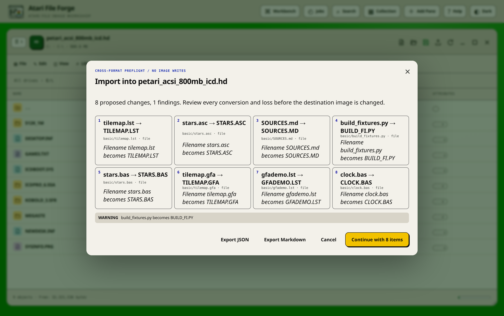

Destination checks are deliberately conservative:

- A drawer that exists but contains no children is reused automatically.
- A populated drawer pauses the batch and offers **Keep existing and
  continue**, **Replace and continue**, or **Abort bulk copy**.
- Keep leaves all existing content untouched and skips that source disk.
- Replace recursively removes the populated drawer, recopies the current disk,
  and then continues.
- Abort keeps completed drawers and starts no further disks.
- A same-named ordinary file is never considered an empty drawer and is never
  overwritten silently.

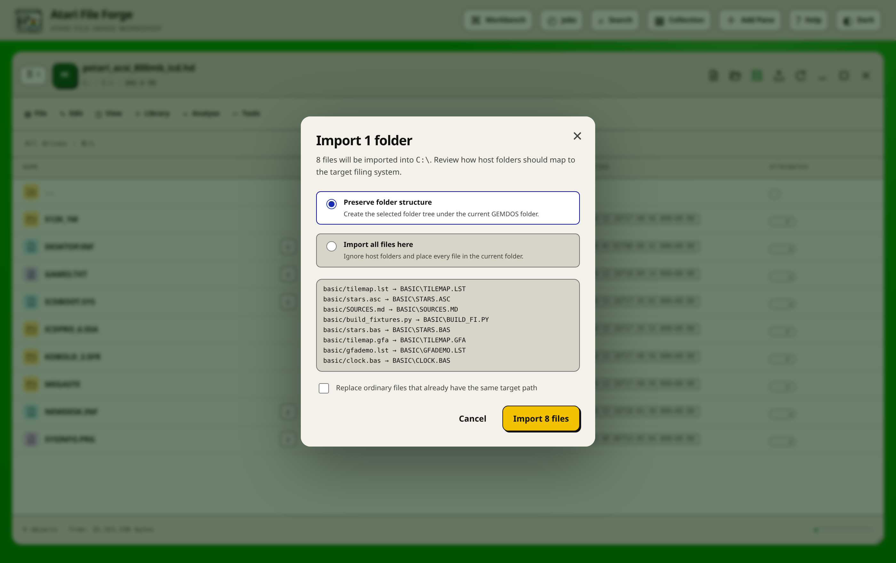

When another pane has a floppy image or a partition open, use **File → Import
from open &lt;filename&gt;**. One command is shown for each other open image.
An image whose contents cannot be written to this destination remains visible
but disabled, with the reason shown beside it.

Use ◆ or ◇ in the Access column to mark one file, or every applicable item in a
multiple selection, read-only or read/write. GEMDOS has no partition-level
write-protect flag, so a partition's access state is that of the volume mounted
in it.

## Working with ADF and ADZ

GEMDOS rules are enforced before a write is attempted:

- A file, drawer or volume name holds at most 30 Latin-1 characters, and cannot
  contain a colon or a forward slash.
- A drawer hashes its entries into a 72-entry table and chains the collisions,
  so what limits a drawer is the volume's free blocks rather than an entry
  count.
- A file must fit in the volume's free blocks. OFS spends 24 of every 512
  bytes on a block header, so the same file occupies more of an OFS disk than
  an FFS one.

An `.adz` is a gzip-compressed `.adf` and nothing more; it is expanded on
ingest and recompressed on save. A file holding two 880 KiB volumes back to
back is recognised from its two root blocks and offered as two volumes rather
than as one broken disk. Compaction can optionally prioritise boot files or
another requested order.

## HFE floppy images and HxCFE

HFE is a track and bit-cell container rather than a filing system. Atari File
Forge uses the official HxCFloppyEmulator command-line converter, `hxcfe`, to
expose the OFS or FFS sectors inside an HFE, then presents them through the
normal file browser. Docker images and native Debian/Ubuntu packages include a
pinned, architecture-native HxCFE build and its supporting libraries. No
separate host HxC installation is needed.

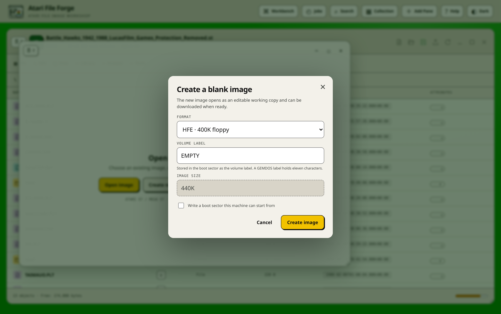

- Ordinary HFE v1 images with clean sector data are editable. Saving encodes
  the changed sectors against the original HFE as a reference, decodes the new
  file again, and byte-compares every sector before offering the download.
- HFE v2/v3 images, images with reported bad sectors, weak bits, variable
  timing, protection data, or other advanced track features open in a
  read-only safe view. Files may still be inspected, exported, or dragged to
  another image.
- An HFE can be extracted to a drawer just like its underlying ADF or ADZ.
- New HFE images can wrap any DS/DD or high-density floppy format.
- Copying an advanced read-only HFE to a sector image intentionally carries
  only its readable sectors. A sector image has no place to store HFE timing,
  weak-bit or protection information, so the destination receives a visible
  warning.

The pane badge reads `HFE`, while navigation and file rules follow the decoded
OFS or FFS filesystem. A read-only HFE is labelled `Read-only safe view` and
does not offer editing or compaction controls.

The original HFE remains untouched in the session until a verified replacement
has been produced. This matters because an apparently normal catalogue can
coexist with non-sector protection data that a filesystem editor cannot
represent.

See the [HFE, SCP and HxCFE guide](docs/HFE-HXC-GUIDE.md) for the complete opening,
creation, guarded-save, package-layout and troubleshooting procedures.

## SCP flux captures and exporting to another format

An `.scp` file is a SuperCard Pro track and bit-cell capture. Opening one does
not require connected capture hardware: Atari File Forge handles an existing
SCP the same way it handles an HFE, and HxCFE decodes it to a
private working sector image, the result is identified as OFS or FFS, and it
is browsed through the normal file list. HxCFE then re-encodes the decoded
sectors and decodes that result again; a capture only remains editable if that
round trip is byte-identical, otherwise it opens in a read-only safe view.
The recovered filesystem must also pass a complete structural validation. A
known HxCFE edge case can omit the blank final sector of an otherwise complete
DS/DD decode; the app restores only that exact one-sector-short
geometry before validation, producing the canonical 901,120-byte `.adf` export.
The native Linux edition can separately send the original SCP to a connected
Greaseweazle drive. Flux-level writes cannot use the sector read-back verifier,
so they remain explicitly unverified and must be tested on target hardware.

**File → Export as…**, or the **Export** control in the pane header, converts
an open image's current decoded sectors into another compatible container
without touching the working image or the usual timestamped Save ZIP. The
header control is greyed out, with an explanatory tooltip, whenever the open
media has no compatible target:

- Every OFS or FFS image can export its plain sector image under the correct
  canonical extension, useful for turning an HFE-, SCP- or IPF-opened image
  into an ordinary `.adf` or `.adz` for an emulator.
- Any floppy-sized volume can also export as HFE or SCP,
  verified with the same encode-decode-compare check used for saving an edited
  HFE or SCP.

Other FFS geometries and Hardfile HDA/GEO pairs only offer the native sector
export, since HxCFE has no blank flux layout for those geometries. See the
[HFE, SCP and export guide](docs/HFE-HXC-GUIDE.md) for the complete procedure.

## Working with ROM images

A ROM pane treats the image as banks of bytes rather than pretending it has a
filing system. The default bank is 256 KiB, which is one Kickstart 1.x ROM;
choose 512 KiB for Kickstart 2.0 and later. A 512 KiB Kickstart programmed as a
pair of byte-wide 27C400 EPROMs is one bank split across two chips, and the
workbench can split and recombine it for you.

For a headerless custom ROM or a generically named dump, choose **Open image →
Raw format override → Atari ROM** so filesystem probing cannot misclassify it.
Choose **Tools → ROM layout** for other bank sizes, an `$FF` or `$00` erased
value, and Kickstart, cartridge or custom target notes. A partial final bank is
preserved and reported by the health check.

A ROM describes itself in three independent ways, and all three are decoded:

- The **image header**: `$1111` for 256 KiB or `$1114` for 512 KiB, followed by
  a `JMP` to the address the machine starts executing at.
- The **resident tags**: `$4AFC` followed by a pointer back to itself, one per
  module. That self-reference is what separates a real tag from the same two
  bytes appearing inside code, and it is why the module list is reliable rather
  than a heuristic.
- The **footer**: the declared size and the ones-complement checksum the ROM
  overlay logic verifies at reset. A bad checksum is reported plainly, because
  a real machine will refuse to start from it.


The dedicated [ROM image handbook](docs/ROM-GUIDE.md) contains the complete
field reference, supported layouts, Workbench instructions, physical programmer
transform order, patch safeguards and troubleshooting guide.

## Working with a ROM's resident modules

A Kickstart or expansion ROM is not a disk, but it is a container of named,
versioned, individually addressable parts: the resident modules the ROM tag
scan installs at boot. Atari File Forge presents that list as a read-only
filing system with a `ROM` badge, so `exec.library`, `dos.library`,
`graphics.library` and everything else in the ROM can be browsed, exported and
compared with the same tools you use for a floppy.

Each module reports its name, its identification string, its version, its
priority, its node type (library, device, resource, and so on) and whether the
ROM scan auto-initialises it. Priority is what decides the order the machine
brings the modules up in, so the list is presented in that order rather than
alphabetically.

Choose **Create a blank image → Expansion ROM with a resident tag** to build
one. The result is what an autoboot expansion ROM looks like before its driver
code is linked in: the size header, a jump to the entry point, one resident tag
with a name and identification string, the declared size and a correct reset
checksum. Its init routine is `MOVEQ #0,D0 / RTS`, which is a real and safe
"nothing to install" answer rather than an address that would crash a machine
if the ROM were fitted before it was finished.

Rules and safeguards:

- A module's identification string can be rewritten in place, but only if the
  replacement fits the bytes it already occupies. A longer string is refused
  rather than truncated, because a silently shortened identification string is
  indistinguishable from a corrupted ROM.
- Changing the version word or the identification string repairs the reset
  checksum automatically.
- An encrypted Cloanto ROM (`AMIROMTYPE1`) is recognised and reported as
  read-only until its `rom.key` file is present.
- A ROM whose declared size does not match the file is reported as one part of
  a split set, or as padded, rather than being quietly accepted.

### Pane and decoded bank information

- A recognised Atari-family header shows its title, version, copyright, language
  and service roles. Rename changes only the allocated header strings. Raw or
  unrecognised banks remain fully editable in the hex editor.
- The main ROM inventory explains each bank before you open another tool. It
  shows the bank number, image offset, Atari mapped window where applicable,
  decoded title, version, copyright, resident module purpose, processor,
  entry vectors, programmed space, duplicate banks and a shortened SHA-256.
  The guidance strip links those facts to Info, Hex, ROM Workbench and layout.
- The ⓘ action opens a decoded-content view with processor and feature flags,
  mapped entry points, known regions, and bounded printable strings. Each
  location can be opened directly in the hex editor. Strings are evidence of
  commands, messages or build information, not invented files.
- The decoded view also lists the resident modules the ROM provides. A module
  declared by a `$4AFC` tag is marked `declared`, with the name and
  identification string the tag points at. An expansion ROM has no universal
  module catalogue beyond that, so the scanner also recognises coherent name
  and vector tables. It requires a coherent run of entries and, for a vector
  table, a 68000 code reference plus valid in-ROM handler addresses. Printable
  text alone is deliberately not listed. A `?` beside a module opens the help
  the ROM supplies or a signature reconstructed from its own tables. The
  tooltip says whether its contents are declared, reconstructed, or a literal
  line recovered from the ROM. Hover, keyboard focus and click
  are supported. Table and handler buttons open the relevant ROM bytes in a
  hex editor inside the decoded-information dialog. Closing it reveals the
  same information at its previous scroll position. Hex editing launched from
  a pane menu remains scoped to that pane.
- The same view reports the bank's SHA-256 and CRC-32 fingerprints, entropy,
  distinct byte count, erased-byte percentage, used range, zero and `&FF`
  counts, image programming offset, and any byte-identical banks. Image Health
  checks duplicate banks and disagreements between header role flags and entry
  vectors.
- On an Atari 4000 or recognised TOS extension image, structurally valid
  relocatable-module header candidates show their title, help text, entry
  facilities, SWI information and exact offsets. Candidates stay clearly
  labelled until an enclosing extension-ROM chunk proves their role.
- A standard TOS `ExtnROM0` extension-ROM trailer is recognised. Image
  Health reports its checksum if it does not match the image bytes.
- Double-click a bank to open the hex editor at its first byte. Erase fills a
  selected bank with the configured erased value while keeping the image size.
- **File → Insert ROM bank(s)** accepts several files. Exact multiples of the bank
  size are split in order; a file that would need silent truncation is refused.
- Select two or four equal-size ROM files together to concatenate them or
  interleave them as byte-wide chips. Four-chip mode covers the usual
  Atari 4000/TOS physical ROM arrangement. The save ZIP contains the
  logical working image, the original chip names and reconstructed chip files.
- Cut, Copy, Paste and drag work across ROM images and the normal disk formats
  where the target can represent the bytes. ROM banks do not acquire fake
  directories, lock bits or filesystem compaction controls.
- Save produces the normal timestamped ZIP and technical README. The README
  records bank size, layout, erased value, target family, component order,
  header findings and SHA-256 checksum. It also contains `ROM-project.json`,
  which keeps hardware notes, symbols, comments, regions and emulator test
  results separate from the ROM bytes.


The decoded dialog starts with focus on its heading, so opening it does not
highlight or expand the first command. Use Tab to enter the command table. A
command help tooltip appears on hover or keyboard focus and can be pinned with
a click.


### ROM Workbench

Choose **Tools → ROM Workbench** for the higher-level maintenance tools:

- **Overview** draws the logical bank map, file offsets, physical byte lanes,
  duplicate-bank relationships, fingerprints and structural audit. Proven
  contradictions between header flags and entry vectors can be aligned
  automatically. A bad extended-ROM checksum can also be
  rebuilt. Both operations receive an automatic undo checkpoint.
- **Disassembly** decodes 68000, 68010, 68020, 68030, 68040 and 68060
  instructions from any bank and offset, always in the big-endian mode the
  hardware uses. Bytes that decode to no instruction remain `DC.B` data rather
  than being presented as invented code. Known entry points seed reachable-code
  analysis, branch and call targets receive cross-references, and a call through
  the base in A6 is labelled with the library function it reaches, such as
  `exec.library OpenLibrary` or `dos.library Write`. Internal routines are named
  from the calls they make, their return form, loops and hardware access;
  anything unproved uses a clear `subroutine_`, `loop_`, `dispatch_` or
  `continue_` role. Symbols and address regions saved in the project
  metadata are applied to the listing.
- **Compare** compares this ROM with another ROM open in a workbench pane. It
  lists contiguous changed ranges and exports an Atari File Forge patch. A
  patch records both source and target SHA-256 checksums, so it is rejected if
  the source is the wrong version or the result is not exact. Tick individual
  ranges when only reviewed changes should be included in a selective patch.
- **Build** creates an inert Atari expansion-ROM development scaffold with a
  real `$4AFC` resident tag whose initialisation routine returns `MOVEQ #0,D0 /
  RTS`, which is a genuine "nothing to install" answer. It can also package host
  files in the documented `AFFARCHIVE1` data layout. That archive needs a
  matching resident module of the developer's own and is not a filing system
  Kickstart understands.
- **Programmer** pads or mirrors the image to a power-of-two physical device,
  optionally swaps adjacent bytes or 16-bit words, applies explicit address-line
  swaps, and splits it into one, two or four byte lanes. The resulting ZIP
  includes the chip files and a checksum-bearing programming report.
- **Project** records hardware, socket, research and symbol information without
  modifying the image. **Emulator** reports the managed emulator selected by
  the hardware profile. Direct ROM attachment remains disabled unless the
  selected machine's exact ROM address mapping is known; this avoids silently
  replacing a Kickstart or testing the wrong bank.


Workbench data falls into three safety classes:

| Class | Examples | Effect on working bytes |
| --- | --- | --- |
| Read-only analysis | Overview, audit, disassembly, compare, identity lookup | None |
| Project metadata | Exact-ROM identity, notes, symbols, regions, emulator results | Stored beside the image, not in ROM bytes |
| Reviewed write | Header repair, checksum repair, patch apply, Build | Automatic checkpoint, explicit confirmation and image revision change |

Programmer export is read-only with respect to the logical working ROM. Its
padding, mirroring, byte swapping, word swapping, address-line swapping and
lane splitting exist only in the downloaded programmer ZIP.

### Identification, saving and safety

Exact known-ROM identification reads `app/rom_catalogue.json`. Catalogue rows
use SHA-256 rather than titles or filenames. This makes the catalogue safe to
extend locally and prevents similar-looking versions from being confused. The
Overview tab can store an identification in an owner-scoped local catalogue,
so later sessions in the same browser recognise the exact dump without sharing
that private record with another user.

Raw ROM edits can make hardware unbootable. Use a checkpoint, keep the original
dump and test a disposable programmed device or emulator before replacing a
known-good ROM.
## Working with a partitioned hard drive

An Atari hard drive describes itself. Block 0 carries a Rigid Disk Block, which
chains to one `PART` block for every partition, and each of those names the
device the partition mounts as, the filing system it holds, its cylinder range
and whether the machine boots from it. Atari File Forge reads that description
and shows the drive exactly as a machine would see it at boot, which is why
`HDToolBox` and an emulator agree with what the pane shows.

A drive opens at its partition table, not inside the first partition.

- Every partition is listed with its device name, DOS type, size, boot flag and
  boot priority.
- Double-click a partition to browse the volume inside it. From that point
  everything behaves as it does on a floppy.
- Use **All partitions** to return to the table. The partition you came from
  stays selected.
- **Tools → Check filesystem** and **Compact filesystem** act on the open
  partition, not on the whole drive.
- The download arrow beside a partition exports that volume as a standalone
  image, named from its device name.

A partition's identity comes from two independent places, and reading both is
what makes a damaged container still usable. The `PART` block holds the device
name, the DOS type the mount will request and the bootable flag. The volume's
own boot block and root block hold the DOS type actually written and the name
the Atari displays. When the two disagree the volume wins, because that is what
a real machine mounts, and the health dashboard reports the disagreement rather
than hiding it.

GEMDOS has no partition-level read-only flag, so write protection is stored
where a real machine can also see it: the root block's protection long, which
`List` displays and which every tool that honours root protection respects.
Kickstart itself does not enforce it, so the workbench treats it as an
instruction to the user as much as to the software, and refuses its own writes
while it is set.

### Creating a drive

Choose **File → New → New Image** and pick **Partitioned drive · HDF with RDB**.
Enter a volume title and a capacity such as `20MB` or `512MB`. The new drive is
created with a Rigid Disk Block and one FFS International partition, which is
what an Atari expects to find, and the title is written both to the volume's
root block and to the partition's device name.

### Bare hardfiles

A UAE hardfile has no partition table at all. Its geometry lives in a `.geo`
sidecar instead, and both files must be opened together; opening the data file
alone is refused rather than guessed at, because the wrong geometry silently
reads the wrong blocks. Choose **UAE hardfile · HDA + GEO sidecar** when
creating one. Surfaces, blocks per track and cylinders always multiply back to
the exact file size, because an emulator that finds a mismatch refuses the
hardfile.

Both kinds are ordinarily named `.hdf`, because that is what every Atari
emulator calls a hard-drive file. Which kind a given file is comes from its
contents -- a Rigid Disk Block, or the lack of one -- and never from its name.
An `.hdz` is a gzip-compressed `.hdf` and is expanded on ingest.

### Loader compatibility when software moves to a drive

When a floppy image is imported into a drawer, readable scripts are checked for
floppy-device references such as `DF0:Game`. That reference is correct in a
drive and wrong the moment the software sits on a hard drive, because `DF0:` is
then empty or holds a different disk. If exactly one file in the volume carries
that name, the reference is replaced with a path relative to the script's own
drawer, padded with spaces to the same length so no offset in the file moves.
A replacement longer than what it replaces is refused. Ambiguous references are
left untouched and reported, because a wrong repair is worse than none.

## TOS hard drives

Atari File Forge reads the GEMDOS structure directly, so drawers are fully
traversable and normal operations work at any level of the hierarchy. An
entry's protection bits, comment, datestamp and Workbench icon type are
displayed when present.

The target-hardware choice controls compatibility checks rather than changing
the file extension:

- **Auto / inspect only** identifies and browses the filesystem without adding
  machine-specific repairs.
- **Atari 500 / 2000** restricts a volume to what Kickstart 1.3 can mount,
  which is OFS only.
- **Atari 600 / 1200** allows every DOS type Kickstart 2.0 and later
  understands, including FFS, International and Directory Cache.
- **Hardfile** requires a matched HDA and GEO pair.
- **TOS hard drive** assumes a Rigid Disk Block and a machine that can load
  a file system from it.

To reorganise one FFS image, drag a row onto a directory row. Multiple
selected rows move together. You can also show the same image in multiple
panes, navigate them to different directories, and drag between them. Every
pane showing that image refreshes after the move, including any pane whose
current path moved with its parent directory.

The application accepts virtual hard-drive images and byte-for-byte dumps of
physical drives. "Physical drive" means an image captured from the device. A
web browser does not receive direct access to host paths such as `/dev/sdb`,
and the Docker container is not granted raw-device access.

This separation is intentional. It prevents a typo in a web request from
writing directly to a real disk. If a finished raw image must be restored to
hardware, do that outside Atari File Forge with a trusted imaging tool and
verify the target device carefully.

### GEMDOS compatibility note

The bundled Atarinut engine reads and writes every DOS type from `DOS\0` to
`DOS\5`, on floppies and on hard-drive partitions of any size. It preserves
protection bits, comments and datestamps across a copy, allocates blocks
outwards from a file's own header so the volume stays readable at speed on real
hardware, defragments in place, and runs a full structural validator.

An GEMDOS drawer is a hash table with overflow chains, so it has no fixed
entry count: the only real limit is free blocks, and the workbench reports it as
such rather than inventing a ceiling. Names hold up to 30 characters. The
long-filename variants `DOS\6` and `DOS\7` allow 107, and are recognised and
reported but opened read-only.

The GEO sidecar is mandatory when editing an RDB-less hardfile. A hardfile
carries no partition table, so the host has to be told its surfaces, sectors and
reserved-block count; that is what the sidecar holds, and it is not safely
recoverable from the image alone. If only one half of the pair is selected,
Atari File Forge retains and prefills it in a paired upload dialog, leaving only
the missing companion to choose. A hardfile opened without its sidecar remains
browseable but all writes are blocked. An HDF that carries a Rigid Disk Block
describes itself and can be edited without
a GEO sidecar.

A hardfile's surfaces, sectors and cylinders must multiply back to exactly the
file's size, because an emulator that finds a mismatch refuses the hardfile
rather than guessing. Atari File Forge keeps the two in step: it will not pad a
short image, because real filesystem data may be missing, and it will not trim
a long one while any byte beyond the volume is non-zero.

The filing-system engine ships in this repository as `atarinut/` and needs
nothing beyond the Python standard library. An `.adf` suffix remains only a
hint: recognition comes from the boot block's DOS type, the root block and the
bitmap. See the
[Atarinut GEMDOS engine notes](docs/ATARINUT-GEMDOS-SUPPORT.md).

### HDF and RAW creation detail

New HDF and RAW images are created from an explicit capacity. An image whose
volume begins at an emulator's own header offset is detected from its GEMDOS
structures and retains that layout while it is edited.

## DiskMasher archives

DMS was how Atari disks travelled. Unlike an ADF, which is just the sectors, a
DMS carries the *tracks*: their numbers, their compression modes and their
CRCs. That is why a DMS can hold a disk an ADF cannot represent, and why
converting one is a real operation rather than a rename.

- The archive header is decoded in full: creator version, required version,
  disk type, low and high track, packed and unpacked sizes.
- Every track is listed with its number, compression mode, packed and unpacked
  lengths, and both of its CRCs. A truncated download is detected here rather
  than producing a disk full of zeros.
- **Tools → DMS project** inventories the header and every track with offsets,
  lengths and a SHA-256 fingerprint of the whole archive.
- A complete archive can be rebuilt as an ADF. Tracks are written at their
  declared positions rather than in the order they appear, so an archive that
  omits empty tracks -- which DiskMasher does by default -- still produces a
  correctly sized image with the gaps zeroed.
- An uncompressed track can be replaced in place, but only by one of exactly
  the same length. Re-packing a track would move every following track and
  invalidate the archive's own size fields, so the workbench refuses rather
  than producing an archive that only it can read.

**Compression support in this build.** The `NOCOMP` and `SIMPLE` modes, and the
run-length pass every mode may apply on top of them, are decoded. `QUICK` is
decoded. `MEDIUM`, `DEEP`, `HEAVY1` and `HEAVY2` are recognised, listed with
their real sizes and checksummed, but their LZ-with-Huffman stages are not
decoded here: a track packed with one of them is marked incomplete rather than
guessed at, and the archive reports which mode it needs. Unpack those with
`xdms` and open the resulting ADF.

## Saving and recovery

**Save Image** first validates and finalises the current working image, then starts
the download in an isolated browser target. A validation or network error is
reported inside Atari File Forge and cannot replace the application with a raw
JSON error page. A successful preparation clears the pane's orange changed dot;
a failed preparation leaves it in place so unsaved work cannot be mistaken for
a completed save.

- Every format is returned as a timestamped ZIP named
  `<image-name>-YYYYMMDD-HHMMSS.zip`, so repeated saves do not silently reuse
  the old `-edited` filename.
- Every ZIP includes a detailed `README.md` with the format, target
  hardware, byte size, SHA-256 checksum, warnings, usage notes and a filesystem
  catalogue. A hard drive's report lists every partition with its device name,
  DOS type, access state and the files inside each mounted volume.
- An HDA image with a GEO descriptor keeps both files together below the
  `Hardfile0/` directory in the ZIP. The README remains at the archive root.
- Sparse Hardfile HDA archives use fast DEFLATE compression. Free zero-filled
  capacity therefore does not need to cross the network verbatim; the extracted
  HDA still has its original logical size and exact SHA-256 checksum.
- ZIPs are built with bounded memory and real byte progress before the browser
  handoff. The completed archive is served as an ordinary file with a known
  length, so "ready" means no hidden checksum or ZIP-building work remains.
- Opening or creating FFS media offers a target-hardware profile. Each profile
  validates the block checksums, hash chains and bitmap the chosen Kickstart
  relies on. A saved hardfile volume also receives a later datestamp and a
  rebuilt root checksum, so a machine that already mounted it does not serve a
  stale cached view of the edited filesystem.
- Saving a hard drive returns the complete image, every partition included.
- Saving an edited HFE v1 first writes against the original track layout, then
  decodes and byte-compares the resulting sectors. A mismatch blocks the
  download. Read-only HFE v2/v3 and damaged images download unchanged.

Session metadata is stored beside each working image. If the Gunicorn worker
restarts, the application can reopen a valid session from disk. On either empty
pane, choose **Recover previous session** to list retained working copies newest
first. Recovery preserves completed edits after a refresh, accidental browser
navigation, interrupted download, or container restart. Removing the Docker
volume removes those sessions.

Recovery is private to the owner that opened or created the image. In the web
edition the server issues a random, year-long `HttpOnly`, `SameSite=Strict`
ownership cookie and mirrors the same opaque ID in origin-scoped browser
storage. Either copy can restore the other after a browser update or container
restart. The desktop edition keeps a stable owner ID in
`$XDG_CONFIG_HOME/atari-file-forge/owner-id`, or the corresponding directory
under `~/.config`, with mode `0600`. Recovery listings, direct image API access
and deletion always enforce that owner match. There is no shared global session
browser. Clearing both site cookies and site storage breaks web recovery;
deleting the desktop owner ID breaks desktop recovery. Download important work
before clearing either identity.

Closing a work pane now detaches the image without deleting its server-side
working copy. Reopen it through **Recover previous session**. Permanent removal
is deliberately confined to the recovery dialog's confirmed **Clear** actions.

The browser remembers every currently displayed work pane, its position, size,
stacking state and order. A normal refresh reopens each image and returns to
the same partition and drawer. Closing a pane removes it from
automatic reopening while keeping its recovery copy.
On the first refresh after upgrading from a version without workspace memory,
the newest working session owned by that browser is reopened automatically.
This one-time bridge stops the upgrade itself returning active work to the
empty start screen.

Use **Recover previous session** to remove individual retained sessions or clear
the previous sessions shown there. Images currently open in any pane are
omitted from those clearing controls. Clearing removes only Docker-side working
copies, never the source files selected from the host.

Each recovered session includes its named checkpoints and automatic undo
history. Recovery ownership therefore protects both the active working image
and every snapshot beneath it.

## Built-in help

Use **Help → Handbook** in the top-right corner for the illustrated guide. It covers
the expandable freeform pane workspace, window snapping, undo and named
checkpoints, all supported formats, hard-drive partitions and protection,
drag and drop, directory traversal, DMS conversion,
HFE safety and conversion, Hardfile pairing, long-operation recovery, keyboard
selection, saving, and safety. The guide uses screenshots from the current
interface and works in light or dark mode.

Use **Help → About Atari File Forge** to confirm the version actually served by
the running process, distinguish the web and Linux desktop editions, identify
the filesystem engine, and open the source, release and third-party notice
pages. The version comes from the same `VERSION` file used by packages and
release tags.

Browser state is not a substitute for saving. Download important work before
upgrading the container, deleting its volume, or cleaning Docker storage.

The in-app handbook and this README describe the same current workflows. If
they disagree with the controls in a newer build, please report the mismatch
in the [project repository](https://github.com/peteclarke-del/AtariFileForge).

## Limits and practical considerations

- The default upload limit is 8 GiB. Set `ATARI_MAX_UPLOAD_GIB` in
  `docker-compose.yml` to change it.
- A working image needs roughly its own size again in the Docker volume.
  Extraction and conversion may need additional temporary space. HFE sessions
  retain the original container, decoded sectors, and a verified encoded copy
  while saving.
- Large hard-drive uploads and recursive copies can take time. Keep the page
  open while the progress overlay is visible.
- A failed long operation replaces the progress view with a foreground error
  screen. It shows the completed count and last reported path. **Back / retry**
  returns to the original operation and completed items are skipped.
- Read-only requests retry brief connection failures automatically.
- Bulk extraction mounts the destination once for a complete batch, and holder
  drawers are expanded in memory instead of launching one filesystem process
  for every contained disk.
- Complete directory extraction uses one recursive engine invocation, rather
  than starting a process for every top-level object.
- Local source-image benchmarks use clone or kernel-copy paths where available.
  In the 512 MiB HDA test this reduced open time from about 4.9 to 4.5
  seconds; storage speed remains the dominant cost.
- Individual files use disk-backed responses. Complete image ZIPs are built
  with bounded memory while the foreground progress bar tracks checksum and
  archive bytes. Only then is the known-length archive handed to the browser.
- Open FFS working images use a trusted, direct memory-mapped mount after the
  upload has been identified. Changing directory therefore reads only the
  requested catalogue and returns its free-space figure in the same request.
  It does not copy or re-identify a complete HDA, HDF or RAW file on every
  click.
- ADF, ADZ, HFE and DMS transfers into a volume keep one destination mount open
  for the complete batch. Files, metadata and loader checks are applied before
  that mount is released instead of reopening a large hard-drive image for
  every file or phase.
- Mutations to the same image are locked and run in sequence.
- The engine subprocess timeout is 240 seconds. Gunicorn allows requests for
  up to 300 seconds.
- Atari filenames are matched case-insensitively. The application preserves
  the spelling stored in the image.
- One canonical filename policy is used by browser uploads, native path opens,
  clipboard operations, drag and drop, Online Library imports and dry-runs.
  An GEMDOS file, drawer or volume name allows 30 Latin-1 characters and
  excludes the colon and the forward slash; an RDB device name allows 31, and a
  Kickstart ROM filing system allows 30. A long-filename volume is reported as
  read-only rather than being written with a name the writer cannot verify.
- Leading or trailing whitespace, control characters, path syntax and names
  that cannot be represented in Latin-1 are rejected at the API boundary. The
  compatibility review can propose NFKC-normalised replacements, underscores
  and safe truncation before the first write. Collision checks are
  case-insensitive and scoped to the destination parent, so identical leaf
  names in different drawers do not conflict. Two partitions may hold volumes
  with the same title, because a partition's identity is its device name rather
  than its volume title.
- Defragmenting matters most on a volume that has been written to many times. A freshly created volume would not need
  the same contiguous-free-space maintenance. The bundled Atarinut engine writes
  every GEMDOS DOS type it can create, so the detected container and directory
  format is preserved rather than converted.

## Configuration

The Compose defaults are:

```yaml
services:
  atari-file-forge:
    image: atari-file-forge:latest
    container_name: atari-file-forge
    ports:
      - "8666:8666"
      - "8668:8668"
    environment:
      ATARI_FILE_FORGE_WORK_DIR: /app/work
      ATARI_MAX_UPLOAD_GIB: "8"
    volumes:
      - atari-file-forge-work:/app/work
    restart: unless-stopped
volumes:
  atari-file-forge-work:
    name: atari-file-forge-work
networks:
  default:
    name: atari-file-forge-network
```

`ATARI_FILE_FORGE_WORK_DIR` selects the private server-side working directory.
The Compose service, image, container, volume and network all use explicit
Atari File Forge names, so they remain consistent regardless of the checkout
directory name.

## Architecture

```text
Browser
  dynamic panes, dialogs, HTML drag and drop
                    |
                    | JSON and multipart HTTP
                    v
Flask API
  images | files | hex editor | ROM tools | catalogue | analysis | jobs
                    |
                    v
Disk service
  session copies | locking | RDB adapter | DMS parser | HFE safety
             |                              |
             v                              v
   Atarinut engine                     HxC engine
  OFS | FFS | RDB | Kickstart     HFE tracks | sector conversion
```

The application runs one Gunicorn worker with eight threads. A single worker
keeps the in-memory session cache coherent, while per-image locks allow safe
parallel reads and prevent overlapping writes to the same image.

### The Atarinut engine

`atarinut/` is the GEMDOS filing-system engine, and it ships in this
repository rather than as an external dependency. It has no dependencies of its
own beyond the standard library.

- `atarinut/filesystem/blocks.py` owns the 512-byte block layout, the
  checksum, the name hashing (including international folding) and the DOS-type
  table.
- `atarinut/filesystem/gemdos.py` implements OFS and FFS in one class,
  because the variants differ in three branches rather than three
  implementations. It owns block allocation, the hash-table directories, file
  extension chains, validation and defragmentation.
- `atarinut/filesystem/rdb.py` reads and writes the Rigid Disk Block, its
  partition chain and its filesystem headers.
- `atarinut/filesystem/__init__.py` is the registry: `create_filesystem`,
  `reader_for`, `identify`, the geometry sidecar, and the `AtariMetadata` /
  `Datestamped` / `Filetyped` mount protocols.
- `atarinut/kickfs/kickfs.py` decodes a Kickstart ROM: its size header, its
  declared size, its reset checksum and every `$4AFC` resident tag.
- `atarinut/file/` owns protection bits, comments and datestamps, including
  the four inverted permission bits that are the commonest source of mistakes
  when reading Atari metadata by hand.
- `atarinut/basic/` tokenises and detokenises ST BASIC, and proves the round
  trip on every save rather than trusting it.
- `atarinut/disc/cli.py` is the `adisc` command line and the bulk-copy
  machinery the workbench borrows through one adapter module.

Run the engine directly when you want to check something without the web
application:

```bash
python3 -m atarinut identify --as json disk.adf
python3 -m atarinut ls drive.hdf:
python3 -m atarinut tree games.adf:
python3 -m atarinut validate drive.hdf
python3 -m atarinut kickstart kick31.rom
```

### Backend responsibilities

Backend routes are split by responsibility:

- `app/wsgi.py` is the Gunicorn composition root. It creates the production
  service without making route modules depend on process startup.
- `app/routes/images.py` handles opening, creating, saving, conversion and
  defragmentation.
- `app/routes/files.py` handles tree browsing, file operations, extraction and
  cross-image transfers.
- `app/routes/catalog.py` handles Online Library search, source settings and
  installation.
- `app/routes/tools.py` handles health checks, manifests, duplicate analysis,
  file inspection, editor projects, BASIC verification, disassembly, emulator
  hand-off and dependency reports.
- `app/routes/effects.py` lets each image-changing route declare its own undo
  checkpoint reason and target, so a new write route cannot depend on a
  separate endpoint-name table staying in sync.
- `app/atari_paths.py` is the one place inner paths are built and taken apart.
  GEMDOS separates path components with `/` and names a volume root with a
  bare `:`; the separator matters, because Atari filenames routinely contain
  full stops.
- `app/image_session.py` defines the shared session model and ownership
  context used by the disk, checkpoint, operation and download services.
- `app/session_state.py` owns durable session metadata and warning compaction.
- `app/disk_service.py` coordinates image operations and calls the engine.
- `app/session_disk_service.py` owns private session persistence, ownership,
  recovery, checkpoints and summaries.
- `app/filesystem_disk_service.py` owns trusted GEMDOS and Kickstart mounts.
- `app/ffs_install_service.py` owns installed-software discovery, dry-run
  audits and deterministic loader repairs for hard drives.
- `app/install_service.py` owns staging a title's discs into a drawer on the
  drive they are destined for, installing a staged set into its own home, and
  the WHDLoad install. Staging writes onto the target image rather than onto
  this computer, so the job can be finished in an emulator or on the machine
  itself.
- `app/workbench_install.py` owns installing TOS from the operator's own
  Workbench floppies: recognising each disk by the volume name inside it,
  keeping a set to one release, and copying the disks in the order that makes
  the shared files come out right.
- `app/volume_copy.py` is the one implementation of reading an Atari volume and
  copying its contents into another one. Staging and the Workbench install were
  the same code twice and had already drifted apart in how they handled a file
  they could not read.
- `app/progress.py` declares the progress callback every long-running service
  operation accepts, and the do-nothing default that eighteen modules had each
  written out for themselves.
- `app/disk_tools.py` owns engine and HxC process execution, timeout handling,
  JSON decoding and user-facing error cleanup.
- `app/hardfile_geometry.py` owns RDB-less hardfile geometry, the `.geo`
  sidecar, and the root-block checks a real machine applies.
- `app/rdb_service.py` reads the Rigid Disk Block, lists the partitions it
  chains to, and opens one of them as an ordinary mountable volume.
- `app/disk_identity.py` works out a disk's title, launcher and stack from the
  disk itself, carrying the evidence for each conclusion so an ambiguous one
  can be marked rather than guessed.
- `app/filename_policy.py` is the canonical name policy. GEMDOS reserves only
  `:`, `/` and `\`; full stops, spaces and hashes are all legal and common.
- `app/ofs_compat.py` reads a volume's catalogue straight out of the image
  bytes, and repairs floppy device references in scripts that are being
  installed to a hard drive.
- `app/rom.py` decodes ROM headers, resident tags and extended-ROM trailers.
- `app/rom_workbench.py` owns 68000-family disassembly, guarded patches,
  builds, programmer transforms and ROM project metadata. Library vector calls
  through A6 are named, and custom-chip registers and exception vectors are
  identified.
- `app/rom_components.py` validates physical ROM component ordering,
  interleaving and the 64 MiB combined-image bound.
- `app/rom_disk_service.py` owns raw ROM bank inspection, layout, movement,
  replacement, physical-component export and persistent ROM projects.
- `app/dms.py` parses DiskMasher archives: the archive header, every track
  header, both CRCs per track, and the rebuild back to an ADF.
- `app/dms_disk_service.py` owns cached DMS access and DMS-to-ADF conversion.
- `app/dms_codec.py` decodes every DiskMasher compression mode in-tree, ported
  from the public-domain xDMS 1.3 reference and pinned to its exact output.
- `app/tos_cd.py` recognises the TOS 3.5 and 3.9 release CDs and says
  whether a machine can run one. Neither can be installed from outside the
  Atari, so this checks the disc, the processor and the drive, and the
  installation itself is left to Commodore's own script.
- `app/iso9660.py` reads an ISO 9660 CD image, including the Joliet and Rock
  Ridge naming schemes and the Atari `AS` extension that carries a file's
  protection bits and comment. It reads from the file rather than into memory,
  because a CD image runs to hundreds of megabytes.
- `app/iso_disk_service.py` presents a CD as an ordinary read-only pane, so a
  disc is browsed and copied from like any other container.
- `app/ipf.py` loads the SPS decoder library when it is installed and turns the
  MFM bit cells it returns into GEMDOS sectors; see
  [docs/IPF-GUIDE.md](docs/IPF-GUIDE.md).
- `app/emulator_config.py` builds the FS-UAE command line for the applied
  profile. No Kickstart ROM is shipped or downloaded; a profile that cannot find
  one says so rather than starting to a black screen.
- `app/analysis_service.py` builds health, manifest, duplicate, inspection and
  loader-dependency reports.
- `app/image_diff.py` assigns filesystem-aware manifest identities, produces
  deterministic logical fingerprints and classifies cross-image changes.
- `app/workflow_recipe.py` proves completed workflows by replaying a guarded
  patch from the earliest retained base and comparing byte-exact outputs.
- `app/content_kind.py` owns bounded content classification.
- `app/archive_browser.py` owns safe DMS and compressed-archive traversal.
- `app/file_editor.py` owns editable-file inspection, checked source writes,
  ST BASIC round trips, byte ranges and annotated disassembly.
- `app/checksum.py` provides the shared byte-payload and sparse-aware image
  checksum implementations.
- `app/hfe.py` validates HFE headers and classifies HFE versions safely.

### Frontend responsibilities

Frontend format declarations live in `app/static/formats.js` and backend
extension declarations in `app/formats.py`, so accepted names live in one place
on each side of the API.

`app/static/atari-metadata.js` owns the protection-bit vocabulary the whole
interface shares: the `hsparwed` letters, the four low bits GEMDOS stores
inverted, and the formatting used wherever protection is displayed or edited.
`app/static/core.js` contains shared request and formatting primitives,
`workspace.js` owns pane state and selection paths, `file-visuals.js`
classifies entries for consistent icons, and `import-planning.js` owns target
naming and host metadata. `pane-view.js` owns format, breadcrumb and capacity
presentation, `transfer-planning.js` owns directory-transfer allocation, and
`safety-dialogs.js` owns destructive stack-size override confirmation.
`editor-workspace.js` owns bounded editor-tab persistence,
`workspace-persistence.js` owns open-pane recovery, and `operation-ui.js` owns
guarded actions and persistent job progress. `help.js` owns the in-app
handbook, `about.js` the runtime About panel, `hex-editor.js` raw fixed-range
editing, `code-editor.js` language intelligence, `assembly-language.js` the
68000-family instruction catalogue, `atari-call-catalogue.js` the library
vector catalogue, and `app.js` coordinates panes and workflows. The content
classifier remains a backend authority, so a filename or browser hint cannot
bypass filesystem-aware validation.

The palette lives entirely in `app/static/theme.css`. Its light and dark
sections define semantic tokens for surfaces, text, state, media icons,
dialogs, progress and the hex editor. `app/static/styles.css` consumes those
tokens and contains no palette-specific colour literals, which keeps visual
redesigns small and contrast review repeatable.

## Development checks

Local development media belongs in `samples/`, which is ignored by Git, source
archives and the Docker build context. Tests that need optional real-world
fixtures should skip cleanly when those files are not present. Generated test
images belong in `output/`, which is also excluded.

Run the Python regression tests:

```bash
python3 -m unittest discover -s tests -v
```

Check Python and JavaScript syntax:

```bash
python3 -m py_compile app/*.py app/routes/*.py atarinut/*.py
node --check app/static/formats.js
node --check app/static/core.js
node --check app/static/app.js
```

Run the standalone editor language-engine regressions:

```bash
node tests/run_js_tests.js
```

Run the permanent browser regression against a service on port 8666, which
is where the CI container publishes it. Set `ATARI_FILE_FORGE_URL` for any
other address, including the Compose default of 8684:

```bash
npm install
npx playwright install chromium
npm run test:browser
```

Set `ATARI_FILE_FORGE_URL` when the service is listening elsewhere.

Check the running service:

```bash
curl http://localhost:8684/api/health
```

A healthy response looks like:

```json
{"engine":"atarinut","status":"ok","version":"0.0.0"}
```

## Main dependencies

Atari File Forge source is licensed under the [MIT License](LICENSE). Runtime
components and user media retain separate terms. Review
[THIRD_PARTY_NOTICES.md](THIRD_PARTY_NOTICES.md) before redistributing a source
archive, container image or native package.

- Python 3.14 in the container, or a compatible Python 3 release for the native
  application
- Flask 3.1
- Gunicorn 26
- Capstone 5.0, for 68000-family disassembly
- The bundled Atarinut engine, which needs nothing beyond the standard library
- HxC Floppy Emulator command-line engine, compiled from one pinned upstream
  revision for both Docker and native release packages
- FS-UAE, for the optional emulator hand-off
- Docker or Docker Compose

**No Atari firmware is shipped, and none is downloaded during a build.**
Kickstart ROMs, Workbench disks and the CD32 and CDTV extended ROMs remain the
copyright of their owners. The emulator hand-off reads ROMs you supply from the
directory named by `ATARI_FILE_FORGE_KICKSTART_DIR`, and reports plainly when it
cannot find one. See [firmware/README.md](firmware/README.md).

The Dockerfile is multi-architecture. It builds on `amd64`, `arm64` and 32-bit
Raspberry Pi Linux without assuming that PyPI provides a binary package for the
host. Capstone is compiled into a staged Python installation when the
architecture has no published package. Copying that verified installation,
rather than a locally architecture-tagged wheel, avoids a second compatibility
decision after the native build has already succeeded. The compiler, `make` and
development headers are not copied into the final application image.

The first Docker build compiles HxC, and may also compile Capstone on 32-bit
Raspberry Pi systems, so it takes longer than an application-only build. Docker
caches those builder layers, so later source and documentation rebuilds are much
quicker.
