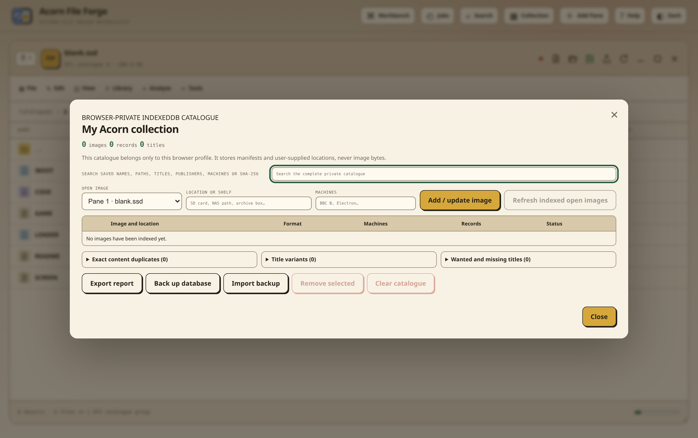

# Private collection catalogue

Atari File Forge can retain a searchable catalogue of images without putting
image bytes in the catalogue. In the web edition the database belongs to the
current browser profile and is stored in origin-scoped IndexedDB. In the Linux
desktop edition the same data is stored in
`$XDG_CONFIG_HOME/atari-file-forge/client-state.json`, or the corresponding
directory under `~/.config`. Desktop updates are validated, written atomically
and protected with mode `0600`. Both stores contain manifests and descriptive
metadata, not disk, dms or ROM image bytes.

Open **Collection** in the application header, or choose **Library → Private
collection** in a pane. The catalogue remains available when its indexed images
are closed.

## What is indexed

Each entry records:

- image name, media family, byte size and exact logical fingerprint;
- the server-generated working-image revision used for stale detection;
- every manifest record, including paths, partitions, ROM banks, sizes, access,
  protection bits, comments and SHA-256 content hashes where available;
- recognised volume titles and publishers;
- the applicable machines supplied by the user or hardware profile;
- an optional location such as an SD-card label, NAS path or archive box;
- creation and most recent indexing times.

The location is descriptive. The browser cannot open an arbitrary host path,
and Atari File Forge does not claim that a noted removable disk is currently
attached.

## Add or refresh an image

1. Open the image in any pane.
2. Open **Collection**.
3. Select the pane, enter its location and comma-separated target machines.
4. Choose **Add / update image**.
5. Keep the progress dialog open for large HDF or hard-drive images. Every
   partition, drawer and file must be read and hashed.

Re-indexing replaces only the matching catalogue entry. Other collection
images remain untouched. **Refresh indexed open images** updates every open
image that already has an entry.

When an indexed working image changes, its entry is marked **Refresh needed**
if the current byte-size and modification revision differs from the indexed
revision. Refreshing creates a new logical fingerprint and clears that flag.
The old manifest is retained until the replacement has been generated
successfully, so an aborted scan does not erase useful catalogue data.

## Collection reports

The catalogue reports across stored manifests, including images that are not
open:

- **Exact content duplicates** groups files, volumes and ROM banks with the
  same SHA-256 content in more than one indexed image.
- **Title variants** groups normalised volume, drawer and ROM titles found in more
  than one image. Punctuation and case are ignored for this comparison.
- **Wanted and missing titles** compares a locally retained one-title-per-line
  wanted list against indexed volume, drawer and ROM titles.

Online Library results are also compared with the private title index. A title
known only from a closed indexed image can therefore appear as already present.
This is a title-level warning rather than proof that two downloads have the
same bytes.

## Export, backup and restore

**Export report** downloads the current summary, exact duplicate groups, title
variants and missing titles. It is intended for review and does not contain the
complete database.

**Back up database** downloads a versioned JSON document containing every
catalogue entry and the wanted list. **Import backup** validates the format,
image count and total record count before offering to replace or merge the
current catalogue. Imported data never writes to an open image.

**Remove selected** deletes only checked catalogue records. **Clear catalogue**
removes the complete local catalogue and wanted list after confirmation.
Neither command deletes image files, downloads or retained working sessions.

## Privacy and limits

The web catalogue is isolated by browser origin and browser profile. Another
computer, browser profile or private-browsing session cannot see it unless a
backup is deliberately exported and imported there. Anyone sharing the same
operating-system account and browser profile may have access, so use a separate
profile on a shared machine.

The desktop catalogue belongs to the Linux user account and survives the
private loopback port changing between launches. Protect the account and its
XDG configuration directory as you would any other local application data.
The complete desktop client-state document, which also contains workspace and
profile settings, is limited to 64 MiB.

Catalogue backups are limited to 2,000 images, 1,000,000 manifest records and
a 128 MiB selected file. These are safety bounds, not recommended working
sizes. Browser storage quotas vary, and a large HDF or hard-drive collection
should be backed up periodically regardless of which edition is used.
