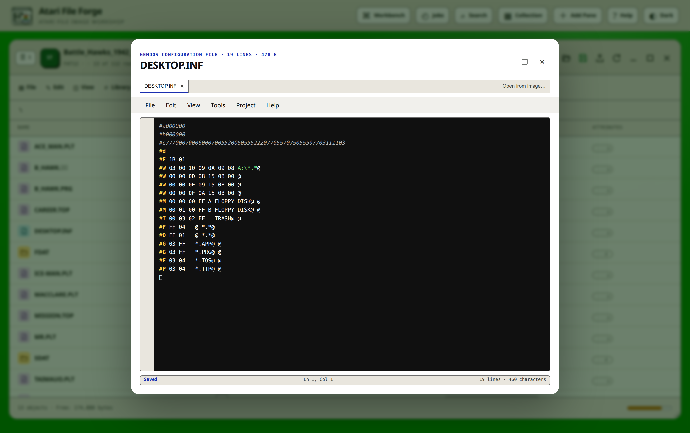
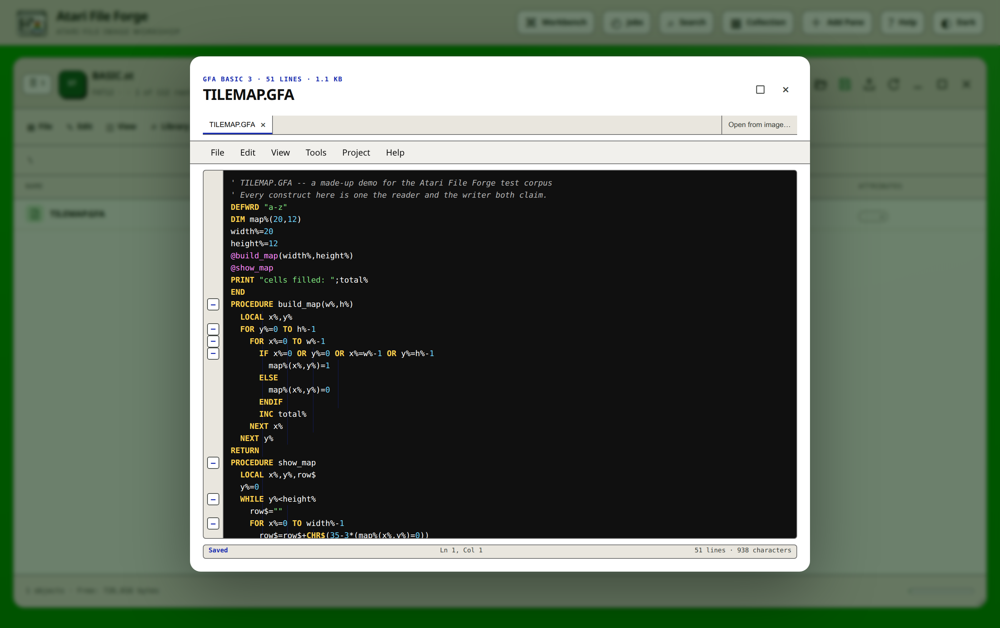
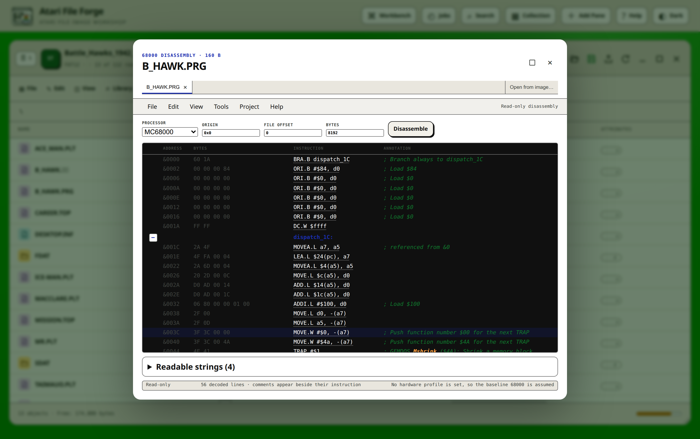

# File editor and code analysis handbook

This handbook covers the file-level editors in Atari File Forge. It describes
what the application proves from the bytes, what it infers from the active
hardware profile, and where it deliberately stops. The editor is intended for
maintenance, inspection and controlled changes inside a working image. It is
not a source-level debugger or a substitute for testing on the target machine.

Return to the [documentation index](README.md) for installation, media-format,
ROM, firmware and release references.

## Safety model

Opening a file does not modify it. Editable source remains local to the editor
until **File > Save** or **File > Save As** is selected. A successful write:

1. verifies that the file still matches the SHA-256 recorded when the editor
   opened;
2. validates or tokenises the source as required by its content type;
3. creates an automatic image checkpoint;
4. writes through the mounted filesystem while retaining the GEMDOS attribute
   byte and datestamp;
5. refreshes the pane and marks the image as changed.

The stale-file check prevents one editor from silently replacing a newer
change made elsewhere in the workspace. Save As creates a sibling file and
leaves the source file intact. The image is still a private working copy until
the pane's Save Image control prepares its timestamped download ZIP.

Archive members are expanded in memory. Readable members in ZIP, TAR,
compressed TAR, GZIP, BZIP2 and XZ containers can be edited. Save verifies the
member and parent archive SHA-256 values, rebuilds the complete container and
replaces the outer image file through the normal undoable transaction. A
member whose container cannot be rebuilt safely stays read-only, and exporting
it returns the original member bytes.

## Opening and exporting a file

Double-click a file in a floppy volume, a hard-disk partition, a bare GEMDOS
volume, a TOS ROM view or an archive view. The same dispatch is available
through **Analyse > Open selected file**. The arrow beside a filename downloads
the original file and its GEMDOS metadata without opening an editor.

The pane's columns describe the directory entry, not the editor's
interpretation of the bytes: the GEMDOS name, the identified kind, the recorded
size, the FAT datestamp and the attribute byte printed as six letters. There
are no address columns, because a GEMDOS directory entry records no load or
execution address. A program carries its own sizes instead: the `0x601A`
header declares the text, data and uninitialised (BSS) segment lengths, the
symbol-table length, the `_p_flags` long and the absolute-relocation word.
**File > Properties** edits the attribute byte and the datestamp and nothing
else. See the [catalogue metadata guide](FILE-METADATA-GUIDE.md) before
changing an entry whose original values matter.

Content detection uses evidence in this order:

1. a recognised GEMDOS filename or extension;
2. bounded inspection of files up to 128 KiB while the directory listing is
   already open;
3. complete inspection when the user opens a file;
4. a raw hexadecimal fallback when no safer interpretation is available.

This keeps large hard-disk directory listings responsive without leaving
ordinary BASIC programs, desktop configuration files and archives with
misleading icons. The cache is tied to the working image revision and is
discarded after a mutation.

## Editor window

Source and disassembly editors open as movable, resizable windows within the
browser. Drag the title bar to move one. Drag an edge or corner to resize it.
Use the square title-bar control, or double-click the title bar, to maximise
and restore it. The window is constrained to the browser viewport.

The menus follow desktop editor conventions:

- **File** contains Save, Save As, text or source export, original-byte
  download, Properties and Close where those operations apply.
- **Edit** contains Undo, Redo, clipboard operations, Select All, persistent
  Find and Replace, image-wide search, Find all references, Rename symbol,
  Go to line, completion and the line operations.
- **View** contains structure guidance, folding and synchronized bytes.
- **Tools** contains Renumber BASIC, command normalisation, formatting, the
  BASIC round-trip check, the program outline, dependency analysis, editor
  history, Compare with saved file, raw bytes in Hex, Condense and Refactor.
- **Project** contains bookmarks, notes, the project metadata manager, the
  managed emulator, the debugger workspace and retained test results.
- **Help** contains the language overview, a searchable command reference,
  document symbols and current diagnostics.

The native textarea remains the editable document. Syntax colour, indentation,
folding, annotations and hover targets are presentation layers. This preserves
normal browser selection, input methods, clipboard behaviour and undo.

After opening one editor menu, moving the pointer or keyboard focus across the
menubar opens each menu in turn. Selecting a command, clicking elsewhere or
pressing Escape closes the menu layer.

An editor tab strip keeps several files from the same mounted image open at
once. Unsaved source is retained when another tab is selected and a dot marks a
dirty tab. **Open from image…** searches filenames and bounded readable content,
then opens the selected result as another tab after navigating to its
partition and folder. Closing a dirty tab or editor requires confirmation.
The tab set, active document, draft, selection and scroll position are stored
in browser session storage. They are restored after an ordinary refresh once
the private server-side image sessions have reopened. Session storage is scoped
to the browser tab and is bounded to 24 documents and 512 KiB per draft.

On a hard drive, **Open from image…** scans every partition rather than only
the one currently mounted. Results identify both the drive letter and the
volume label. An unreadable partition is counted in the result summary, and the
search remains bounded so a damaged drive cannot hold the browser indefinitely.

## Desktop configuration editor

The Atari has no startup command file. What it has instead is a small set of
configuration files the desktop and the kernel read at boot, and those are what
this editor opens: `DESKTOP.INF` on TOS 1, `NEWDESK.INF` on TOS 2 and later,
`EMUDESK.INF` under EmuTOS, and `MINT.CNF` for the MiNT kernel. Other `.INF`,
`.CNF` and `.SYS` files open the same way, because the syntax is the same.

A desktop file is one record per line, each introduced by `#` and a letter.
The editor recognises them and explains what each one does:

- `#A` and `#B`, the general settings and the confirmation and sort switches;
- `#C`, the sixteen-colour desktop palette;
- `#E`, the view, sort and resolution word, which is how a desktop boots into
  medium resolution;
- `#D`, `#F` and `#N`, the icon and name masks for folders, files and files
  with no application;
- `#G`, `#P` and `#Y`, the bindings that start a GEM program, a TOS program or
  a TTP for a document extension;
- `#M` and `#T`, the drive and trash icons and their grid positions;
- `#W`, a desktop window's position, size, scroll position and path;
- `#I`, `#K`, `#Q`, `#V`, `#X` and `#Z`, the NEWDESK-only icon, shortcut,
  accessory, Falcon video, extended-option and autostart records.

`MINT.CNF` is read line by line before the AES starts, and its directives are
recognised individually: `INIT`, `GEM`, `CON`, `PRN`, `AUX`, `BIOBUF`,
`DEBUG_LEVEL`, `DEBUG_DEVNO`, `MAXMEM`, `SLICES`, `INITIALMEM`, `NEWFATFS`,
`VFAT`, `FASTLOAD`, `HIDE_B`, `WRITEPROTECT`, `CACHE`, `SECURELEVEL`,
`MEMPROTECT`, `CLOCKMODE`, `setenv`, `alias`, `sln`, `echo`, `cd`, `exec`,
`include` and `ren`. An unrecognised record letter or directive is still
described generically, because the desktop and the kernel both ignore lines
they do not know rather than failing.

Files are written back with one newline per line. The live checks are:

- an unclosed string quotation mark;
- a `#D`, `#F`, `#G`, `#I`, `#M`, `#N`, `#P`, `#T`, `#W`, `#Y` or `#Z` record
  that does not end with `@`, which makes the desktop read the next line as
  part of this one;
- `GEM=` and `INIT=` both set, when MiNT starts only one of them;
- a forward slash in a path on an `INIT`, `GEM` or `EXEC` line, because GEMDOS
  separates with a backslash and reads a slash as part of the name.

Hovering a record that names a drive path reports that the desktop skips the
record at boot when that drive is not present. These checks are deliberately
narrow. A configuration file can depend on a TOS release, a resolution, a
driver or a machine that static text cannot prove.

## BASIC editor

The ST never had one BASIC, so the editor recognises three and treats them
differently. Which one a file is comes from its bytes, never from its name,
because a program recovered from a floppy may carry any extension or none.

| Dialect | Storage | Line numbers | Save |
| --- | --- | --- | --- |
| GFA BASIC 3 | Tokenised `.GFA` | None; blocks carry the structure | Read and written |
| STOS BASIC | Tokenised `.BAS` | Yes | Read only |
| Atari ST BASIC | Plain text | Yes | Read and written |

GFA BASIC 3 is the dialect most surviving ST source arrives in. The file is the
interpreter's own program area: a header, an identifier pool and a stream of
tokenised lines. The editor decodes it to a listing and encodes a listing back,
and the round trip is proved on a corpus in both directions. Indentation is not
stored in the file; it is re-derived from the block structure, two spaces per
level, exactly as GFA BASIC does. A GFA BASIC 2 saved program is a different
binary layout that is not decoded; only its plain-text `.LST` export is read.
A `PSAVE` protected program still lists, but its identifier names are gone from
the file and cannot be recovered.

STOS BASIC is **read only, and that is deliberate rather than unfinished**. The
container, the line framing, the escapes and every literal encoding were read
off real STOS programs and are covered by tests, but the keyword table was
derived from those programs rather than transcribed from STOS itself, and a
saved file carries three bytes of interpreter state in every variable reference
and four in every branch that this application would have to write as zero. No
real STOS save was available to prove that STOS accepts that. Writing a file a
real STOS might refuse to load is worse than not writing one, so the tokeniser
refuses the dialect and the editor opens the listing read only. For you that
means: read it, search it, analyse it, copy the listing out through
**File > Export as text…**, and make changes in STOS on the machine or in an
emulator. A token outside the derived table lists as `{&A0,&C9}` rather than as
a guess, so an unfamiliar keyword is visible rather than silently wrong.

Atari ST BASIC saves plain ASCII with numbered lines, so encoding is the
identity operation and the round trip is exact by construction. Each line opens
with one visible space after its number.

### Editing and paste handling

In a numbered dialect, type a numbered line to insert or replace it and remove
the complete physical line to delete it. GFA BASIC has no line numbers: lines
are inserted and removed as ordinary text, and the block words carry the
structure.

When numbered text is pasted, the editor asks whether to validate and normalise
it as BASIC or insert the bytes as plain text. The complete listing must still
tokenise successfully before it can be saved. **Tools > Verify BASIC round
trip** runs that check on demand.

**Tools > Renumber BASIC** takes a start and a step and rewrites physical line
numbers together with the encoded direct targets used by `GOTO`, `GOSUB` and
`RESTORE`. It does not rewrite numbers inside strings or dynamic line
expressions. Renumbering has no meaning for GFA BASIC, which stores no line
numbers at all.

### Diagnostics and help

The live analyser reports missing, duplicated or out-of-order line numbers in a
numbered dialect; direct destinations that do not exist; `GOTO` to a label that
is not defined in a listing without line numbers; `@name` and `GOSUB name`
calls with no `PROCEDURE` or `FUNCTION` behind them; `FN name` with no `DEFFN`
or `FUNCTION`; a definition that is never called; unmatched `PROCEDURE`,
`FUNCTION`, `FOR`, `WHILE`, `REPEAT`, `DO`, `IF` and `SELECT` boundaries; array
use before a `DIM`; a `NEXT` that closes a different `FOR` than the one it
names; unclosed strings; and conservatively identified unreachable lines after
an unconditional transfer. It also builds a procedure and function outline with
its direct call sites.

Each dialect carries a generation, and a keyword that needs a later release
than the detected dialect is reported by name. A GFA BASIC 2 listing that uses
`SELECT`, `LOCAL`, `DPOKE` or another GFA 3 word is flagged, because it will
not run.

Array checks use token identities rather than raw name-and-parenthesis
patterns, so a built-in such as `TAB(...)` is not reported as an array, and a
name in a `DIM`, `LOCAL` or parameter list is treated as declared. The analyser
deliberately does not claim that an assignment is unused: a variable can be
read by a `PROCEDURE`, by a `CHAIN`ed program or by machine code reached
through `CALL`, so the absence of a later textual read is not evidence of a
defect. `A`, `A%` and `A$` are separate, valid variables in every ST dialect
and are not reported merely because they share a base name.

Commands with reference data have dotted hover targets. Hovering displays the
command's purpose, syntax, requirements and relevant cautions, and the help
leads with the GFA spelling, naming the STOS and ST BASIC forms where they
differ. Put the caret in a command and press F1 for the keyboard equivalent.

Help also reads the constants beside a command:

- `GEMDOS(n,...)`, `BIOS(n,...)` and `XBIOS(n,...)` are resolved to the
  function the first argument selects, with each stack argument named and
  decoded;
- `GEMSYS` and `VDISYS` are named from the opcode where the statement supplies
  one, and say plainly when the opcode comes from the parameter block and was
  therefore not proved;
- `SETCOLOR`, `SOUND`, `WAVE` and `VSYNC` are decoded against the hardware they
  drive;
- `PEEK`, `DPEEK`, `LPEEK`, `POKE`, `DPOKE`, `LPOKE` and their supervisor and
  STOS spellings are named by the system variable or hardware register the
  address lands on;
- a word or long access to an odd address is reported, because a 68000 raises
  an address error on one;
- a plain `POKE` below `$800` is reported, because those addresses are
  supervisor-only on a 68000 TOS and a user-mode write there raises a bus
  error; `SPOKE`, `SDPOKE` and `SLPOKE` are the forms that work.

Inline assembler inside a BASIC listing uses the same 68000 instruction,
system-call and system-variable help as the disassembly editor. On a profile
that targets a TT030 or a Falcon030 the inline assembler is read as 68030.

A desktop configuration file and a BASIC program are told apart by vocabulary
rather than by punctuation, and each keeps its own help. `LOAD "Program"` in a
BASIC line receives the BASIC command's help; a `#G` record in a desktop file
receives the desktop record's.

### Structure guidance and folding

Structure guidance understands `PROCEDURE ... RETURN`, `FUNCTION ... ENDFUNC`,
`FOR ... NEXT`, `WHILE ... WEND`, `REPEAT ... UNTIL`, `DO ... LOOP`,
`IF ... ENDIF`, `SELECT ... ENDSELECT` and inline assembler boundaries. Choose
a 2, 4 or 8-character guide step. Live lines show nesting and the innermost
block containing the caret is highlighted. This does not insert whitespace,
replace the textarea, change dirty state or alter saved bytes.

The left gutter folds recognised blocks. The state-aware View command reads
**Collapse all blocks** when everything is expanded and **Expand all blocks**
when anything is folded. Double-click a rendered source line to return to its
exact editable location.

A one-line `IF ... THEN` opens nothing. In a numbered dialect a line such as
`IF condition THEN 100` is a jump, and an omitted-`THEN` form controls only the
statement that follows it on the same line. Physical lines after it are not
indented as if the language had an implicit `ENDIF`.

### Refactor

Refactor operates on the physical selection, a selected line, or the complete
program when nothing is selected. It proposes a readable expansion of compact
BASIC and can:

- split proven colon-separated statement boundaries;
- expand inline and nested `IF`, `ELSE IF` and `ELSE` logic;
- extract a compact error handler behind an explicit branch;
- separate commands on procedure boundary lines;
- update direct line destinations after its proposed renumbering.

The proposal appears beside the original. It is tokenised, detokenised and
tokenised again before acceptance is enabled, and the review shows the line
count and the tokenised byte size. No source is changed or renumbered until the
user accepts the review and confirms it. Cancel returns to the untouched
document. Acceptance is one undoable editor operation and retains the logical
cursor and viewport.

Refactor does not rename variables, alter strings, invent procedures, rewrite
dynamic destinations or split inline assembler. When a statement boundary
cannot be proved safe it remains unchanged for manual review.

### Condense

Condense performs the controlled inverse. It packs adjacent statements with
`:` while preserving target lines and runtime order, using the installed
tokeniser to enforce the dialect's physical-line limit. Packing stops at inline
`IF`, error handlers, `REM`, unconditional transfers and structured branch
boundaries. Code with computed line destinations, or code whose error-line
reporting would be changed by removing physical lines, is left alone.

Condense uses the same original and proposal review, round-trip proof, explicit
acceptance and single undo operation as Refactor.

### Synchronized bytes

**View > Show synchronized bytes** maps the caret's BASIC line to the bytes in
the last saved program. Unsaved source is never presented as if it were already
on disk. A newly inserted or renumbered line has no saved byte range until Save
succeeds; the strip says so rather than pointing at offset zero. The Hex
shortcut opens the exact saved offset.

## Text editor

Readable Latin-1 content that is neither a recognised BASIC program nor a
desktop configuration file opens as text. Save encodes Latin-1 strictly and
refuses characters that cannot be represented rather than silently replacing
them; the editable limit is 64 KiB. Line endings are normalised to one newline
per line. **File > Export as text…** downloads browser-local text. Save
preserves the entry's GEMDOS attribute byte and datestamp.

Find and Replace supports case-sensitive matching, whole identifiers, regular
expressions, selection-only scope, preview and one-step Replace All. Ctrl+Space
offers commands, identifiers, symbols and templates. Text and configuration
editors can duplicate, move, join and delete selected lines; a numbered BASIC
listing disables the line moves that cannot preserve line-number meaning. The
conservative formatter removes trailing whitespace and normalises proven
prefixes, and BASIC must pass a token round trip before formatting is accepted.
Image-wide search covers names and bounded readable content across every
partition and folder. Results open as another document tab, each retaining its
unsaved draft, selection and scroll position.

**File > Properties** changes the attribute byte and the datestamp without
modifying content. There is no comment field and no per-entry icon type to
edit; the desktop stores its icon assignments in `DESKTOP.INF` and its later
names instead. Whole-image dependency analysis distinguishes exact,
unique-leaf, ambiguous, missing and root-relative launcher targets.

## Disassembly editor

Binary files open as editor-style disassembly rather than a report table. The
processor comes from the applied hardware profile: 68000 on the ST, the Mega
ST, the STE and the Mega STE, and 68030 on the TT030 and the Falcon030. With no
profile applied the baseline 68000 is assumed, and the footer states which rule
was used. The toolbar can override that choice with MC68000, MC68010, MC68020,
MC68030, MC68040 or MC68060, and accepts a mapped origin, a file offset and a
bounded byte count. Every 68000-family processor in an Atari is big-endian, so
the byte order is fixed rather than offered as a choice that could only ever be
wrong.

A GEMDOS program is relocatable and the directory entry records no address, so
the origin defaults to zero, which is what a relative listing wants. Move it
deliberately when you know where the code ran.

### Decoding and annotation

The decoder distinguishes instructions from data. Bytes it cannot decode remain
`DC.B`. It tracks immediate register values only while the code path proves
them, drops assumptions at uncertain joins, and adds specific comments for:

- system calls, by recognising the function number pushed immediately before a
  `TRAP`: `TRAP #1` is GEMDOS, `TRAP #13` is the BIOS and `TRAP #14` is the
  XBIOS, and the pushed word is resolved to the named call with its stack
  arguments decoded;
- `TRAP #2`, which is GEM: the value in D0 selects the AES (`$C8`) or the VDI
  (`$73`), with D1 pointing at the parameter block, and the annotation says so
  rather than guessing when D0 was not proved;
- `TRAP` on any other vector, which TOS does not define, so the comment says a
  program or resident utility must have installed it;
- Line A opcodes `$A000` to `$A00F`, named individually, with the caution that
  Line A bypasses the VDI and is not supported by every TOS or AES replacement;
- the documented TOS system variables between `$380` and `$5FF`, named by their
  conventional labels such as `_hz_200`, `_v_bas_ad`, `phystop` and `_drvbits`,
  with the note that reading or writing them needs supervisor mode on a 68000
  TOS;
- the 68000 exception vectors below `$400`, including the TRAP and MFP entries;
- the hardware registers at `$FF8000` and `$FFFA00`, named individually where a
  register is known and by region otherwise: the MMU configuration, the shifter
  and its palette, the DMA, FDC and ACSI ports, the YM2149, the STE DMA sound
  and joypads, the blitter, the MFP 68901, the keyboard and MIDI ACIAs and the
  Mega ST clock;
- branch conditions, direct references and subroutine calls;
- an immediate constant that is also a printable character.

A short absolute address is sign-extended by the processor, so `$FFFA01` and
`$FFFFFA01` name the same register and both spellings are folded to one.

Context help uses the hardware profile applied to the containing pane. The
decoded operation and its actual constant parameters are explained first, then
the documented platform scope is compared with the configured machine, which is
one of the ST, Mega ST, STE, Mega STE, TT030 and Falcon030. An operation
outside that scope remains documented but receives an explicit warning that it
was not designed for the current target and may fail or behave unexpectedly.
An XBIOS call above 63, for instance, needs an STE, a TT or a Falcon and is
refused with an error on an ST. A floating-point instruction on a profile with
no 68881 or 68882 is reported, because it raises an F-line exception there. An
automatic target is reported as unconfirmed rather than treated as compatible.

Local targets receive stable semantic labels where behaviour is proven, with
their hexadecimal address retained to keep similar routines distinct. A label a
person wrote is never overwritten by a generated one. Saved project symbols
apply to every supported processor.

Static disassembly cannot prove indirect targets, generated code, compression,
overlays or whether bytes are data. Treat the original bytes and execution on
the target machine as the final evidence.

### Layout, strings and navigation

The grid measures the widest byte and instruction fields in the current
result, adds a small gutter, and places annotations immediately after them.
Long cells are capped and expose their complete content on hover. The heading
remains visible while scrolling.

Readable strings require alphabetic content and exclude incidental punctuation
and number runs. Strings found inside the decoded range are rendered as `DC.B`
data rows. Select one in the Readable strings list to jump to its disassembled
location. If the location is outside the current block, the editor requests a
new bounded disassembly around it. Double-click an instruction only when the
corresponding raw bytes are required in Hex.

### Project metadata

Project metadata is stored outside the file bytes in the private recoverable
session. It includes:

- notes;
- bookmarks tied to saved file offsets;
- address symbols;
- free-form comments tied to exact saved file offsets;
- user-classified code, text, byte, 16-bit word, address-table and bitmap
  regions;
- transformation history;
- retained emulator and debugger results.

Each is bounded so a project cannot grow without limit: 20,000 characters of
notes, the last 2,048 regions, 1,024 bookmarks, 4,096 comments, 200 history
entries and 100 retained test results.

Shift-click disassembly rows to select a range, classify it through the
**Project** menu, and rebuild the listing using that decision. Word and address
regions are read big-endian, because that is how every 68000-family processor
reads them. Symbols can be imported and exported as `&address = label`. Find
references and the outline navigate direct users and labelled entry points.
Project metadata participates in session recovery and checkpoints but does not
alter the image bytes.

The project manager edits notes, symbols, comments and bookmarks together and
exposes a portable JSON representation. A row comment is anchored to its exact
saved file offset and is rendered beside that instruction on every later
disassembly. **Compare with saved file** shows the current and persisted source
side by side. **Tools > Inspect selected data…** renders text, hexadecimal
bytes, both 16-bit byte orders and a bounded one-bit bitmap preview.

## Cheat-candidate analysis

The editor's **Tools > Find cheat candidates…** command accepts tokenised BASIC
and files that normal content inspection classifies as machine code. The report
opens inside that editor window, is read-only and does not alter the editor
project or the image.

At normal desktop widths the report docks to the right of the code and scrolls
independently at the full listing height. Narrow windows place it below the
editor so the code and evidence remain readable. Its separator is draggable
and keyboard adjustable. Selecting a candidate centres and highlights the
corresponding BASIC line or disassembly address.

For BASIC, it correlates semantic variables, plausible initial values, updates,
zero or one tests and terminal paths. Unexplained direct memory writes and
opaque countdown loops are suppressed. For machine code, it uses the
profile-aware disassembly to join constant initialisation, access to the same
storage, updates, forward terminal branches and saved semantic labels. Generic
backward decrement loops, hardware registers and likely copy, clear, scan or
delay counters are discarded. Reachable unlabelled memory updates with a
forward decision remain visible as Possible candidates, while speculative
instructions decoded from data are excluded. Loaders and payloads with almost
no reachable code are called out explicitly, including the need for a
post-loader memory snapshot. Every retained result contains its source line or
decoded address, corroborating evidence, confidence, suggested runtime check
and remaining risk.

Purpose and confidence filters help separate lives, energy, ammunition, timer,
score and collision evidence from generic counters or memory writes. Optional
internet title identification uses the existing bounded metadata lookup.
Specialist browser searches come from `app/cheat_sources.json` and open only
when selected. See the [cheat analysis guide](CHEAT-ANALYSIS-GUIDE.md) for the
safe checkpoint, watchpoint and hardware-test workflow.

Selecting a machine-code result with a proven file offset enables **Prepare
guarded patch**. This workflow does not convert static confidence into proof.
It asks the tester to record the watchpoint and at least two distinct gameplay
events where the watched value changed, along with the intended replacement,
rationale and author. A valid `.affcheat.json` record contains:

- the full SHA-256 and size of the analysed source file;
- the exact file offset, original bytes and same-length replacement bytes;
- the applied hardware profile, watchpoint and gameplay observations;
- an author, rationale and explicit rollback instruction.

Apply repeats both the complete-file hash check and the original-byte check. It
then writes through the normal filesystem transaction, which creates an image
checkpoint before the change. A mismatched revision, byte sequence or target
is refused. The host-private patch library stores no image data, is limited
to 500 records and matches by exact hash rather than a title. Entries can be
exported individually and cleared without affecting images or checkpoints.
The web edition retains it in origin-scoped browser storage. The Linux desktop
edition retains it in the same private XDG client-state file as workspace
settings and the collection catalogue.
Archive members and BASIC source are not patch targets in this first guarded
workflow. Emulator observations are tester supplied until managed watchpoint
capture can correlate runtime events automatically.

## Managed emulator and debugger

Open **Workbench > Hardware profiles > Emulator and debugger integration**.
Choose a profile and machine. The emulator, debugger, emulated RAM and startup
controls are populated from that choice. Save the profile and apply it to the
pane that will use it. Atari File Forge uses the effective profile shown for
that pane rather than a global fallback.

The one managed emulator is Hatari. A single portable build covers every
machine from a 520ST to a Falcon030, floppies, hard drives and host folders
alike, which keeps the capability checks honest rather than spread across
several tools with different gaps. The machines are the ST, the Mega ST, the
STE, the Mega STE, the TT030 and the Falcon030, and each is started with the
`--machine`, `--memsize`, `--cpulevel`, `--cpuclock` and `--monitor` values its
profile implies. See the [emulator guide](EMULATOR-GUIDE.md) for the exact
command each machine receives.

Firmware is looked for in two places. A real TOS ROM you supply is preferred,
because it is what the software was written against; the releases each machine
shipped with are tried newest first, and UK and US builds before other
languages. When none is found, the bundled EmuTOS of the right size boots the
machine instead, so a profile is never stuck at a black screen. The pane names
which firmware booted and why. EmuTOS is not TOS: software that depends on a
particular release may behave differently under it.

The same managed launcher is available from each applicable pane's **Tools**
menu as **Run…** and **Debug…**, and from an editor's **Project** menu as
**Run in configured emulator…**. A floppy image or container is attached
directly to a drive. A hard drive is attached whole: the working image is
copied to a private file and that copy is attached, so the image you are
editing is never writable by the emulator. The launch dialog offers **Mount
only**, which leaves the machine at its normal desktop or prompt, and **Mount
and boot**, which follows the image's normal boot sequence.

A whole drive image is attached directly through the interface the profile
declares: the ACSI port on the ST family, SCSI on the TT030 and the Falcon030
where a SCSI add-on is fitted, and IDE where an IDE or CompactFlash add-on is.
A host folder can be attached instead as a GEMDOS drive C:. All three of those
paths were verified working. A profile with no mass-storage interface says so
plainly instead of attaching a drive that machine could not have had.

Two floppy drives are attached at once at most, A: and B:, because that is what
the hardware has. Without a second disc and without the external drive add-on,
drive B: is switched off so the machine has the drives the profile says it has.
Hatari has no CD emulation, so a CD image cannot be handed to a machine; open
it in a pane and copy from it instead.

Opening a BASIC file first asks which launch context is wanted. The parent
choices, **Mount parent only** and **Mount and boot parent**, attach the
containing image so the program keeps its companion files and its filing-system
context. They appear only when the emulator can attach that exact container,
and the capability message names the machine and the reason when it cannot.
A third choice, **Inject and run BASIC buffer**, is offered for a recognised
tokenised program and tokenises the current editor source, including unsaved
changes, onto a temporary disc of its own. That isolated context deliberately
provides none of the parent image's companion files. **This guide cannot
confirm the isolated context yet**: the routine that builds its temporary
test disc has not been retargeted at the time of writing, so prefer **Mount
and boot parent** until it has.

Atari File Forge then:

1. attaches the media to the selected managed machine;
2. uses the profile's machine, memory, processor and monitor options;
3. runs either an interactive session or an automated run bounded to 8 seconds,
   or 15 for a debug run;
4. retains the return code and the final 20,000 characters of each output
   stream in project metadata and presents it in the editor's retained
   test-results view;
5. keeps the image bytes in the recoverable working session.

The confirmation identifies the machine and the resolved safe arguments. An
exit code records what that configured tool observed. It does not prove
compatibility with every expansion or physical machine.

Run and Debug start a live virtual display and embed it in the editor through a
local noVNC viewer on port 8668. Click the display before typing, use Full
screen when needed, and use Stop and close to terminate the emulator and
release its temporary media. Starting another emulator replaces the current
one. The Linux desktop edition opens Hatari in its own window instead. The
container routes audio to a null device, so headless audio errors do not
obscure useful firmware and machine configuration information.

The debugger is the same run with Hatari's own debugger attached through a
fixed script, so a processor exception enters the debugger with a
512-instruction history and the registers shown. Results are retained in
project test history. A format that cannot be attached explains that specific
limitation rather than disabling a context that would work.

`ATARI_FILE_ASSEMBLER_COMMAND` enables the dangerous, explicit reassembly
workflow. It must contain `{source}` and `{output}` and can use `{origin}` and
`{architecture}`. Generated labels and comments are a starting point rather
than guaranteed source syntax. Atari File Forge checks the original binary
hash, requires confirmation, runs the command without a shell and replaces the
whole binary through an undo checkpoint only when a bounded output file exists.

## Archive members and containers

ZIP, TAR, TAR.GZ, TGZ, TAR.BZ2, TAR.XZ and standalone GZIP, BZIP2 and XZ
containers open as bounded hierarchies in the pane. Use the breadcrumbs or
**..** to move up. Double-click a member to expand it in memory and open the
normal BASIC, configuration, text, disassembly or hex viewer. Readable members
can be edited: Save verifies both the member and the parent archive SHA-256,
rebuilds the complete container and checkpoints the outer image.

Inspect, disassembly, Hex and cheat-candidate analysis retain the outer image,
container and member path as one context, so a nested name is resolved inside
its archive rather than being mistaken for a path on the volume.

Archive handling rejects parent traversal, non-regular TAR objects, archives
over 512 MiB, individual expanded members over 128 MiB and catalogues with
20,000 or more entries. Small members are classified while the archive is open;
larger members are classified only when explicitly opened. These limits bound
memory use and decompression work.

LZH and LHA archives, which were as common on the ST as ZIP, are decoded for
import without an external tool. They are not currently offered as a browsable
editor container, so extract from one into an image before editing its
contents.

An archive member cannot be handed to an emulator. Extract it into an image
first; the editor says so rather than silently launching the wrong thing.

### Container formats

A container is opened as the floppy it decodes to, and the file editors then
work on the volume inside it exactly as they do on a plain sector image.

- **MSA** unpacks to the sector image the archiver was fed, and the conversion
  is proved byte for byte in both directions, so an edited image can be written
  back as MSA.
- **DIM** is a sector image behind a 32-byte FastCopy Pro header that records
  the shape, so the geometry is never in doubt. The "used sectors" form is
  reconstructed only when the packed length agrees exactly with what the
  image's own allocation table predicts.
- **Pasti STX** is a record of a physical read: the ID fields as written, the
  controller status, sector positions, read times and the bytes that changed
  between reads. It is opened read only and there is no writer, because the
  application has no physical read to record. Sectors whose status reports
  record-not-found or a CRC error are reported as unreadable rather than filled
  in, and the protection evidence the capture holds is reported alongside.

## Hex fallback

The fixed-range hex editor remains available from the pane and from every file
editor through **Tools > Open raw bytes in Hex**. It shows byte offsets,
hexadecimal data, ASCII, typed values and staged changes. The inspector shows
unsigned 8, 16 and 32-bit values in both byte orders: a 68000 reads words
big-endian, but the boot sector's parameter block stores several fields
little-endian, so both are always shown. Search accepts text or byte patterns.
**Analyse > Compare with binary file** highlights differing bytes, reports size
differences and navigates to the next changed offset.

The **Structure template** control decodes the bytes at the cursor without
changing them. The templates are Automatic, Generic values, GEMDOS boot sector,
GEMDOS directory entry, AHDI partition table, TOS ROM header, GEMDOS program
header, MSA header and track, and a custom JSON template you load yourself.
Automatic mode recognises only safe signatures: `$0E0F` or an `.msa` name for
MSA, `$601A` for a program, `$602E` or the valid GEM entry longword `$87654321` for
a TOS ROM, a drive-image extension or a `GEM`, `BGM` or `RAW` identifier for a
partition table, and a `$60` branch with a 512-byte sector size at offset
`$0B` for a boot sector. A directory entry is 32 bytes anywhere inside a
directory, so it is read from the cursor rather than from offset zero.

A template is an interpretation, never a claim. A custom JSON template can
define up to 128 fields relative to the selected byte using `u8`, `u16le`,
`u16be`, `u32le`, `u32be` or `hex`, with anything else read as text. Field
offsets are bounded to 4095 and lengths to 256 bytes.

Writes cannot insert, remove or resize bytes. They require explicit
confirmation, reject overlapping or stale changes, create a checkpoint and
refresh decoded caches.

Renaming or moving a file or folder also moves its editor project metadata.
Deleting it removes matching notes, symbols, comments, bookmarks, regions and
retained emulator results. Metadata in other partitions remains untouched.

## Keyboard reference

| Key | Action |
| --- | --- |
| `Ctrl+S` | Save editable source |
| `Ctrl+Shift+S` | Save As inside the image |
| `Ctrl+F` | Find |
| `Ctrl+H` | Find and Replace |
| `Ctrl+G` | Go to line |
| `Ctrl+Space` | Complete at cursor |
| `Ctrl+Z` / `Ctrl+Y` | Undo / Redo |
| `Ctrl+X` / `Ctrl+C` / `Ctrl+V` | Cut / Copy / Paste |
| `Ctrl+A` | Select All |
| `Ctrl+/` | Toggle comment, in BASIC |
| `Ctrl+W` | Close editor, with an unsaved-change warning |
| `F1` | Help for the command at the caret |
| `Escape` | Dismiss hover help, menus or the current nested view |

## Troubleshooting

### A file opens as binary

Check its extension, its attribute byte and its actual bytes. A generic
filename is not sufficient evidence, and detection never trusts a name alone.
Files larger than the 128 KiB directory sniff limit are classified when opened,
not during every listing. A file that is neither a recognised BASIC program nor
readable Latin-1 text has no safer interpretation than hex.

### BASIC opens read-only

The most likely reason is that the program is STOS BASIC, which is read only by
design: see the BASIC editor section above for why, and export the listing
instead. The other reasons are a program that exceeds the safe editor limit,
one whose bytes no longer round-trip through the tokeniser, or a GFA BASIC 2
saved program, whose binary layout is not decoded. The read-only banner names
the detected dialect and the raw bytes remain available in Hex.

### Disassembly looks wrong

Confirm the processor, the mapped origin, the file offset and the hardware
profile applied to the pane. The footer states which rule chose the processor;
set it explicitly in the toolbar when the automatic answer is not the one you
want. The selected bytes may be data, text, compressed content or code that
depends on relocation. Classify proven regions through the Project menu and
retain useful labels, but do not treat a plausible instruction stream as proof.

### A TRAP is not named

The annotation needs the function number to be a proved constant. A function
number computed at runtime, loaded from a table or passed in from a caller
cannot be resolved from isolated bytes, and the comment says so rather than
naming a call it cannot prove. The same applies to `TRAP #2` when D0 was not
loaded with a visible `$C8` or `$73`.

### A bookmark points at older bytes

Bookmarks use saved file offsets. Save a newly inserted or renumbered BASIC
line before bookmarking it. After a successful save the line map is rebuilt
from the new saved bytes.

### Save reports a stale file

Another operation changed the file after this editor opened. Export or copy
the editor text if needed, close it, reopen the current file and reapply the
change. The stale check is intentional data-loss protection.

### Emulator testing is unavailable

Confirm that the Workbench profile applied to the pane selects the managed
emulator and that Hatari is installed in this build. The error names the
chosen emulator and the machine, and distinguishes a missing executable from
firmware that could not be found and from a container the emulator cannot
attach. Firmware is the least likely cause: when no TOS ROM is found the
bundled EmuTOS boots instead, and only a checkout missing `firmware/emutos`
leaves the machine with nothing to boot. Archive members must be extracted into
an image before they can be handed to an emulator.
