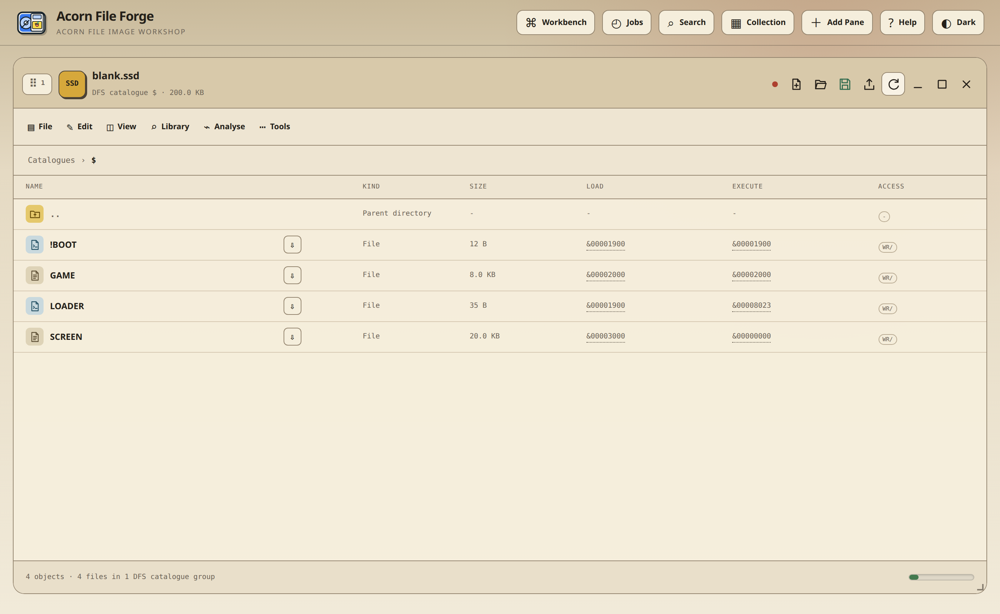
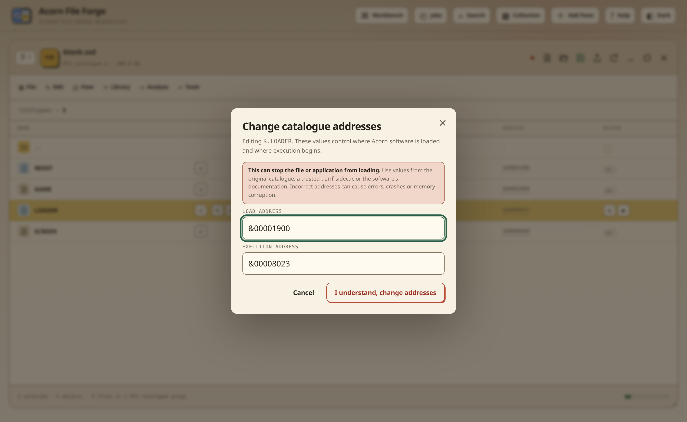

# Atari file catalogue metadata

An GEMDOS entry is more than a filename and a byte stream. The catalogue also
records a protection long, a free-text comment and a datestamp, and a file that
appears on Workbench has an object type in the `.info` icon beside it. Those
values are part of the file's identity: a script will not run without its `s`
bit, an executable will not start without `e`, and Workbench will not show an
icon it cannot type.

Atari File Forge displays those values at file level and preserves them across
supported copies, imports, exports and editor saves. It never invents one
because the bytes happen to resemble a program.



## What GEMDOS stores, and what it does not

| Value | Where it lives | Notes |
| --- | --- | --- |
| Protection bits | The file header block | Eight flags, printed `hsparwed`. The low four are inverted: a set bit means the operation is denied. |
| Comment | The file header block | Up to 79 characters of free text, shown by `List`. |
| Datestamp | The file header block | Days, minutes and ticks since 1 January 1978. A tick is a fiftieth of a second. |
| Workbench object type | The `.info` icon beside the file | Tool, Project, Drawer, Disk, Kickstart and so on. Absent unless the file has an icon. |
| Load or execution address | Nowhere | GEMDOS load files are relocatable. The hunk loader places one wherever there is free memory, so no address is stored and none can be. |

The workbench's file-properties dialog therefore edits protection, comment and
writability. Earlier releases of this application exposed two address words;
those are still read from an old sidecar so nothing is lost, but they are not
written any more.

## The protection bits

```text
h s p a r w e d
│ │ │ │ │ │ │ └── delete   (inverted: set means delete denied)
│ │ │ │ │ │ └──── execute  (inverted: set means execute denied)
│ │ │ │ │ └────── write    (inverted: set means write denied)
│ │ │ │ └──────── read     (inverted: set means read denied)
│ │ │ └────────── archived
│ │ └──────────── pure     (the command may be made resident)
│ └────────────── script   (Execute is not needed to run it)
└──────────────── hold     (keep resident after the first run)
```

A newly written file has all four low bits clear, which prints as `----rwed`:
everything is permitted. Marking a file read-only sets the write and delete
bits, so it prints `----r-e-`.

## Where the metadata is available

| Source | Display | Edit | Notes |
| --- | --- | --- | --- |
| GEMDOS floppy, ADF and ADZ | Yes | Yes | Every DOS type from `DOS\0` to `DOS\5`, at any depth of drawer. |
| A volume opened from a hard-drive partition | Yes | Yes | The metadata belongs to the file inside that partition's own volume, not to the slot record. |
| Partitioned drive, HDF with an RDB | Yes | Yes | Each partition is an ordinary volume. |
| Hardfile HDA with a matching GEO | Yes | Yes | The same operation, while retaining the hardfile's geometry and bitmap safety. |
| Kickstart ROM file archive | Yes | Yes | The archive's own record is changed without altering the file payload. |
| DMS and supported archive members | Yes when metadata exists | Read-only inside the archive | A companion `.inf` sidecar, or a ZIP written on an Atari, can supply it. Extract into writable media to change it. |
| Raw ROM banks | Not applicable | Not applicable | A ROM image is decoded as banks and structures, not as a file catalogue. |
| Directories and grouped result rows | Protection and comment only | Yes | A drawer carries the same header fields a file does. |

## Editing protection and the comment

1. Open the volume and navigate to the file.
2. Read the **Protection** column, printed exactly as `List` prints it.
3. Choose **File properties**, then set the bits you intend and the comment.
4. Confirm. The operation creates the normal image undo point, changes only
   the header block, and leaves the file's bytes untouched.



A missing file, a read-only image or an unsupported filing system is refused
before anything is written.

## Import metadata priority

An image-to-image copy reads the source catalogue directly. A loose host file
carries no Atari metadata, so imports use reliable evidence in this order:

1. the source GEMDOS volume or decoded DMS member;
2. a matching `.inf` sidecar selected with the file;
3. the protection bits a ZIP written on an Atari records for that member;
4. neutral defaults when no trustworthy source exists: everything permitted,
   no comment, and the host file's own timestamp.

Batch imports apply that decision separately to every file. **Apply to all
remaining** accepts each file's own detected values rather than reusing the
first file's.

## Target filenames

The import planner and the write API share one filename policy. An GEMDOS
directory entry holds up to 30 characters, and cannot contain `:`, `/` or `\`.
A full stop is an ordinary character, which is why `Disk.info` and
`Read.Me` are perfectly normal names. A long-filename variant raises the limit,
and the destination reports its own when it does.

Names cannot begin or end with whitespace and cannot contain control
characters, and every target must be representable in Latin-1. Before a
cross-format write, the compatibility review shows every NFKC normalisation,
unsupported-character replacement and truncation, then checks case-insensitive
collisions within each destination drawer: GEMDOS compares names without
regard to case, so `Game` and `game` cannot share one drawer. The same leaf in
two different drawers is valid. Two partitions may hold volumes with the same
title, because a partition is identified by its RDB device name rather than by
the title of the volume mounted in it.

## `.inf` sidecars and downloads

The download arrow beside a file creates a ZIP containing the byte stream and a
matching `.inf` sidecar where catalogue metadata is available. A generated
record has this shape:

```text
Games/Program ----r-e- 00000007 "The game loader"
```

The fields are the file's path inside the volume, its protection bits printed
as `List` prints them, its length in hexadecimal, and its comment when it has
one. A path containing spaces is quoted. The drawer is retained because
`Games/Program` and `Utilities/Program` are different files even though their
leaf names match.

A record written by an earlier release held two address words instead. Those
are still read, so an existing download still imports with whatever it recorded.

Complete ADF, ADZ, HDF, HFE and hardfile downloads do not receive an
image-level sidecar; those formats already contain their own catalogues. Their
timestamped ZIP packages contain the image and a generated technical README,
and a hardfile save also contains the matching GEO descriptor.

## Verification checklist

When correcting metadata for software that previously failed to run:

- compare the values with an original image or a trusted sidecar;
- check that a script carries its `s` bit and an executable its `e` bit;
- check that a command you intend to make resident carries `p`;
- confirm that a write-protected file is meant to be, since a game that saves
  its own high scores is not;
- save, reopen and verify the catalogue before testing on hardware;
- retain a checkpoint or the original image until the software has run on its
  intended machine and filing system.
