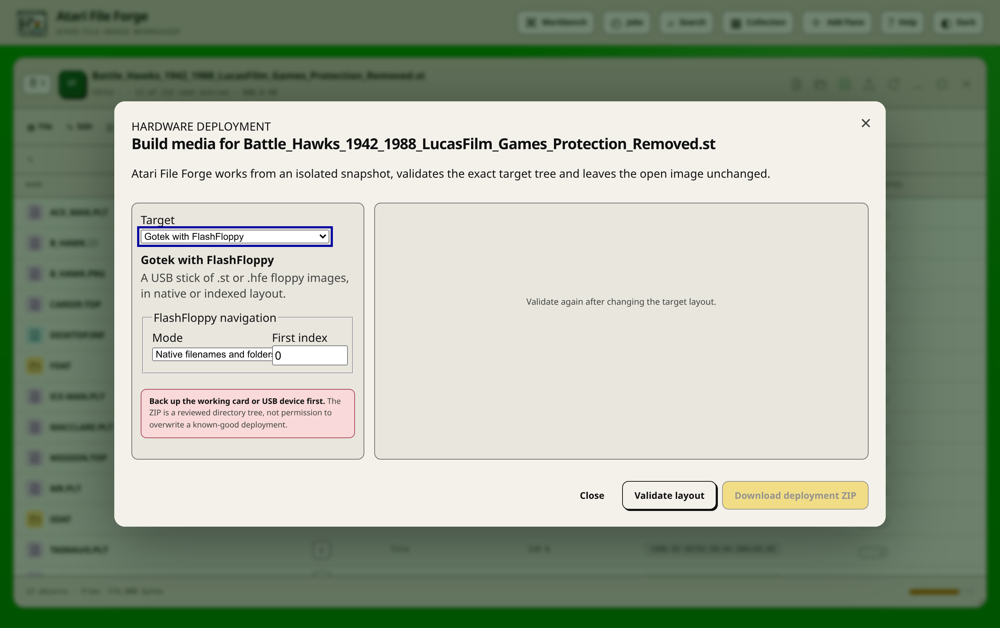

# Hardware deployment assistant

Atari File Forge turns an open image into a checked directory tree for a Gotek,
an SD card in an ACSI device, a CompactFlash or IDE drive, a host folder Hatari
presents as a GEMDOS drive, or a genuine ACSI enclosure. Open the image, apply
the target hardware profile, then choose **Tools → Build hardware deployment**.

The assistant is separate from **Save image**. Save creates the canonical
archive of the working image. Deployment creates a hardware-specific package
whose filenames and directories match the selected target. It never writes
directly to an SD card, a USB device or a physical disk.

## Safety model

Validation and packaging use a sparse private snapshot. The image is finalised,
checked and hashed in that snapshot, so opening the assistant does not change
the live image or clear the pane's changed state. The reviewed source revision
is recorded in the plan. If the image changes before **Download deployment ZIP**
is selected, the server rejects the stale plan and requires another validation.

## What a package contains

Every package contains:

- the exact target directory tree, with the filenames the device expects;
- `README.md`, generated from the chosen target and the applied hardware
  profile, holding the numbered installation steps, the verification checks and
  the rollback instruction;
- `Deployment/manifest.json`, with the source revision, every path, its size and
  its SHA-256;
- `Deployment/compatibility-report.md`, using the same versioned compatibility
  schema as a cross-format copy.

Blocking findings disable download. Warnings stay visible and are copied into
the package, so a manual hardware requirement cannot be forgotten once the
browser is closed.

## Target layouts

### Gotek with FlashFloppy

A floppy image is packaged under `GOTEK-USB` together with an `FF.CFG` that
selects the Shugart interface, the Atari host type and the chosen navigation
mode. Native mode keeps the image's own filename. Indexed mode names it
`DSKA0000` at the chosen starting index, and `FF.CFG` sets `nav-mode = indexed`
with the `DSKA` prefix.

FlashFloppy presents `.st`, `.msa` and `.hfe` images. A flux recording is not
one of those and is refused rather than converted behind your back. A hard drive
is not offered either: its partitions are not floppies.

The geometry has to agree with the boot sector. An ST reads the sectors per
track and the side count from the BIOS parameter block, so a 720 KiB
double-sided image whose block says single-sided will not read on hardware even
though the file size is right. The image health dashboard reports that
disagreement before the package is built.

Steps:

1. Format the USB device as FAT32 with a single partition.
2. Copy the contents of `GOTEK-USB` to the root of the device, keeping `FF.CFG`
   beside the images.
3. Insert the device, select the image, and list the disk from the desktop
   before enabling writes.

The assistant does not generate `HXCSDFE.CFG`. That file holds physical
directory-order state maintained by the HxC selector workflow, and a lookalike
built from filenames would not be safe.

### SD card for an ACSI device

The whole drive image is packaged under `SD-CARD` as one raw `.img` file, to be
written to the card sector for sector. UltraSatan, ACSI2STM and CosmosEx all
read a card written this way.

Steps:

1. Back up the existing card. Writing the image replaces every byte on it.
2. Write the image, for example
   `sudo dd if=SD-CARD/<image>.img of=/dev/sdX bs=1M conv=fsync status=progress`.
3. Set the ACSI id on the device. Id 0 is the id TOS boots from; UltraSatan and
   ACSI2STM present their first card there.
4. Install a driver unless EmuTOS is fitted, which reads ACSI drives itself.
   AHDI, HDDRIVER, PPDRIVER and the ICD driver all work.
5. Boot, list the root of each partition, and read from it before writing.

An ACSI device reads the bytes as they stand. If the open image is byte-swapped,
which is IDE word order, the plan reports it and the image must be un-swapped
before it is written. An ACSI2STM card larger than 1 GiB needs HDDRIVER or the
ICD driver; the built-in and AHDI drivers will not address it.

### CompactFlash or IDE drive

The same raw image, packaged under `CF-CARD`, for an IDE adapter in an ST, STE
or Mega, for a CompactFlash card on that adapter, and for the Falcon's internal
IDE interface.

Steps:

1. Back up the existing card.
2. Write the image, for example
   `sudo dd if=CF-CARD/<image>.img of=/dev/sdX bs=1M conv=fsync status=progress`.
3. Check the byte order the adapter expects. The Falcon internal IDE and most ST
   and STE IDE adapters wire the data bus swapped, so the image on the card is
   byte-swapped.
4. Reproduce the same case in Hatari with `--ide-swap` before trusting the card
   on hardware.
5. Install HDDRIVER or the ICD driver unless EmuTOS is fitted.
6. Boot, list each partition, and read from it before writing.

The plan reports a plain image sent to an IDE target and a byte-swapped image
sent to an ACSI target, because those are the two ways a correct image reads as
noise on correct hardware.

### GEMDOS drive folder

The mounted volume is copied out as a host directory tree under `GEMDOS-DRIVE`,
with a `hatari.cfg` fragment beside it. Hatari's `--harddrive` presents that
folder to the machine as a GEMDOS drive.

Names are written the way TOS sees them: upper case, eight characters and a
three-character extension. `AUTO` keeps its name, so Hatari runs the programs
inside it at boot exactly as a real drive would.

Steps:

1. Extract `GEMDOS-DRIVE` to a directory on the host computer.
2. Point Hatari at it with `--harddrive /path/to/GEMDOS-DRIVE`, or paste the
   fragment from `hatari.cfg` into your own configuration.
3. Leave the drive read-only until it has been listed and read, then allow
   writes if the software needs to save.

This target is offered for a floppy or for a selected partition of a drive, not
for a whole partitioned drive: a drive is several volumes and a host folder is
one.

### ACSI hard drive

A Megafile, SH204, SH205 or third-party enclosure has no removable card, so the
package holds the raw image under `ACSI-DRIVE`, its SHA-256, and the steps to
get it onto the drive.

Steps:

1. Back up whatever the enclosure currently holds. The drive inside it is
   replaced wholesale.
2. Write `ACSI-DRIVE/<image>.img` to the drive: either connect the drive to the
   host computer directly, or write the image to a card in a CosmosEx or
   UltraSatan and copy it across on the machine.
3. Set the ACSI id with the switch on the back of the enclosure. Id 0 is the
   drive TOS boots from.
4. Install a driver: HDX ships with AHDI, HDDRIVER installs itself from the
   desktop, and the ICD tools drive most third-party host adapters.
5. Boot from the drive, list each partition, and read from it before writing.

The plan warns about the TOS partition limits before the package is built. TOS
1.00 stops at 16 MiB, TOS 1.02 to 1.62 at 256 MiB, and TOS 2.06, 3.06 and 4.0x
at 512 MiB. Nothing above 512 MiB mounts without a replacement DOS such as
BigDOS or MiNT.

## Profile validation

The applied hardware profile is checked against the selected target before the
package is built. The assistant reports:

- a target the machine has no interface for: a Gotek package without `gotek`, an
  SD-card package without `acsi2stm`, `ultrasatan` or `cosmosex`, a
  CompactFlash package without `ide-internal`, `ide-adapter` or `cf-adapter`,
  and an ACSI enclosure package without `acsi-megafile` or `acsi-third-party`;
- a partition larger than the selected TOS release will mount;
- a byte-swapped image sent to an ACSI target, which needs the bytes un-swapped;
- a plain image sent to an IDE target on a machine whose adapter expects swapped
  data;
- a card image with no partition table, whose geometry the receiving driver has
  to be told.

## Verification

1. Compare each SHA-256 in `Deployment/manifest.json` against the file you wrote
   or copied.
2. Boot the machine and list the root of every volume.
3. Read a known file from each volume before writing anything.
4. Reboot and repeat the directory listing, so a write that only appeared to
   succeed is caught.

## Rollback

Keep the previous working medium unchanged until the new deployment has passed
every check above. If any check fails, put the backup back and revalidate the
image in Atari File Forge before trying again. Nothing in the assistant writes
to a device, so a rollback is always a copy of your own backup rather than an
undo inside the application.

## Recommended workflow

1. Apply the exact hardware profile.
2. Save or checkpoint important edits.
3. Choose **Tools → Build hardware deployment** and select the target.
4. For a Gotek, choose Native or Indexed mode and the first index.
5. Select **Validate layout**. Review target paths, byte totals, SHA-256 values,
   profile warnings and installation steps.
6. Resolve blocking findings. Revalidate after changing either the image or the
   target options.
7. Download the ZIP and extract it to a temporary host directory.
8. Back up the known-good physical medium, then write or merge the generated
   tree.
9. Perform the verification checks listed in the package README.
10. Keep the previous medium unchanged until those checks pass.

## Cross-format preflight

Drag and drop, Cut, Copy and Paste, **File → Insert File**, folder import and
Online Library installation all use the same versioned compatibility report
before a cross-format batch starts. The report shows each proposed target name,
the 8.3 conversion, attribute and datestamp loss, and collisions. Nothing is
copied while that review is open. Online Library keeps the review inside its
search dialog and requires a second, explicitly reviewed Install action.

JSON and Markdown exports are available from the full review dialog. The manual
**Analyse → Dry-run selected items** command remains useful when a report is
needed without starting a transfer.

## Limits

- Deployment does not format removable media or overwrite an attached device.
- Driver installation on the target drive remains a manual step. Atari File
  Forge does not write AHDI, HDDRIVER or ICD boot code into a package.
- The geometry an adapter assumes for an image with no partition table is a
  documented manual decision.
- Flux recordings, unsupported HFE track layouts and ambiguous GEMDOS media keep
  their read-only or rejected behaviour, so they are not offered as deployment
  sources.
