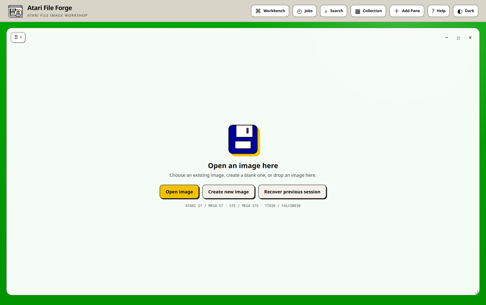

# Installing and operating Atari File Forge

Atari File Forge is distributed as a Docker application and as a native Debian
package. The repository builds the web service, filesystem tools, conversion
tools and managed emulators into one container image. The supported container
targets are `linux/amd64`, `linux/arm64` and 32-bit `linux/arm/v7`.

A native GTK 4 host is also available for Linux. It shares the complete Flask
application and frontend rather than maintaining a separate editor. See the
[Linux desktop guide](LINUX-DESKTOP.md) for its system packages and installer.

## Install a Debian package

The release page provides one `.deb` for each supported distribution and
architecture combination. A package
must be built on the Debian or Ubuntu release it targets because Capstone and
other native Python extensions use that distribution's Python ABI. Current
Debian 13 and Ubuntu 24.04 or later provide the required GTK 4, Libadwaita and
WebKit 6 packages.

Install a downloaded package with APT so its system dependencies are resolved:

```bash
sudo apt install ./atari-file-forge_0.4.0-1~deb13_amd64.deb
```

Launch **Atari File Forge** from the application menu, open an associated image
from the file manager, or run `atari-file-forge`. Upgrade by installing the new
package over the old one. Remove the program with:

```bash
sudo apt remove atari-file-forge
```

Removal leaves working images and preferences in the user's XDG data and
configuration directories. Delete those only after saving all required work.
The package contains the shared application, pinned Python dependencies, the
pinned HxCFloppyEmulator command-line converter (`hxcfe`) and its private
runtime libraries,
desktop entry, MIME definitions, icon, AppStream metadata, manual page and
handbook. Atari firmware, commercial software and optional emulators are not
bundled.

HxCFE provides HFE opening, creation and guarded saving. The executable and
libraries are private to Atari File Forge, so no separate host HxC package is
required. See the [HFE, SCP and HxCFE guide](HFE-HXC-GUIDE.md) for runtime paths,
supported HFE revisions and the verification process.

To build the native package on the current machine:

```bash
sudo apt install -y python3 python3-pip dpkg-dev desktop-file-utils appstream git make gcc libc6-dev
tools/build-linux-package.sh
```

The result is written to `dist/`. The build downloads the complete dependency
set pinned in `packaging/linux/requirements-debian.txt` and compiles HxCFE from
the revision recorded in `tools/build-hxc-runtime.sh`, so release builders
should use a controlled network or approved source and Python package mirrors.
`tools/build-release.sh` requires a clean Git tree and writes the source
archive, current-system `.deb` and `SHA256SUMS`. The tag-driven release workflow
builds and inspects Debian 13 and Ubuntu 24.04 packages for AMD64, ARM64 and
ARMv7 before it publishes them with a combined checksum manifest.

Return to the [documentation index](README.md) for media, editor, ROM, firmware
and release references.

The normal installation exposes:

- host port `8684` for the application and API, published from `8666` inside
  the container;
- host port `8685` for the managed emulator display over noVNC, published from
  `8668` inside the container;
- the named `atari-file-forge-work` volume for private working sessions.

Neither port should be exposed directly to an untrusted network. Atari File
Forge is designed for a local machine or trusted LAN. Use an authenticated,
TLS-enabled reverse proxy before making it reachable from elsewhere.

## Before installing

You need:

- Git;
- Docker Engine or Docker Desktop;
- Docker Compose v2, normally invoked as `docker compose`;
- enough storage for compiler layers, the final image and the media you edit;
- a current browser with JavaScript, `dialog`, IndexedDB and drag-and-drop
  support.

Large hard-disk images require additional temporary space while an image
is uploaded, checkpointed and packaged. Allow space for the source image, its
working copy and the finished ZIP at the same time. Raspberry Pi builds also
need room for the native HxCFE and Capstone builds.

## Install on desktop Linux, macOS or Windows

Clone the public repository over HTTPS. HTTPS does not require a GitHub SSH
key:

```bash
git clone https://github.com/peteclarke-del/AtariFileForge.git
cd AtariFileForge
docker compose up --build -d
```

Open <http://localhost:8684> after the service reports healthy.



On macOS and Windows, run the same commands in a terminal supported by Docker
Desktop. Make sure Docker Desktop is running and has enough memory and disk
allocated for a native multi-stage build. On Linux, the Docker daemon must be
running and the current user must either belong to the `docker` group or use an
approved equivalent setup.

Systems which still use the old standalone Compose program can substitute
`docker-compose` for `docker compose`. The repository file is named
`docker-compose.yml` and both commands read it from the project directory.
Compose v2 is preferred. Legacy Compose 1.29 can fail while recreating a
stopped container with `KeyError: 'ContainerConfig'`; the image and named work
volume are not the cause.

## Install on Raspberry Pi

64-bit Raspberry Pi OS is recommended. Current 32-bit Raspberry Pi OS is also
covered by the `linux/arm/v7` build gate. A Pi 4 or newer with sensible swap and
several gigabytes of free storage provides the most practical first build.

Install the host packages:

```bash
sudo apt update
sudo apt install -y git docker.io docker-compose-plugin
sudo usermod -aG docker "$USER"
```

Log out and back in after changing group membership, then verify Docker without
`sudo`:

```bash
docker version
docker compose version
```

Clone and build as the normal user:

```bash
git clone https://github.com/peteclarke-del/AtariFileForge.git
cd AtariFileForge
docker compose build --pull --progress=plain
docker compose up -d
```

Open `http://<pi-address>:8684` from a browser on the same trusted network.

The save and background-operation identifiers work on this plain-HTTP LAN URL.
Browsers expose `crypto.randomUUID()` only in a secure context, which excludes
an ordinary `http://<pi-address>` page. Atari File Forge therefore uses the
browser's cryptographically secure `getRandomValues()` API to construct a UUID
when `randomUUID()` is unavailable. No HTTPS-only API or weak random fallback
is required. TLS is still strongly recommended whenever the service leaves a
trusted private network.

### What to expect from the first Pi build

The first build is deliberately substantial. The Dockerfile compiles native
components in architecture-matched builder stages and copies only the runtime
results into the final image. On a Pi this can take many minutes. Plain progress
output should continue to show package installation or compilation even when a
single build step is slow.

The build performs the following platform-sensitive work:

1. Builds a native Capstone installation when no suitable wheel can be used.
2. Builds the pinned HxCFloppyEmulator command-line converter (`hxcfe`), its
   private libraries and the upstream licence.
3. Installs the emulator runtime components.
4. Installs Trixie package names appropriate to the target architecture,
   including `liballegro4.4t64`.
5. Verifies that Capstone exposes M68K support for every 68000-family mode.
6. Reconstructs and checks the bundled expansion-ROM scaffold.
7. Import-checks the bundled Atarinut engine's writable GEMDOS API for every
   DOS type it creates.

Do not cancel a build merely because another independent builder is still
running. BuildKit may show a stage as `CANCELED` after a different stage fails;
the first `ERROR` block is the useful diagnosis.

## First launch

Check the service and API:

```bash
docker compose ps
curl http://localhost:8684/api/health
docker compose logs --tail=100 atari-file-forge
```

A healthy response contains `"engine":"atarinut"`, `"status":"ok"` and the
version recorded in the repository `VERSION` file. Do not use a version copied
from this guide as the health criterion because the guide remains useful across
release candidates.

At first launch the page contains one empty pane. Choose **Open image**,
**Create new image** or **Recover previous session**. The application stores a
random browser identity locally and uses it to isolate recoverable sessions.
Another browser profile cannot browse those sessions merely because it reaches
the same server.

## Configuration

The Compose service defines these settings:

| Setting | Default | Purpose |
| --- | --- | --- |
| `ATARI_FILE_FORGE_WORK_DIR` | `/app/work` | Working-session and job storage inside the container |
| `ATARI_MAX_UPLOAD_GIB` | `8` | Maximum accepted browser upload size in GiB |
| `ATARI_FILE_FORGE_PORT` | `8684` | Host port for the web UI and JSON API |
| `ATARI_FILE_FORGE_VNC_PORT` | `8685` | Host port for the noVNC emulator display |

The container always listens on `8666` and `8668`; only the published host
ports move. They default to `8684` and `8685` because `8666` and `8668` are
frequently already in use. The sibling File Forge applications publish 8666,
8668, 8674 and 8675, and they are all meant to run side by side.

Set either variable to move a port, or bind it to one interface by editing the
left side of the Compose mapping directly: `127.0.0.1:9866:8666` keeps the
service local and opens it at `http://localhost:9866`.

Increasing the upload limit also increases the maximum temporary storage an
operation may consume. It does not enlarge a filesystem or bypass an image
format's own capacity rules.

## Working sessions, browser identity and backups

Files selected in the browser are uploaded into private working sessions. The
source files on the host are never modified in place. The named Docker volume
retains those sessions across ordinary container replacement:

```bash
docker compose down
docker compose up -d
```

`docker compose down -v` deletes the volume. Use it only when every recoverable
working image can be discarded.

For an operational backup, save important images through the UI first. A saved
timestamped ZIP is the portable, documented result. To make an additional
administrator backup of the Docker volume, stop writes and use the normal
volume-backup procedure for the host. Restoring only browser local storage does
not restore server image bytes, and restoring only the volume does not recreate
the original browser identity.

Normal browser refresh restores open pane references, current directories and
the workspace layout. Deliberately closing a pane removes it from automatic
restore while its server-side recovery copy remains available until cleared.

## Updating

Save or checkpoint important work, then update the checked-out branch:

```bash
git pull --ff-only
docker compose build --pull
docker compose up -d
```

`docker compose up -d` replaces the application container but reuses the named
work volume. Refresh the browser once after the new health endpoint responds.
If static assets appear mixed between versions, perform a hard refresh rather
than clearing the work volume.

Review changes before updating a production-like local installation. Media
editing code can legitimately tighten validation when an unsafe format variant
is discovered.

## Stopping, starting and removing the service

```bash
# Stop and retain the container and work volume
docker compose stop

# Start it again
docker compose start

# Remove the container and network, retaining the work volume
docker compose down

# Remove the container, network and every retained working session
docker compose down -v
```

Removing the Git checkout does not remove the named Docker volume. Removing the
volume does not remove timestamped ZIPs already downloaded through the browser.

## Logs and diagnostics

Useful commands are:

```bash
docker compose ps
docker compose logs --tail=200 atari-file-forge
docker compose logs -f atari-file-forge
docker image ls atari-file-forge
docker volume inspect atari-file-forge-work
```

For a reproducible build diagnosis:

```bash
git status --short
git rev-parse HEAD
docker compose build --pull --no-cache --progress=plain
```

Keep the full first error block. Later `CANCELED` lines usually describe stages
BuildKit stopped after that error and are not independent failures.

## Common installation and build failures

### `Permission denied (publickey)` while cloning

The `git@github.com:...` address uses SSH authentication. Use the public HTTPS
command instead:

```bash
git clone https://github.com/peteclarke-del/AtariFileForge.git
```

### `no configuration file provided: not found`

The shell is not in the cloned project directory. Run `cd AtariFileForge`, then
confirm `docker-compose.yml` is present before starting the build.

### Docker socket permission denied

Log out and back in after adding the account to the `docker` group. Verify with
`docker version`. Avoid changing Docker socket ownership as a shortcut.

### `make: command not found` while building Capstone

The checkout predates the native dependency builder. Pull the current branch
and rebuild. The current builder installs its compiler and `make` before
building Capstone.

### `liballegro4.4 has no installation candidate`

The checkout predates Debian Trixie's `liballegro4.4t64` correction. Pull the
current branch and rebuild with `--pull`.

### `No matching distribution found for capstone==5.0.9`

Older builds moved an architecture-tagged wheel between incompatible Python
stages. The current Dockerfile copies a verified staged native installation.
Pull the current branch and rebuild. If the message remains, include the
`python-deps` stage above it in the report.

### `KeyError: 'ContainerConfig'` from legacy Compose

This is a known legacy Compose recreation failure. Confirm the named work
volume before touching the stale container:

```bash
docker volume inspect atari-file-forge-work
docker ps -a --filter name=atari-file-forge
```

Remove only the stopped `atari-file-forge` service container, install the
Compose v2 plugin, then run `docker compose up -d` again. Do not use
`docker compose down -v`: `-v` deletes the volume containing recoverable
working sessions.

### Build appears to stop for a long time

Use `docker compose build --progress=plain`. HxCFE, Capstone and emulator builds
can be slow on a Pi. A healthy build continues to print compiler output or
eventually advances. Check free disk, available memory, swap and host
temperature before assuming a software deadlock.

### Out of memory or a compiler killed with signal 9

Stop unrelated containers, provide sensible swap and rebuild. Do not keep
restarting the same build while the host is under memory pressure because that
also consumes disk with incomplete cache layers.

### Port 8666 or 8668 is already in use

Stop the conflicting service or change the host side of the mapping in
`docker-compose.yml`. Keep container ports `8666` and `8668` unchanged.

### Application starts but an emulator window is blank

Check port `8668`, browser pop-up policy and the application log. Managed
emulators run through a virtual display inside the container. Firmware is
audited before compatible Atari 4000 actions are enabled. See the
[firmware notes](../firmware/README.md).

### Browser cannot recover a session

Confirm the same browser profile is being used, the named volume still exists
and the application origin has not changed from `localhost` to an IP address or
different port. Browser identity and server-side session bytes are both needed.

## Security and privacy notes

- The application does not require a cloud account.
- Online Library searches contact enabled public catalogue sites through the
  server when the user starts a search.
- Uploaded images remain in the local Docker work volume unless the operator
  has separately configured remote storage or backups.
- Managed emulator ports do not provide authentication.
- Treat disk images and archives as untrusted input. Atari File Forge validates
  formats and filenames, but operators should still keep the service local and
  retain known-good originals.
- Do not redistribute firmware, commercial images or downloaded software
  without the appropriate permission.

## Developer installation checks

After modifying build or dependency files, test at least one clean native build
and rely on CI for all three supported Linux architectures. The full release
gate is in [RELEASE-CHECKLIST.md](RELEASE-CHECKLIST.md).
