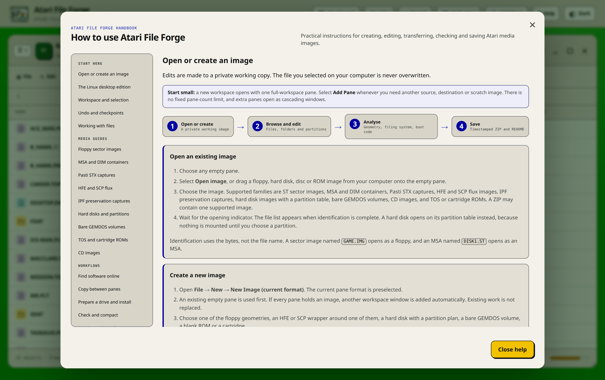
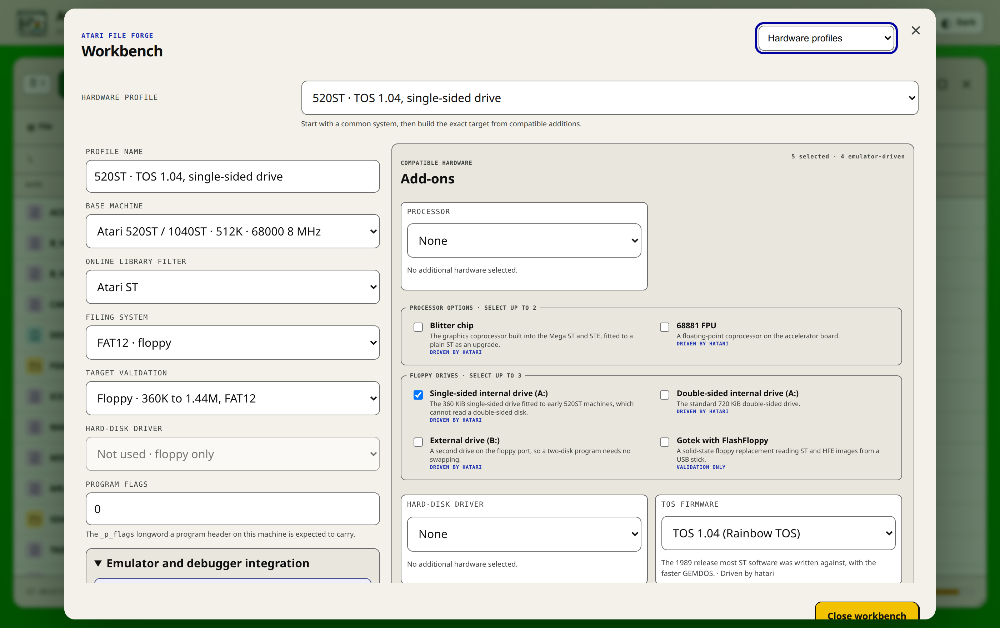

# Atari File Forge documentation

This directory is the technical handbook for Atari File Forge. Start with the
task you need to complete, then follow the linked guide for the details. The
in-app **Help** handbook covers the same workflows with controls and terminology
that match the running frontend.

## Choose a guide

| I want to... | Read this |
| --- | --- |
| Install, update, back up or troubleshoot the Docker service | [Installation and operations](INSTALLATION.md) |
| Install or develop the native Linux application | [Linux desktop application](LINUX-DESKTOP.md) |
| Build for Windows, macOS or an RPM-based Linux | [Windows, macOS and RPM builds](CROSS-PLATFORM.md) |
| Read or write real disks with Greaseweazle or a floppy controller | [Physical floppy guide](PHYSICAL-FLOPPY-GUIDE.md) |
| Open, create, edit, verify or troubleshoot HFE or SCP flux images, or export an image to another compatible format | [HFE, SCP and export guide](HFE-HXC-GUIDE.md) |
| Hand an image to the emulator, and choose between your own TOS and the bundled EmuTOS | [Emulator guide](EMULATOR-GUIDE.md) |
| Build a checked Gotek, SD card, CF card, host folder or ACSI drive | [Hardware deployment assistant](HARDWARE-DEPLOYMENT-GUIDE.md) |
| Review the mandatory web and desktop parity rules | [Web and desktop platform contract](PLATFORM-CONTRACT.md) |
| Understand every supported media family and normal workflow | [Main project handbook](../README.md) |
| Edit BASIC, configuration files, machine code, archives or binary data | [File editor and code analysis](FILE-EDITOR-GUIDE.md) |
| Inspect, preserve or edit GEMDOS attributes and datestamps | [Atari file catalogue metadata](FILE-METADATA-GUIDE.md) |
| Prepare a drive, and install a floppy onto it by staging or with its own installer | [Preparing a drive and installing floppies](INSTALL-GUIDE.md) |
| Inspect, compare, build, patch or program TOS and cartridge ROMs | [ROM image handbook](ROM-GUIDE.md) |
| Read a preservation capture that records the physical disk | [IPF and preservation captures](IPF-GUIDE.md) |
| Build and validate a release | [Release checklist](RELEASE-CHECKLIST.md) |
| Review the current release, 0.3.0 | [Atari File Forge 0.3.0 notes](releases/0.3.0.md) |
| Contribute code or documentation | [Contribution guide](../CONTRIBUTING.md) |
| Understand maintainership and project decisions | [Project governance](../GOVERNANCE.md) |
| Report a vulnerability | [Security policy](../SECURITY.md) |
| Check dependency, emulator and firmware licence boundaries | [Third-party notices](../THIRD_PARTY_NOTICES.md) |
| Ask for support or report conduct concerns | [Support](../SUPPORT.md) and [code of conduct](../CODE_OF_CONDUCT.md) |
| Review validation evidence | The CI run on the released commit; see the [release checklist](RELEASE-CHECKLIST.md) |
| Review completed and outstanding product improvements | [Product backlog](BACKLOG.md) |
| Audit the firmware shipped with the application | [Firmware notes](../firmware/README.md) |
| Review the engine's GEMDOS integration and format limits | [Atarinut GEMDOS support](ATARINUT-GEMDOS-SUPPORT.md) |
| Automate creation, validation, imports, comparison and patching | [Headless CLI and deterministic recipes](CLI-GUIDE.md) |
| Catalogue owned images and find cross-image duplicates or missing titles | [Private collection catalogue](COLLECTION-GUIDE.md) |
| Find possible lives, energy, timer or collision modifications in game code | [Cheat-candidate analysis](CHEAT-ANALYSIS-GUIDE.md) |
| Complete a task while the application is open | Select **Help** in the application header |

## Capability map

| Media or feature | Browse | Edit | Create | Transfer | Analyse and repair | Export as | Save package |
| --- | ---: | ---: | ---: | ---: | ---: | ---: | ---: |
| ST sector images, 360K to 1.44M | Yes | Yes, including attributes and datestamp | Yes, every standard geometry | Files and complete images | Directory, chain, capacity and TOS-limit checks | ST, MSA, DIM, HFE and SCP | Image, metadata and README |
| MSA containers | Yes, decoded to sectors | Yes, once decoded | Yes, by conversion | Files and complete images | Per-track packing report and round-trip proof | ST, MSA, DIM, HFE and SCP | Image and README |
| DIM containers | Yes, decoded to sectors | Yes, once decoded | Yes, by conversion | Files and complete images | Track and used-sector report | ST, MSA, DIM, HFE and SCP | Image and README |
| Pasti STX captures | Yes, as recovered sectors | No, the format records a physical read | No | Recovered sectors into writable media | Per-track protection report | ST | Working image and README |
| HFE floppy images | Yes | Clean sector HFE v1 only | Yes | Files and images | Track and sector capability checks | ST, MSA, HFE and SCP | HFE and README |
| SCP flux captures | Yes, when the converter decodes a GEMDOS volume | Where the capture re-encodes byte for byte | No | Files and images | Round-trip re-encode verification | ST, MSA, HFE and SCP | SCP and README |
| Preservation captures, IPF | Yes, when the decoder library is installed | No, the format records a physical read | No | Recovered sectors into writable media | Per-sector recovery report | ST | Working image and README |
| Partitioned hard disks, AHDI, extended and ICD tables | Yes, every partition it chains to | Yes, inside any mounted partition | Yes, with a partition plan | Files, folders and complete images | Table, partition bounds, boot sector and TOS-limit checks | One partition as a sector image | Complete drive and README |
| Hard disks with a PC partition table | Yes, every FAT partition | Yes, inside any mounted partition | Yes | Files, folders and complete images | The same checks, plus logical sector size | One partition as a sector image | Complete drive and README |
| Byte-swapped drive images | Yes, un-swapped transparently | Yes | No, written in the normal order | Files and folders | The swap is reported so a target cannot be fed the wrong order | Un-swapped sector image | Image and README |
| Bare GEMDOS volumes | Yes | Yes, including attributes and datestamp | Yes, at any size FAT16 allows | Files and folders | Filesystem, capacity and TOS-limit checks | Sector image | Image and README |
| TOS ROM images | Header, segments, entry points and fonts | No, a ROM is read-only | No | Banks and programmer files | Header, checksum, date and vector-install checks | No | ROM, project JSON and README |
| Cartridge and custom ROM images | Banks, headers and regions | Bytes, project data and supported structures | Yes | Banks and programmer files | Header, code, data and checksum checks | No | ROM, project JSON and README |
| CD images | Yes, read-only | No | No | Files into writable media | Name-scheme and structure checks | No | Exported file or destination image |
| ZIP and other supported archives | Yes, as a hierarchy | Extract, inspect and edit supported members | No | Members into writable media | Type and metadata inspection | No | Exported member or destination image |

The table is a navigation aid, not a replacement for format restrictions.
Atari File Forge rejects geometry, track and filesystem variants it cannot
write safely. Read the warning shown by the application before converting or
repairing unusual media.

## Main workflows

### Work with several images

The workspace starts with one pane and has no fixed pane-count limit. Each pane
is a movable, resizable window with its own open image, current directory,
selection, progress, undo history and hardware profile. Panes can overlap,
snap to workspace sides or corners, minimise to the workspace shelf and restore
their layout after refresh. Dragging between panes
uses the same validation as Cut, Copy and Paste, including the 30-character
GEMDOS name limit, free-block capacity and metadata conversion.

Cross-format drag, clipboard, File-menu and Online Library batches stop at a
shared compatibility review before the first write. The review records every
target-name conversion and metadata loss using the same exportable schema as
**Analyse → Dry-run selected items**.

### Edit files by content

Double-click a file to open the suitable editor. Tokenised ST BASIC opens as
editable source, command files open as scripts, recognised machine code opens
as annotated disassembly, archives open as file hierarchies, and other binary
data opens in the hex editor. The editor includes search and replace, history,
safe save and save-as operations, local export, folding, language help, BASIC
formatting and guarded source transformations. See the
[editor handbook](FILE-EDITOR-GUIDE.md) for the exact save and byte-sync rules.

Open one BASIC or machine-code file and use **Tools → Find cheat candidates**
for a read-only gameplay-state report. It distinguishes strong,
likely and possible evidence, supports purpose filters and links to optional
online identification and specialist references. It does not patch uncertain
code. Proven machine-code changes can be saved as exact-hash guarded patches;
the host-private library matches the complete file hash and original bytes,
then applies through an automatic checkpoint. Runtime observations remain
tester supplied until managed watchpoint correlation is complete. See the
[cheat analysis guide](CHEAT-ANALYSIS-GUIDE.md).

### Identify what a disk is and how it starts

An imported disk arrives with a volume label, a set of files and nothing else.
Atari File Forge reads that evidence and proposes a title and the file that
starts the software. A program in the `AUTO` folder outranks the rest, because
TOS runs it before the desktop appears; a `DESKTOP.INF` that installs an
application follows, and then conventional loader names, each judged by its
actual content rather than its name alone. Every proposal carries its evidence,
and one the evidence does not support is marked ambiguous so the caller asks
rather than writes.

### Test against a hardware profile

The Workbench describes the base machine, the TOS release, compatible
additions, memory, storage interface and display. Analysis and help use that
profile when deciding whether a program, image or partition size is
appropriate. A managed Hatari session provides launch and debugging paths for
every medium it can genuinely mount; it is the one bundled emulator because a
single build covers the whole Atari range, and it boots the bundled EmuTOS when
you have supplied no TOS ROM of your own.

Use **Tools → Build hardware deployment** to create a validated Gotek, SD
card, CF card, host folder or ACSI drive package from the open image. The assistant
works on an isolated snapshot, shows exact paths and SHA-256 values, and writes
the installation, verification and rollback procedure into the downloaded
ZIP. See the [deployment guide](HARDWARE-DEPLOYMENT-GUIDE.md).

### Preserve and recover work

Browser-owned sessions are private working copies. Named checkpoints and undo
cover image changes, while workspace restoration reopens panes after an
ordinary refresh. Saving builds a timestamped ZIP only after the image and its
documentation are complete. Each package includes the image, partner and
metadata files where applicable, checksums, target details, warnings and a
generated README.

### Automate a repeatable build

The supported headless CLI exposes image creation, finalisation, validation,
manifest export, host-file import, container conversion, compaction, comparison and
guarded patches. Mutating commands have a dry-run
mode with stable JSON status and exit codes. Completed commands can record a
versioned recipe containing exact source hashes and replayable non-secret
decisions. See the [CLI guide](CLI-GUIDE.md).

### Catalogue a collection

The header **Collection** command indexes complete manifests in private local
state. The web edition uses origin-scoped IndexedDB; the Linux desktop edition
uses an atomic, mode-0600 XDG configuration file. It records user-supplied
locations and machines, identifies exact
cross-image content and title variants, maintains a wanted-title list and marks
entries stale when an open image revision changes. Full database backup/import
and a smaller report export remain separate. See the
[collection guide](COLLECTION-GUIDE.md).

## Documentation conventions

- Write direct, factual prose. State the supported operation, its validation
  boundary and the observable failure mode. Do not imply support that has not
  been exercised.
- Use commas, colons, semicolons or separate sentences instead of em dashes.
- Distinguish implemented behaviour, retained test evidence and work that
  still requires hardware or architecture-specific validation.
- Menu paths use **File → Save image** style notation.
- Atari paths use GEMDOS syntax: a backslash between components and an optional
  drive letter, as in `GAMES\STARBALL.PRG` or `C:\AUTO\FOLDRXXX.PRG`. Names
  are upper case, at most eight characters with a three character extension,
  and the full stop separates the two.
- Sizes use KiB, MiB and GiB when describing byte capacity.
- “Working image” means the private server-side copy, not the source selected
  from the local computer.
- “Save” updates the working image. “Export” downloads an individual file.
  “Save image” creates the timestamped download package.
- Screenshots are captured from the current Docker build and should be updated
  whenever the illustrated controls or workflow change materially.

## Keeping the handbook current

Documentation changes are part of feature work. A change is complete when:

1. The main README and the relevant specialist guide describe the behaviour.
2. The in-app handbook uses the same names and restrictions.
3. Configuration, environment variables, ports and persistence rules match the
   Docker files in the repository.
4. Local links and image references resolve.
5. Changed UI screenshots are captured from a clean current build.
6. The release checklist includes any new generated-media or manual test gate.
7. Documentation regression tests pass and the published prose contains no em
   dashes or obsolete pane-count claims.

Do not use files from `samples/` as published documentation assets. That
directory is intentionally excluded from Git, release archives and the Docker
build context.
