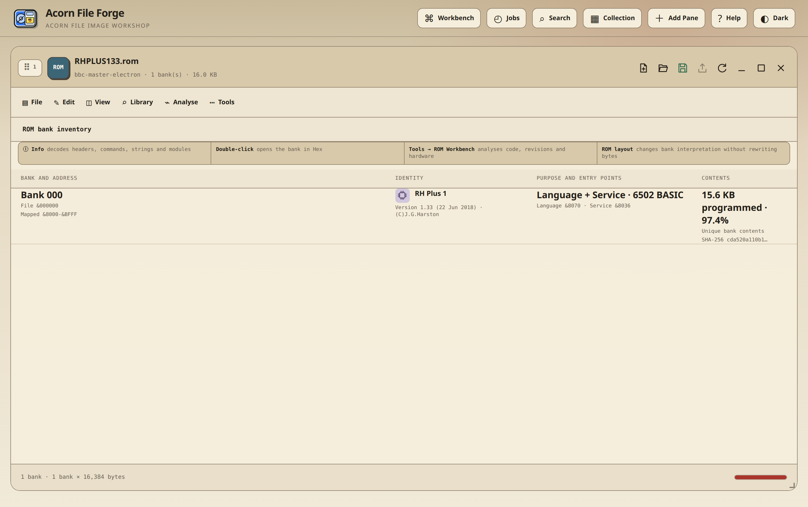
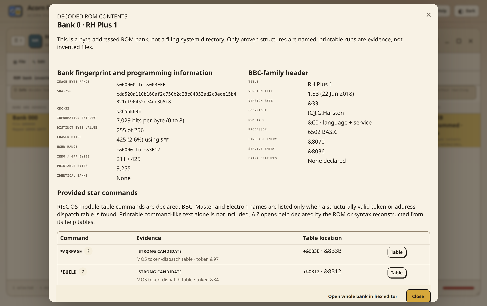
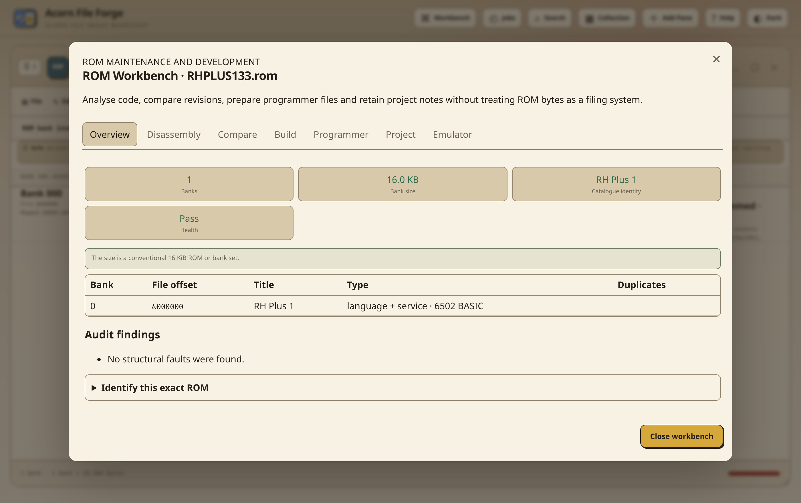
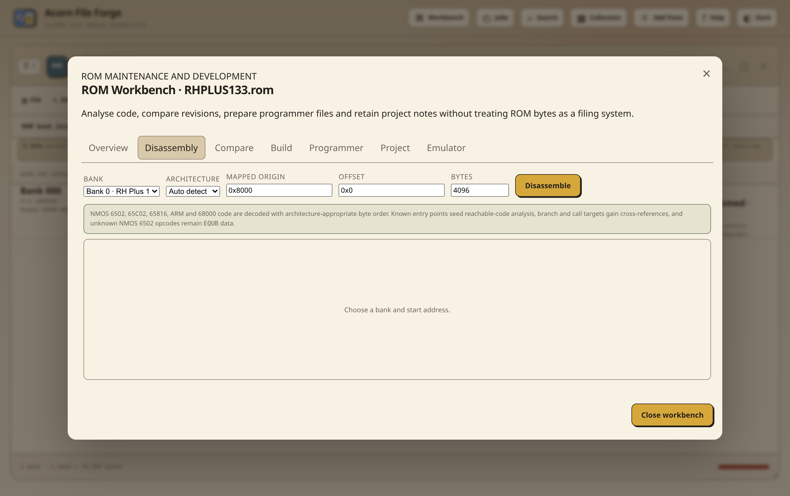
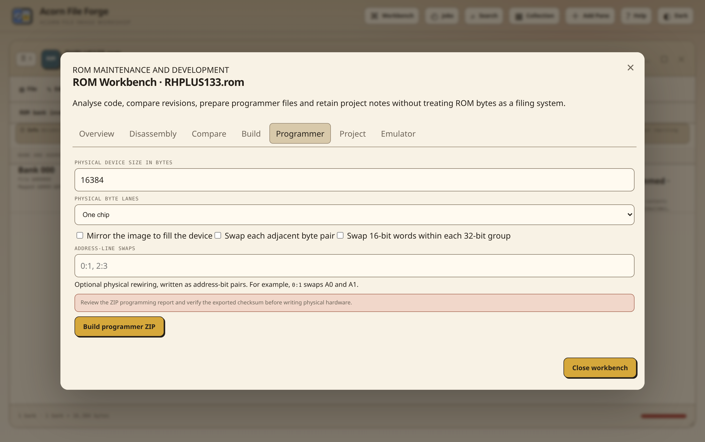

# ROM image handbook

This handbook covers the ROM-specific parts of Atari File Forge. It is intended
for ROM collectors, developers, repairers and anyone preparing images for a
programmer. The main [README](../README.md) remains the complete application
guide. This document goes deeper into ROM interpretation, maintenance and
hardware preparation.

Return to the [documentation index](README.md) for installation, media-format,
file-editor, firmware and release references.

## Safety first

A ROM image is executable machine data. It does not contain a normal OFS or
FFS catalogue, so names shown by the application are decoded structures and
evidence, not files that can be mounted or extracted.

Before changing a ROM:

1. Keep the original dump outside Atari File Forge.
2. Create a named checkpoint in **Edit -> Checkpoints**.
3. Record the machine, socket, ROM board, chip type and any link settings under
   **Tools -> ROM Workbench -> Project**.
4. Save and compare checksums before programming a device.
5. Test in an emulator or a spare programmable device before replacing a
   known-good ROM.

A recognised title or valid header proves only that a structure was decoded.
It does not prove that the code is safe for a particular machine, ROM slot,
accelerator configuration, expansion board or physical device.

## Supported ROM input

The normal image picker recognises `.rom`, `.rom0` through `.rom7`, and `.bin`
files that contain a recognisable Atari header. Use **Raw format override ->
Atari ROM** when a headerless binary or unusually named dump is misidentified.

The application supports:

- 8 KiB to 32 KiB Atari expansion and diagnostic ROMs;
- 32 KiB and larger images divided into configurable logical banks;
- 256 KiB images commonly exposed as sixteen 16 KiB banks;
- a partial final bank, preserved without padding and reported by Image Health;
- Atari-family language, service and combined language/service headers;
- Atari-family 68000, 68010 and 68000 processor flags;
- TOS extension ROM trailers and plausible relocatable module headers;
- two-chip and four-chip byte-interleaved source sets;
- custom byte images where no standard header can be proved.

Logical bank size must be at least 256 bytes and aligned to 256 bytes. The bank
view does not rewrite, pad or reorder bytes merely because its layout settings
change.

## Opening one image or a physical chip set

### One image

1. Choose **Open image** in an empty pane.
2. Select the ROM or BIN.
3. Confirm the platform and byte layout in the ROM summary.
4. Use the raw Atari ROM override if automatic detection is inappropriate.
5. After opening, choose **Tools -> ROM layout** if the logical bank size,
   erased byte, target family or layout needs correction.

### Two or four physical files

Select two or four equal-sized component files together. The open dialog asks
how they relate:

- **Concatenate** places each selected component after the previous component.
  Use this for files that represent consecutive banks.
- **Byte interleave** reconstructs logical CPU byte order from byte-wide
  physical chips. Two lanes alternate bytes between two chips. Four lanes do
  the same across four chips, which is common in Atari 4000 and TOS ROM
  sets.

Component order matters. Keep the file selection order consistent with the
physical sockets. The saved ZIP records that order and contains reconstructed
files in `ROM-components`.

## Reading the ROM pane

The pane is a bank inventory. At normal width it has four columns. In a narrow
or multi-pane layout, each bank becomes a two-column information card.

| Field | Meaning |
| --- | --- |
| Bank | Zero-based logical bank number using the current bank size. |
| File address | Byte offset in the complete saved image. It is not a CPU address. |
| Mapped address | Conventional CPU window for the chosen target. A 512 KiB Kickstart maps to `$F80000-$FFFFFF`. |
| Identity | Header title or a clear `Empty bank` or raw-data description. |
| Version and copyright | Strings decoded from a valid Atari-family header. |
| Purpose | Language, service, combined, TOS extension, raw or erased. |
| Processor | Processor declared by the header, such as 68000 BASIC, 68010 or 68000. |
| Entry points | Proven language and service vectors in mapped address form. |
| Programmed | Bytes that differ from the configured erased value. |
| Percentage | Programmed bytes divided by actual bank length. This is not filesystem free space. |
| Duplicate result | Other banks with byte-identical content, or `Unique bank contents`. |
| SHA-256 | A shortened fingerprint. Point at it for the complete value. |

The guidance strip provides the shortest route to the next level:

- select the information icon to decode the bank;
- double-click the row to open its first byte in the hex editor;
- use **Tools -> ROM Workbench** for code, revision and hardware work;
- use **Tools -> ROM layout** to change interpretation without rewriting data.

## Decoded bank information

The information dialog deliberately begins on its heading. Opening it does not
select or expand the first command. Tab moves to the first interactive control.

### Fingerprints and byte statistics

The bank report includes:

- its exact byte range in the complete image;
- SHA-256 and CRC-32 fingerprints;
- Shannon entropy from 0 to 8 bits per byte;
- the number of distinct byte values;
- counts of configured erased bytes, zero bytes and `&FF` bytes;
- the first and last non-erased offset;
- printable-byte count;
- byte-identical logical banks.

These values are diagnostics. High entropy can suggest compressed, encrypted or
dense code, but it is not a copy-protection detector. Printable strings can
suggest commands, messages or build data, but string boundaries are not files.

### Atari-family header

For a valid Atari ROM header the decoder reports title, version string,
version byte, copyright, ROM type byte, role flags, processor, language entry,
service entry and extra feature bits. It checks the declared role flags against
the entry vectors and reports contradictions to Image Health.

Rename is available only when the existing allocated title field can be changed
safely. It does not move machine code or enlarge the header.

### Resident modules and help

A module declared by a `$4AFC` resident tag is labelled **Declared**: the tag
names the module, points at its identification string and states its node type,
version and priority, which is what decides the order the machine initialises
them in.

An expansion ROM may also build tables of its own. The scanner therefore
accepts only coherent evidence:

- a name table with a valid run of entries;
- a vector table with valid in-ROM handlers and a 68000 code reference;
- a declared resident tag.

Printable text alone is rejected. This avoids listing examples, help headings,
error messages and accidental machine-code strings as modules.

The `?` control opens the help available for a module. Its source label tells
you whether the text was declared by the tag, reconstructed from a table in the
ROM, or recovered as a literal string. Hover
or keyboard focus shows the tooltip. Selecting it pins the tooltip; Escape
closes pinned help. **Table** and **Handler** open the relevant bytes in a hex
editor inside the decoder. Closing that editor returns to the same dialog and
scroll position.

No listed modules does not prove that a ROM installs none. A ROM can build
its tag at run time or lay one out in an unknown way. Check the machine's own
module list on suitable hardware and inspect the initialisation routine when
the static evidence is inconclusive.

### TOS structures

For Atari 4000 targets, the decoder looks for standard relocatable-module
header offsets, bounded title and help strings, entry facilities, command
tables and SWI information. A candidate remains labelled as plausible until
an enclosing extension-ROM structure proves its role.

A standard `ExtnROM0` trailer supplies a declared image size and checksum. Image
Health compares the stored and calculated checksums and offers repair only when
the standard structure is proven.

## ROM Workbench

Open **Tools -> ROM Workbench** for maintenance and development. Its tabs share
the same working ROM and project metadata. Closing the Workbench does not save
the image to the host; use the pane save control for that.

### Overview

Overview shows bank count, bank size, exact catalogue identity and health. The
bank map relates logical bank, file offset, decoded title, type and duplicate
banks. On an interleaved image it also describes physical byte lanes.

Audit findings can offer two narrowly defined repairs:

- align Atari header role flags with proven language and service vectors;
- rebuild the checksum of a standard TOS extension-ROM trailer.

Each repair creates an automatic undo checkpoint. The app does not offer a
guess-based repair for unrecognised headers or ambiguous code.

**Identify this exact ROM** stores title, version, publisher, platform and notes
against the complete SHA-256. Built-in catalogue records live in
`app/rom_catalogue.json`. User records live in an owner-scoped catalogue in the
work volume, so another browser owner does not inherit them.

### Disassembly

Select bank, architecture, mapped origin, byte offset and byte count. Numeric
fields accept normal `0x` notation. The result reports decoded instruction
count, reachable instructions and referenced targets.

| Architecture | Interpretation |
| --- | --- |
| 68000 family | Big-endian, as every Atari processor reads it. Bytes that decode to no instruction remain `DC.B` data. |
| 68010, 68020, 68030, 68040, 68060 | The same set with each generation's additions, so an instruction the target cannot run is not offered as if it could. |
| Auto | The processor the applied hardware profile implies, and the baseline 68000 when no profile is set. |

Known resident-module entry points and decoded handler addresses seed control-flow
reachability. Direct branch and call destinations receive cross-references.
Library calls through the base in A6 are labelled, including `OpenLibrary`,
`AllocMem`, `Open` and `Write` where applicable. This is a bounded static
analysis, not an emulator. Indirect calls, generated code and bank-switching
logic can remain unresolved.

Project symbols use `address = label`, for example `0x8036 = ServiceEntry`.
Known regions use `start-end = meaning`, for example
`0x9000-0x91ff = Command table`. Save them in Project and disassemble again.
Symbols are applied consistently to every 68000-family listing. Address keys
may use decimal, `0x` hexadecimal or Motorola `$` hexadecimal notation. Every
word and address region is big-endian, because that is how the hardware reads
it.

For file-level disassembly, bookmarks, synchronized bytes, region
classification and emulator hand-off, see the
[file editor and code analysis handbook](FILE-EDITOR-GUIDE.md).

### Compare and guarded patches

Open a second ROM in another pane, then choose it in Compare. The report groups
contiguous changed byte ranges and counts changed bytes. You can export all
changes or tick reviewed ranges for a selective patch.

An Atari File Forge patch stores the patch format, complete source SHA-256,
complete target SHA-256, source and target sizes, and fixed byte ranges. Patch
creation has a 16 MiB safety limit. Applying a patch fails if the selected
source checksum is wrong, any range is invalid, or the completed image does not
match the target checksum. Patch application creates a normal image checkpoint.

### Build

The service-ROM scaffold creates an inert Atari-family header and command table.
Its handlers return immediately. It is a development starting point, not a
finished ROM and not proof that entered commands are implemented.

The file-archive builder stores named host bytes in the documented
`AFFARCHIVE1` layout inside a valid expansion ROM. It needs a companion
resident module written for that layout. Kickstart does not mount it, and
Atari File Forge does not describe it as a native filing system.

Both builders replace all working ROM bytes after a dangerous-operation
confirmation and automatic checkpoint.

### Programmer

Programmer prepares bytes for a physical device without changing the logical
working ROM. Available transforms are applied in a defined sequence:

1. pad with the configured erased byte, or mirror the image to the requested
   device size;
2. optionally swap adjacent byte pairs;
3. optionally swap 16-bit words within each 32-bit group;
4. optionally swap address-bit pairs such as `0:1` for A0 and A1;
5. split the result into one, two or four physical byte lanes.

The requested device must be large enough for the image. Address-bit numbers
must be valid for its address range and a bit cannot participate in conflicting
swaps. The ZIP contains each chip file and a programming report with transform,
size and checksum details. Verify those checksums against programmer read-back.

### Project

Project fields are annotations. They do not modify ROM bytes. Store:

- hardware, board, socket and chip information;
- research or repair notes;
- address labels used by Disassembly;
- known address regions;
- retained emulator results.

The normal saved ZIP includes `ROM-project.json`, allowing the reasoning behind
a repair or build to travel with the ROM.

### Emulator

Open **Workbench → Hardware profiles → Emulator and debugger integration**,
choose the target machine and managed emulator, then save and apply the profile
to the ROM pane. The ROM Workbench reports that selection. Direct attachment is
enabled only when Atari File Forge can prove the selected machine's ROM slot,
bank mapping and replacement policy. It otherwise remains disabled and explains
that the programmer export or a machine-specific image is required. This is
intentional: launching an arbitrary ROM in the wrong bank can produce a
convincing but invalid result.

## Editing operations

| Operation | Result | Important restriction |
| --- | --- | --- |
| Rename image | Changes the working filename. | Does not alter internal ROM title. |
| Rename bank | Changes a safely allocated recognised header title. | Raw banks cannot be renamed as if they were files. |
| Add ROM banks | Appends one or several files. | Exact bank multiples split; silent truncation is refused. |
| Append empty bank | Grows by one configured bank. | Uses the configured erased byte. |
| Erase bank | Fills the selected bank. | Keeps bank and image size. |
| Cut, Copy, Paste | Moves or duplicates whole logical banks. | An overlapping move is atomic. |
| Drag between ROM panes | Copies selected banks in order. | Target layout and capacity rules still apply. |
| Hex edit | Replaces fixed byte ranges. | Cannot insert, delete or resize bytes. |
| Repair | Applies a proven metadata correction. | Offered only for supported deterministic faults. |

ROM banks can move between ROM panes. A disk filesystem cannot represent a ROM
bank as a mounted drawer. Where a destination can store ordinary files, use an
explicit file export or archive workflow rather than pretending a bank is a
filesystem.

## Hex editor behaviour

Opening Hex from the pane scopes the editor to that pane. Opening Table,
Handler, a known region or the whole bank from the decoder scopes the editor to
the decoder dialog. Closing the nested editor returns to the same decoder scroll
position. If bytes were written, the decoder is rebuilt from the new data.

Raw writes are fixed-size replacements and require the dangerous-operation
confirmation. The server rejects stale, overlapping and out-of-range changes,
creates an undo checkpoint, writes reviewed ranges, flushes storage and clears
decoded caches. Refresh the pane and run Image Health afterwards.

## Saving and accompanying files

Save produces a timestamped ZIP rather than replacing the browser-selected
source. A ROM save includes:

- the logical ROM image;
- a detailed technical README;
- `ROM-project.json`;
- reconstructed component files when a component set was opened;
- applicable loose-file metadata generated by other export operations.

The technical README records format, byte size, bank size, bank count, erased
byte, platform, logical layout, component order, recognised headers, bank
fingerprints and complete image SHA-256. Keep it with the programmed image.

After a successful save, the pane's changed indicator clears only when the
prepared archive corresponds to the current image revision.

## Health checks and troubleshooting

Choose **Analyse -> Image health dashboard** after structural changes and raw
edits. ROM checks include:

- zero length and invalid configured bank size;
- partial final bank;
- erased or unrecognised banks;
- byte-identical banks;
- Atari header roles that contradict their entry vectors;
- TOS extension size and checksum consistency;
- current target and layout context.

### A title is missing or wrong

The bank may have no standard header, a corrupt offset, a non-standard title
scheme or a different logical bank size. Confirm layout first, then inspect the
header bytes. Use fingerprinted identity for collection metadata rather than
inventing a header repair.

### Commands are missing

Static extraction intentionally favours precision. A tag built at run time,
or an unusual table, can be invisible. Check the machine's own module list on
the target, inspect the initialisation routine, and save useful addresses as
project symbols.

### A reported command is wrong

Record the ROM SHA-256, bank, reported command and relevant table bytes. Do not
rename the bank to hide the result. The extractor needs better structural
evidence or an additional supported dispatch pattern.

### The processor or mapped address looks wrong

Check target family, bank size and mapped origin. Processor flags come from the
header and can themselves be corrupt. A custom image may have no single mapped
origin.

### Disassembly looks like nonsense

Confirm architecture, origin and offset. You may be looking at text, tables,
compressed data, an interleaved physical dump or code reached only after a bank
switch. Disassembly is not an automatic separation of code and data.

### A physical chip does not boot

Verify chip size, erase value, lane order, byte and word swaps, address-line
mapping and programmer read-back checksum. Confirm the board's links and ROM
socket voltage. Return to the untouched original before trying another
transform.

### The ROM is known but the catalogue says Unknown

Built-in and private identities are exact SHA-256 matches. A one-byte change,
different padding or a concatenated bank set is a different image. Use
**Identify this exact ROM** only after confirming that the dump is sound.

## What ROM support deliberately does not claim

Atari File Forge does not fully emulate a machine, infer arbitrary ROM board
bank-switch registers, decompile machine code into source, defeat copy
protection, prove electrical compatibility, or convert arbitrary disk software
into a bootable ROM automatically. The expansion-ROM scaffold and the file
archive are tools for developers who will supply the missing code. Labels such as `candidate`,
`reconstructed` and `unrecognised` are intentional boundaries between evidence
and guesswork.
